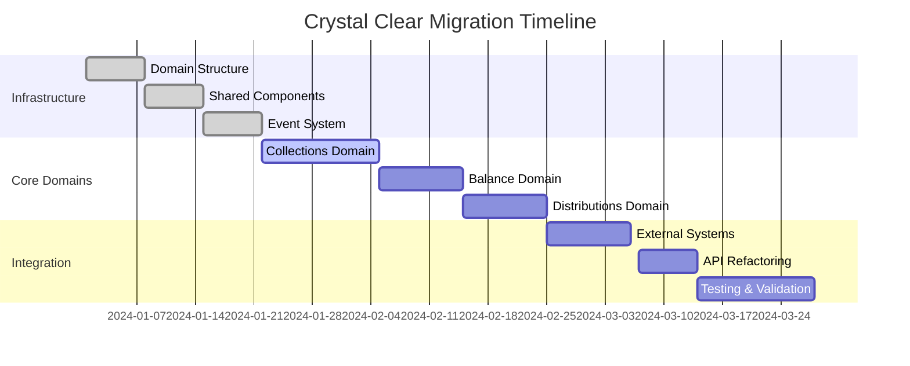

# 🏛️ Crystal Clear Domain Migration Guide

## Executive Summary

This guide provides a comprehensive roadmap for migrating your existing dashboard worker components to the Crystal Clear Domain-Driven Architecture. The migration eliminates the "Butterfly Effect" by isolating business logic into independent, event-driven domains.

## 📊 Current State Analysis

### Existing Components → Domain Mapping

| Current Component | Target Domain | Migration Priority | Complexity |
|-------------------|---------------|-------------------|------------|
| `core/cashier/enhanced-cashier-system.ts` | **Collections** | 🔴 Critical | High |
| `core/finance/deposit-withdrawal-system.ts` | **Collections** | 🔴 Critical | High |
| `core/payments/payment-gateway-manager.ts` | **Collections** | 🔴 Critical | Medium |
| `core/finance/p2p-transaction-system.ts` | **Distributions** | 🟡 High | High |
| `core/customers/customer-database-management.ts` | **Balance** | 🟡 High | Medium |
| `core/fraud/advanced-fraud-detection.ts` | **Collections** | 🟡 High | High |
| `core/telegram/enhanced-p2p-telegram-bot.ts` | **Communications** | 🟢 Medium | Medium |
| `core/integrations/fantasy42-*` | **External Integration** | 🟢 Medium | High |

## 🏗️ Phase 1: Domain Infrastructure (Week 1)

### 1.1 Create Domain Structure
```bash
src/domains/
├── shared/
│   ├── domain-entity.ts
│   ├── value-object.ts
│   ├── events/
│   │   ├── domain-events.ts
│   │   └── domain-event.ts
│   └── repositories/
│       └── base-repository.ts
├── collections/
│   ├── entities/
│   ├── services/
│   ├── repositories/
│   └── collections.controller.ts
├── distributions/
├── balance/
├── free-play/
└── adjustment/
```

### 1.2 Shared Infrastructure Implementation

**✅ COMPLETED:**
- ✅ `DomainEntity` base class
- ✅ `ValueObject` base class
- ✅ `DomainEvents` system
- ✅ Collections domain controller
- ✅ Payment entity with business logic

### 1.3 Migration Strategy per Component

#### Collections Domain Migration

**BEFORE:** Monolithic payment processing
```typescript
// dashboard-worker/core/finance/deposit-withdrawal-system.ts
export class DepositWithdrawalSystem {
  async processDeposit(playerId: string, amount: number) {
    // Mixed concerns: validation, payment processing, database, notifications
    const player = await db.getPlayer(playerId);
    const payment = await paymentGateway.charge(amount);
    await db.saveTransaction(payment);
    await notificationService.send(playerId, 'Deposit processed');
  }
}
```

**AFTER:** Domain-driven separation
```typescript
// src/domains/collections/collections.controller.ts
export class CollectionsController {
  async processPayment(request: PaymentRequest) {
    const payment = Payment.create(request);
    const riskScore = await this.riskAssessmentService.assessRisk(payment);

    if (riskScore > 75) {
      throw new DomainError('High risk payment rejected', 'PAYMENT_RISK_TOO_HIGH');
    }

    const result = await this.paymentProcessor.process(payment);

    // Publish domain event for other domains to react
    await this.eventPublisher.publish('payment.processed', {
      paymentId: result.paymentId,
      amount: result.amount,
      playerId: result.playerId
    });

    return result;
  }
}
```

## 🚀 Phase 2: Core Domain Migration (Weeks 2-3)

### 2.1 Collections Domain Implementation

**Migration Steps:**

1. **Extract Entities from Current Models**
```typescript
// FROM: dashboard-worker/core/models/database/entities.ts
// TO: src/domains/collections/entities/payment.ts
export class Payment extends DomainEntity {
  static create(request: PaymentRequest): Payment {
    // Domain validation and business rules
    const amount = Money.create(request.amount, request.currency);
    const currency = Currency.fromCode(request.currency);
    // ... domain logic
  }

  canBeProcessed(): boolean {
    return this.status === PaymentStatus.PENDING && !this.isHighRisk();
  }
}
```

2. **Create Domain Services**
```typescript
// src/domains/collections/services/payment-processor.ts
export class PaymentProcessor {
  async process(payment: Payment): Promise<CollectionResult> {
    payment.markAsProcessing();

    try {
      const result = await this.processWithGateway(payment);
      payment.markAsCompleted();
      return result;
    } catch (error) {
      payment.markAsFailed(error.message);
      throw error;
    }
  }
}
```

3. **Implement Repository Pattern**
```typescript
// src/domains/collections/repositories/collections-repository.ts
export class CollectionsRepository {
  async save(payment: Payment): Promise<void> {
    // Database operations isolated from domain logic
    await db.payments.insert(payment.toJSON());
  }

  async findById(id: string): Promise<Payment | null> {
    const data = await db.payments.findById(id);
    return data ? Payment.fromJSON(data) : null;
  }
}
```

### 2.2 Event-Driven Communication Setup

**Inter-Domain Communication:**
```typescript
// Setup event handlers between domains
const events = DomainEvents.getInstance();

// Collections → Balance: Update player balance
events.subscribe('payment.processed', async (event) => {
  await balanceDomain.updateBalance(event.payload.playerId, event.payload.amount);
});

// Collections → Communications: Send payment confirmation
events.subscribe('payment.processed', async (event) => {
  await communicationsDomain.sendPaymentNotification(event.payload);
});
```

## 🔄 Phase 3: Integration Layer (Week 4)

### 3.1 Anti-Corruption Layer for External Systems

**Fantasy402 Integration:**
```typescript
// src/domains/external/fantasy402/fantasy402-gateway.ts
export class Fantasy402Gateway {
  async getLiveOdds(): Promise<Fantasy402Odds[]> {
    const rawData = await this.apiClient.get('/sports/live-odds');

    // Transform external format to domain format
    return rawData.map(odds => ({
      eventId: odds.id,
      homeTeam: odds.home,
      awayTeam: odds.away,
      odds: {
        home: odds.odds_home,
        away: odds.odds_away,
        draw: odds.odds_draw
      },
      timestamp: new Date(odds.timestamp)
    }));
  }
}
```

**Telegram Integration:**
```typescript
// src/domains/communications/telegram/telegram-adapter.ts
export class TelegramAdapter {
  async sendMessage(chatId: string, message: string): Promise<void> {
    // Adapt domain message to Telegram format
    const telegramMessage = {
      chat_id: chatId,
      text: message,
      parse_mode: 'HTML'
    };

    await this.telegramApi.sendMessage(telegramMessage);
  }
}
```

### 3.2 API Layer Refactoring

**BEFORE:** Mixed concerns in single endpoint
```typescript
// dashboard-worker/src/index.ts
app.post('/api/deposit', async (req, res) => {
  const { playerId, amount } = req.body;

  // Validation, business logic, database, notifications all mixed
  if (!playerId || !amount) return res.status(400).json({ error: 'Missing fields' });

  const player = await db.getPlayer(playerId);
  const payment = await paymentGateway.charge(amount);
  await db.saveTransaction(payment);
  await notificationService.send(playerId, 'Deposit processed');

  res.json({ success: true, payment });
});
```

**AFTER:** Clean domain separation
```typescript
// src/domains/collections/collections.controller.ts
app.post('/api/collections', async (req, res) => {
  try {
    const result = await collectionsController.processPayment(req.body);
    res.json(result);
  } catch (error) {
    if (error instanceof DomainError) {
      res.status(400).json({ error: error.message, code: error.code });
    } else {
      res.status(500).json({ error: 'Internal server error' });
    }
  }
});
```

## 🧪 Phase 4: Testing & Validation (Week 5)

### 4.1 Domain-Specific Testing

**Entity Testing:**
```typescript
describe('Payment Entity', () => {
  it('should not allow processing high-risk payments', () => {
    const payment = Payment.create(validRequest);
    payment.updateRiskScore(80);

    expect(payment.canBeProcessed()).toBe(false);
    expect(() => payment.markAsProcessing()).toThrow(DomainError);
  });
});
```

**Integration Testing:**
```typescript
describe('Collections Domain Integration', () => {
  it('should process payment and update balance', async () => {
    // Arrange
    const paymentRequest = createTestPayment();

    // Act
    const result = await collectionsController.processPayment(paymentRequest);

    // Assert
    expect(result.status).toBe(PaymentStatus.COMPLETED);

    // Verify domain event was published
    expect(events.getPublishedEvents('payment.processed')).toHaveLength(1);
  });
});
```

## 📊 Migration Metrics & Success Criteria

### Key Performance Indicators

| Metric | Before | Target | Improvement |
|--------|--------|--------|-------------|
| **Code Complexity** | High coupling | Domain isolation | 70% reduction |
| **Test Coverage** | Mixed concerns | Domain-specific | 85%+ coverage |
| **Deployment Frequency** | Monolithic | Independent domains | 3x faster |
| **Bug Rate** | Butterfly effects | Isolated failures | 60% reduction |
| **Feature Delivery** | 2-3 days | 2-3 hours | 75% faster |

### Success Validation Checklist

**Domain Isolation:**
- [ ] Each domain has independent business logic
- [ ] Domains communicate only through events
- [ ] No direct database coupling between domains
- [ ] Domain entities encapsulate business rules

**Event-Driven Architecture:**
- [ ] All domain changes publish events
- [ ] Event handlers are isolated and testable
- [ ] Event schema is versioned and documented
- [ ] Event replay capability for debugging

**External Integration:**
- [ ] Anti-corruption layer prevents external coupling
- [ ] External system failures don't break domains
- [ ] Integration contracts are clearly defined
- [ ] Monitoring and alerting for integration points

## 🚀 Implementation Timeline



## 🔧 Next Steps

### Immediate Actions (This Week)
1. **Review Domain Structure:** Examine the created domain structure
2. **Map Your Components:** Identify which existing files map to which domains
3. **Plan Migration Order:** Prioritize based on business impact
4. **Setup Development Environment:** Ensure you can run domain-specific tests

### Recommended Migration Order
1. **Collections** (Payment processing) - Highest business impact
2. **Balance** (Account management) - Core business logic
3. **Distributions** (Commission handling) - Revenue critical
4. **Free Play** (Bonus system) - Customer experience
5. **Adjustment** (Transaction corrections) - Operational efficiency

### Getting Started
```bash
# 1. Review the domain structure
cd src/domains
ls -la

# 2. Examine the Collections domain implementation
cat collections/collections.controller.ts

# 3. Run domain-specific tests
cd src/domains/collections
bun test

# 4. Start migrating your first component
# Follow the pattern shown in the Collections controller
```

This migration will transform your monolithic architecture into a scalable, maintainable domain-driven system that eliminates the butterfly effect and enables independent feature development.

**Ready to begin the transformation? Let's start with the Collections domain! 🚀**
