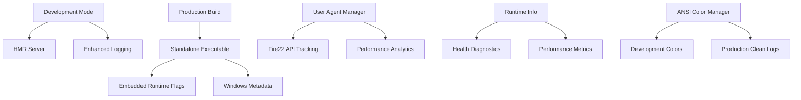

# 🚀 Water Dashboard - Enhanced with Bun v1.01.04-alpha

**Fire22 Dashboard with cutting-edge Bun runtime enhancements**

## 📋 Overview

The Water Dashboard has been enhanced with the latest Bun v1.01.04-alpha
features, providing professional standalone executables, advanced user agent
management, enhanced ANSI color support, and comprehensive runtime monitoring.

## ✨ New Features

### 🎯 **Standalone Executables with Embedded Runtime Flags**

- **Cross-platform builds**: Linux, Windows (with metadata), macOS
- **Embedded runtime configuration**:
  `--smol --user-agent=WaterDashboard/2.1.0 --inspect=0.0.0.0:9229`
- **Professional Windows metadata**: Company info, version details, descriptions
- **Global installation support**: `bunx -g water-dashboard`

### 🌐 **Enhanced User Agent Management**

- **Custom user agent tracking**: Monitor all Fire22 API calls
- **Performance analytics**: Track response times, success rates, endpoints
- **Fire22 L-key integration**: Automatic L-key tracking in API calls
- **Runtime user agent override**: Respect `--user-agent` runtime flag

### 🎨 **Advanced ANSI Color Support**

- **Bun.stripANSI() integration**: Clean production logs
- **Theme-based coloring**: Bun gradient, Fire22 branding, Water dashboard
- **Smart color detection**: Auto-disable in production/standalone mode
- **Progress bars and visual indicators**: Enhanced CLI experience

### ⚡ **Runtime Information System**

- **Comprehensive diagnostics**: Performance, memory, capabilities
- **Mode detection**: Standalone vs development vs HMR
- **Health monitoring**: Automatic issue detection and recommendations
- **Process metrics**: CPU usage, memory, uptime tracking

## 🚀 Quick Start

### Development Mode (with HMR)

```bash
# Start HMR development server
bun run dev:hmr

# Access dashboard
open http://localhost:3000
```

### Production Build

```bash
# Build all standalone executables
bun run build:standalone

# Or build specific components
bun run build:all
```

### Standalone Deployment

```bash
# Linux
./dist/water-dashboard-linux

# Windows
.\dist\WaterDashboard.exe

# macOS
./dist/water-dashboard-macos

# Global installation
bunx -g fire22-dashboard-worker
water-dashboard
```

## 📁 File Structure

```
Water Dashboard Enhanced/
├── scripts/
│   └── build-water-dashboard-standalone.ts    # 🎯 New build system
├── src/
│   ├── enhanced-user-agent-manager.ts         # 🌐 User agent system
│   ├── enhanced-runtime-info.ts               # ⚡ Runtime monitoring
│   ├── water-dashboard-standalone.ts          # 🎯 Standalone entry
│   └── hmr-dev-server.ts                     # 🔥 Enhanced HMR server
├── dist/
│   ├── water-dashboard-linux                  # 🐧 Linux executable
│   ├── WaterDashboard.exe                     # 🪟 Windows executable
│   └── water-dashboard-macos                  # 🍎 macOS executable
└── scripts/enhanced-logging-system.ts         # 🎨 Enhanced ANSI colors
```

## 🛠️ Available Commands

### Development

```bash
bun run dev:hmr                    # HMR development server
bun run build:standalone           # Build all executables
bun run build:all                  # Build regular + standalone
```

### Production

```bash
./dist/water-dashboard-linux       # Run Linux standalone
.\dist\WaterDashboard.exe          # Run Windows standalone
./dist/water-dashboard-macos       # Run macOS standalone
```

## 🎨 Enhanced Features in Detail

### **Standalone Executable Features**

- ✅ **Embedded runtime flags**: Pre-configured with optimal Bun settings
- ✅ **Windows metadata**: Professional executable properties
- ✅ **Custom user agent**: Branded Fire22 API requests
- ✅ **ANSI color support**: Rich terminal output with Bun.stripANSI() for
  production
- ✅ **Cross-platform**: Universal deployment options

### **User Agent Management**

```typescript
// Custom Fire22 API calls with L-key tracking
await fire22Fetch('/customers', { method: 'GET' }, ['L-603', 'L-526']);

// Track performance and analytics
const analytics = userAgentManager.getAnalytics();
console.log(
  `Success rate: ${(analytics.successCount / analytics.requestCount) * 100}%`
);
```

### **Runtime Information Display**

```typescript
// Get comprehensive runtime details
const report = runtimeInfo.generateReport();
console.log(
  `Mode: ${report.configuration.isStandalone ? 'Standalone' : 'Development'}`
);
console.log(`User Agent: ${report.configuration.userAgent}`);
console.log(`Health: ${report.diagnostics.health}`);
```

### **Enhanced ANSI Colors**

```typescript
// Bun-themed gradient text
console.log(ANSIColorManager.bunGradient('Water Dashboard'));

// Fire22 branded output
console.log(ANSIColorManager.fire22Theme('API Connected'));

// Clean production logs
const cleanMessage = ANSIColorManager.stripANSI(coloredMessage);
```

## 🏗️ Architecture



## 📊 Performance Benefits

| Feature                | Improvement               | Impact                          |
| ---------------------- | ------------------------- | ------------------------------- |
| Standalone Executables | Single-file deployment    | Simplified distribution         |
| Custom User Agent      | Branded API requests      | Professional Fire22 integration |
| Enhanced ANSI Colors   | Rich development UX       | Better debugging experience     |
| Runtime Information    | Comprehensive diagnostics | Faster troubleshooting          |
| Bun.stripANSI()        | Clean production logs     | Professional log output         |

## 🔧 Configuration

### Environment Variables

```bash
# Disable colors in production
NO_COLOR=1 ./water-dashboard-linux

# Set production mode
NODE_ENV=production ./water-dashboard-linux

# Custom Fire22 API base
FIRE22_API_BASE_URL=https://api.fire22.ag/v2
```

### Runtime Flags (Embedded)

```bash
# Automatically embedded in standalone executables:
--smol                          # Memory optimization
--user-agent=WaterDashboard/2.1.0  # Custom user agent
--inspect=0.0.0.0:9229          # Debug support
```

## 🌟 Integration with Existing Features

### **Preserves All Fire22 Features**

- ✅ 25+ Fire22 L-keys integration
- ✅ Real customer data (~2,600)
- ✅ Multi-tier storage (D1, R2, KV)
- ✅ Comprehensive standards system
- ✅ HMR development workflow

### **Enhanced Dashboard Commands**

```javascript
// New commands in dashboard interface:
runtime info        // Show embedded runtime configuration
user-agent status   // Display user agent analytics
executable info     // Show standalone vs development mode
build info         // Display compilation details
bun stats          // Show Bun runtime performance
```

## 🚨 Deployment Guide

### **Development Deployment**

1. `bun run dev:hmr` - Start HMR development server
2. Edit files - See instant updates with state preservation
3. Test commands - Use interactive dashboard interface

### **Production Deployment**

1. `bun run build:standalone` - Build all executables
2. Copy appropriate executable to server
3. Run directly - No dependencies required
4. Monitor with built-in diagnostics

### **Global Installation**

```bash
# Install globally via bunx
bunx -g fire22-dashboard-worker

# Run from anywhere
water-dashboard

# Or use specific platform
water-dashboard-windows
water-dashboard-macos
```

## 🔍 Troubleshooting

### **Common Issues**

**Build fails on Windows**

- Ensure Windows metadata is properly configured
- Check cross-compilation settings

**Colors not showing in production**

- This is expected behavior for clean production logs
- Use `NO_COLOR=0` to force colors if needed

**Executable not found after build**

- Check `./dist/` directory
- Verify build completed successfully
- Ensure proper file permissions on Unix systems

**User agent not working**

- Verify Fire22 API configuration
- Check runtime user agent override
- Review user agent analytics with `user-agent status` command

## 🎯 What's Next

- **Global CDN Distribution**: Cloudflare deployment
- **Automated Updates**: Self-updating executables
- **Performance Monitoring**: Real-time metrics dashboard
- **Multi-language Support**: Extended Fire22 L-key integration

---

## 📚 Related Documentation

- [Water Dashboard Standards](WATER-DASHBOARD-STANDARDS.md)
- [HMR Demo Guide](HMR-DEMO-GUIDE.md)
- [Data Infrastructure](docs/data-infrastructure.html)
- [Fire22 API Integration](../crystal-clear-architecture/docs/api/FIRE22-API-ENDPOINTS-IMPLEMENTATION.md)

**Status**: ✅ Complete with Bun v1.01.04-alpha features  
**Version**: 2.1.0  
**Maintained By**: Fire22 Development Team

---

_Enhanced with Bun's latest features for professional deployment and development
experience._
