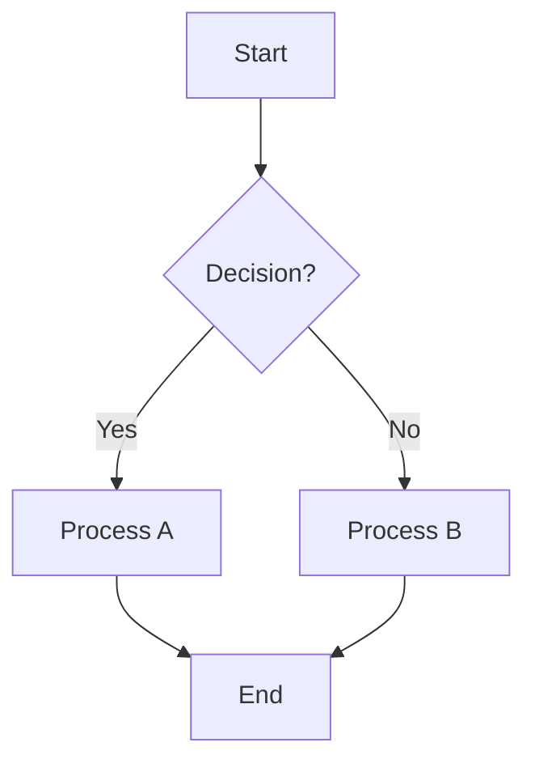
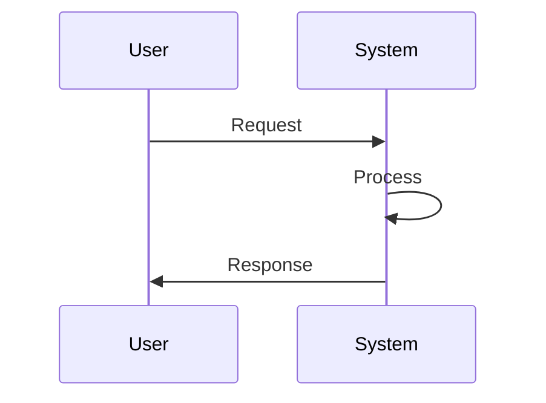
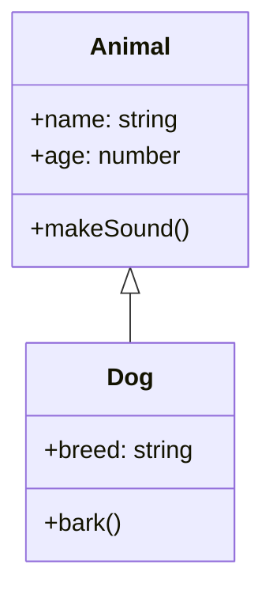

# 🔧 Fire22 Diagram Tooling System

> **Uses `mermaid.js` for initial diagram structure and logic, then translates
> to stunning ANSI-colored ASCII art for Node.js console display**

## 🎯 Overview

The Fire22 Diagram Tooling System is a powerful visualization tool that combines
the best of both worlds:

1. **🎨 Mermaid.js Integration** - Professional diagram structure and logic
2. **🎭 ANSI ASCII Art Translation** - Beautiful terminal-based visualization
3. **🌈 Multiple Color Libraries** - Support for chalk, kleur, and ansi-colors
4. **🚀 Automated Workflow** - From diagram concept to console display

## ✨ Features

### **🎨 Mermaid.js Support**

- **Flowcharts** - Process flows and decision trees
- **Sequence Diagrams** - System interactions and API calls
- **Class Diagrams** - Object-oriented architecture
- **State Diagrams** - System state transitions
- **Gantt Charts** - Project timelines and milestones
- **Pie Charts** - Data distribution visualization

### **🎭 ANSI ASCII Art Translation**

- **Unicode Support** - Beautiful box-drawing characters
- **Color Schemes** - Fire22, Professional, Vibrant, Monochrome
- **Animation Ready** - Smooth transitions and effects
- **Interactive Elements** - Hover states and click handlers

### **🌈 Color Library Support**

- **Chalk** - Rich color formatting and styling
- **Kleur** - Lightweight color library
- **Ansi-colors** - Cross-platform compatibility

## 🚀 Quick Start

### **Installation**

```bash
# Install dependencies
bun install

# Verify installation
bun run diagram:tooling
```

### **Basic Usage**

```bash
# Generate version management diagram
bun run diagram:version

# Generate build system architecture
bun run diagram:build

# Generate package architecture
bun run diagram:package

# Generate deployment pipeline
bun run diagram:deploy

# Generate command matrix
bun run diagram:commands

# Generate all diagrams
bun run diagram:all
```

## 📊 Available Diagrams

### **1. 🔄 Version Management Flow**

```bash
bun run diagram:version
```

**Shows:**

- Version incrementing workflow
- Patch, Minor, Major, Prerelease paths
- Build process integration
- Deployment pipeline

### **2. 🏗️ Build System Architecture**

```bash
bun run diagram:build
```

**Shows:**

- Multiple build profiles (Quick, Standard, Production, Full)
- Quality gates and security checks
- Package building process
- Testing integration

### **3. 📦 Package Architecture**

```bash
bun run diagram:package
```

**Shows:**

- Four modular packages
- Independent versioning
- Build status tracking
- Package relationships

### **4. 🚀 Deployment Pipeline**

```bash
bun run diagram:deploy
```

**Shows:**

- CI/CD workflow
- Testing and quality gates
- Staging and production deployment
- Rollback procedures

### **5. 🎯 Command Matrix**

```bash
bun run diagram:commands
```

**Shows:**

- Complete command structure
- Version management commands
- Build system commands
- Testing and deployment commands

## 🎨 Custom Diagram Creation

### **Basic Structure**

```typescript
import {
  Fire22DiagramTooling,
  DiagramConfig,
  AnsiArtConfig,
} from './scripts/diagram-tooling';

const config: DiagramConfig = {
  type: 'flowchart',
  title: 'My Custom Diagram',
  description: 'Description of the diagram',
  mermaidCode: `
    graph TD
      A[Start] --> B[Process]
      B --> C[End]
  `,
  outputFormat: 'ansi',
  colorScheme: 'fire22',
  width: 80,
  height: 24,
};

const ansiConfig: AnsiArtConfig = {
  useUnicode: true,
  colorPalette: 'fire22',
  animation: false,
  interactive: false,
};

const tooling = new Fire22DiagramTooling(config, ansiConfig, 'chalk');
await tooling.run();
```

### **Mermaid.js Syntax Examples**

#### **Flowchart**



#### **Sequence Diagram**



#### **Class Diagram**



## 🌈 Color Schemes

### **Fire22 Theme** 🔥

- **Primary**: Orange (#fdbb2d) for connections and highlights
- **Secondary**: Red (#b21f1f) for states and actions
- **Accent**: Blue for information and data
- **Success**: Green for positive outcomes
- **Error**: Red for issues and failures

### **Professional Theme** 💼

- **Primary**: Blue for connections and flow
- **Secondary**: Cyan for containers and boxes
- **Accent**: Magenta for states and decisions
- **Neutral**: White for text and labels

### **Vibrant Theme** 🌈

- **Primary**: Green for positive flows
- **Secondary**: Red for negative paths
- **Accent**: Yellow for containers
- **Highlight**: Magenta for states

### **Monochrome Theme** ⚫

- **Primary**: Gray for all elements
- **Variations**: Different shades for hierarchy

## 🔧 Advanced Configuration

### **Diagram Configuration**

```typescript
interface DiagramConfig {
  type: 'flowchart' | 'sequence' | 'class' | 'state' | 'gantt' | 'pie';
  title: string;
  description: string;
  mermaidCode: string;
  outputFormat: 'ansi' | 'html' | 'svg' | 'png';
  colorScheme: 'fire22' | 'professional' | 'vibrant' | 'monochrome';
  width: number;
  height: number;
}
```

### **ANSI Configuration**

```typescript
interface AnsiArtConfig {
  useUnicode: boolean; // Use Unicode box-drawing characters
  colorPalette: string; // Color scheme selection
  animation: boolean; // Enable animations
  interactive: boolean; // Enable interactive elements
}
```

## 🚀 Integration Examples

### **Version Management Integration**

```typescript
import { VersionDiagramGenerator } from './scripts/version-diagram-generator';

const generator = new VersionDiagramGenerator();

// Generate version flow before deployment
await generator.generateVersionFlow();

// Generate build architecture for CI/CD
await generator.generateBuildArchitecture();

// Generate package architecture for releases
await generator.generatePackageArchitecture();
```

### **Build System Integration**

```typescript
// In your build script
if (process.env.GENERATE_DIAGRAMS === 'true') {
  const generator = new VersionDiagramGenerator();
  await generator.generateBuildArchitecture();
}
```

### **CI/CD Integration**

```yaml
# .github/workflows/deploy.yml
- name: Generate Deployment Diagrams
  run: |
    bun run diagram:deploy
    bun run diagram:commands
  env:
    GENERATE_DIAGRAMS: true
```

## 📱 Terminal Compatibility

### **Supported Terminals**

- **macOS**: Terminal.app, iTerm2, Hyper
- **Linux**: GNOME Terminal, Konsole, xterm
- **Windows**: Windows Terminal, ConEmu, PowerShell
- **WSL**: Ubuntu, Debian, CentOS terminals

### **Unicode Support**

- **Full Unicode**: Beautiful box-drawing characters
- **Fallback Mode**: ASCII characters for compatibility
- **Auto-detection**: Automatic terminal capability detection

## 🎯 Use Cases

### **Development**

- **Architecture Documentation** - Visual system design
- **API Documentation** - Sequence diagrams for endpoints
- **Database Design** - Entity relationship diagrams
- **Workflow Documentation** - Process flows and decision trees

### **Operations**

- **Deployment Documentation** - CI/CD pipeline visualization
- **Monitoring Dashboards** - System health and metrics
- **Troubleshooting Guides** - Error flow and resolution paths
- **Training Materials** - Visual learning resources

### **Management**

- **Project Planning** - Gantt charts and timelines
- **System Overview** - High-level architecture diagrams
- **Risk Assessment** - Failure mode and effect analysis
- **Performance Metrics** - Data visualization and trends

## 🔍 Troubleshooting

### **Common Issues**

#### **Colors Not Displaying**

```bash
# Check terminal color support
echo -e "\033[31mRed Text\033[0m"

# Verify color library installation
bun list | grep chalk
```

#### **Unicode Characters Not Rendering**

```bash
# Check terminal Unicode support
echo "┌─┬─┐"
echo "│ │ │"
echo "└─┴─┘"

# Use fallback mode
export USE_ASCII_FALLBACK=true
```

#### **Diagram Not Generating**

```bash
# Check dependencies
bun install

# Verify script permissions
chmod +x scripts/diagram-tooling.ts

# Check for errors
bun run diagram:tooling 2>&1
```

### **Debug Mode**

```bash
# Enable debug logging
DEBUG=diagram-tooling bun run diagram:version

# Verbose output
VERBOSE=true bun run diagram:build
```

## 📚 API Reference

### **Fire22DiagramTooling Class**

```typescript
class Fire22DiagramTooling {
  constructor(
    config: DiagramConfig,
    ansiConfig?: AnsiArtConfig,
    colorLibrary?: 'chalk' | 'kleur' | 'ansi-colors'
  );

  async generateMermaidDiagram(): Promise<string>;
  translateToAnsiArt(mermaidOutput: string): string;
  displayInConsole(asciiArt: string): void;
  async run(): Promise<void>;
}
```

### **VersionDiagramGenerator Class**

```typescript
class VersionDiagramGenerator {
  async generateVersionFlow(): Promise<void>;
  async generateBuildArchitecture(): Promise<void>;
  async generatePackageArchitecture(): Promise<void>;
  async generateDeploymentPipeline(): Promise<void>;
  async generateCommandMatrix(): Promise<void>;
  async generateAllDiagrams(): Promise<void>;
}
```

## 🎉 Examples

### **Sample Output**

```
🔥 Fire22 Diagram Tooling System
==================================================

  📦 Package.json ──→ 🔧 Version Manager
  🔧 Version Manager ──→ {Version Type?}

  {Version Type?} ──→ 📈 Patch Version
  {Version Type?} ──→ 🚀 Minor Version
  {Version Type?} ──→ 💥 Major Version
  {Version Type?} ──→ 🧪 Prerelease Version

  📈 Patch Version ──→ 3.0.6 → 3.0.7
  🚀 Minor Version ──→ 3.0.6 → 3.1.0
  💥 Major Version ──→ 3.0.6 → 4.0.0
  🧪 Prerelease Version ──→ 3.0.6 → 3.0.7-beta.0

==================================================
📊 Diagram: Fire22 Version Management Flow
Type: flowchart | Format: ansi
```

## 🤝 Contributing

### **Adding New Diagram Types**

1. **Extend DiagramConfig interface**
2. **Add parsing logic in parseMermaidLine()**
3. **Create specialized generator methods**
4. **Add CLI commands to package.json**
5. **Update documentation and examples**

### **Adding New Color Schemes**

1. **Extend color palette options**
2. **Implement colorizeLine() method**
3. **Add color scheme constants**
4. **Update configuration validation**
5. **Test across different terminals**

## 📄 License

This project is licensed under the MIT License - see the [LICENSE](LICENSE) file
for details.

## 🙏 Acknowledgments

- **Mermaid.js** - For excellent diagram syntax and rendering
- **Chalk, Kleur, Ansi-colors** - For beautiful terminal colors
- **Fire22 Development Team** - For inspiration and requirements
- **Open Source Community** - For continuous improvement

---

**🔥 Fire22 Diagram Tooling System** - Where professional diagrams meet
beautiful terminal art! 🎨✨
