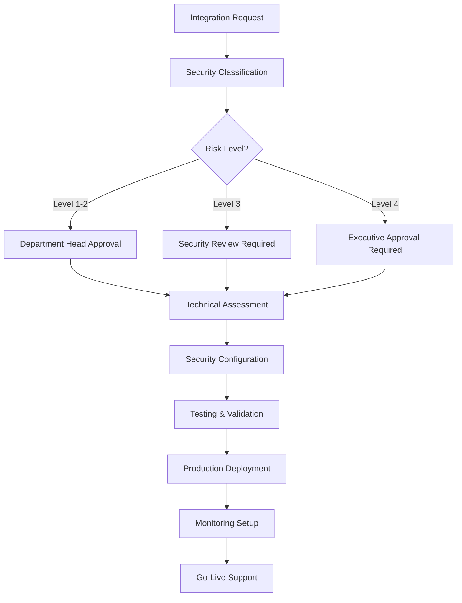

# 📧 Integration Team Coordination - Access Control Implementation

**To:** Integration Team Lead (Amanda Garcia)  
**From:** Fire22 Security & Development Team  
**CC:** CTO (Chris Brown), CSO (Sarah Mitchell)  
**Date:** August 28, 2024  
**Subject:** Urgent: Integration Access Policies & Permission Management
Implementation

---

## 🚨 **Immediate Action Required**

We need to coordinate with the Integration Team to establish comprehensive
access control policies for all Fire22 system integrations. This is critical for
maintaining our zero-breach security standard while enabling seamless
cross-department functionality.

## 🎯 **Integration Team Responsibilities**

### **📋 Immediate Tasks (This Week)**

1. **Access Policy Review**

   - Review the comprehensive integration access policies document
   - Validate technical feasibility of all security requirements
   - Identify any current integrations that don't meet new standards

2. **Permission Matrix Implementation**

   - Implement role-based access controls for all 4 integration levels
   - Configure department-specific permission matrices
   - Establish automated access provisioning and deprovisioning

3. **Support Infrastructure Setup**
   - Create standardized integration request workflows
   - Establish 24/7 support channels for critical integrations
   - Set up automated monitoring and alerting systems

## 🏢 **Department Integration Status Review**

### **Current Integration Landscape**

| Department            | Active Integrations | Security Level | Action Required             |
| --------------------- | ------------------- | -------------- | --------------------------- |
| **Technology**        | 12 integrations     | Mixed (L2-L4)  | ⚠️ Security audit needed    |
| **Security**          | 8 integrations      | L3-L4          | ✅ Compliant                |
| **Finance**           | 6 integrations      | L3-L4          | ⚠️ Permission review needed |
| **Marketing**         | 15 integrations     | L1-L2          | ⚠️ Access controls missing  |
| **Sportsbook**        | 9 integrations      | L3-L4          | ⚠️ Critical system review   |
| **Operations**        | 4 integrations      | L2-L3          | ⚠️ Monitoring gaps          |
| **Customer Support**  | 7 integrations      | L1-L2          | ⚠️ MFA implementation       |
| **Compliance**        | 3 integrations      | L3             | ✅ Mostly compliant         |
| **Management**        | 5 integrations      | L2-L3          | ⚠️ Executive access review  |
| **Team Contributors** | 2 integrations      | L2             | ✅ Compliant                |

## 🔐 **Critical Integration Security Gaps**

### **🚨 High Priority Issues**

#### **1. Marketing Department (15 integrations)**

- **Issue**: Most social media and analytics APIs lack proper access controls
- **Risk Level**: Medium
- **Action Required**: Implement OAuth 2.0 + rate limiting within 7 days
- **Owner**: Kevin Thompson + Integration Team

#### **2. Sportsbook Operations (9 integrations)**

- **Issue**: Live betting and odds APIs need enhanced monitoring
- **Risk Level**: High (business critical)
- **Action Required**: Implement Level 4 security controls within 3 days
- **Owner**: Marcus Rodriguez + Integration Team + Security Team

#### **3. Finance Department (6 integrations)**

- **Issue**: Payment processing APIs require HSM implementation
- **Risk Level**: Critical
- **Action Required**: Hardware security module deployment within 5 days
- **Owner**: Michael Chen + Integration Team + Security Team

## 📊 **Integration Team Support Framework**

### **🎫 New Support Ticket System**

```yaml
Integration Support Tiers:
  Tier 1: Basic API integrations (Response: 4 hours)
    - Social media APIs
    - Basic analytics tools
    - Non-sensitive data connections

  Tier 2: Internal system integrations (Response: 2 hours)
    - Department dashboards
    - Reporting systems
    - Workflow automation

  Tier 3: Enterprise integrations (Response: 1 hour)
    - Financial systems
    - Customer databases
    - Core business systems

  Tier 4: Critical infrastructure (Response: 15 minutes)
    - Payment processing
    - Security systems
    - Real-time trading systems
```

### **📞 Emergency Escalation Chain**

```
Integration Emergency → Amanda Garcia (Integration Lead) → Chris Brown (CTO) → Executive Team
Timeline: 15 min → 30 min → 1 hour → Board notification
```

## 🔧 **Technical Implementation Requirements**

### **🔐 Authentication Systems**

#### **Level 1: Public Integrations**

```javascript
// API Key Management
const apiKeyRotation = {
  interval: '90 days',
  notification: '7 days before expiry',
  autoRotation: true,
  backupKeys: 2,
};

// Rate Limiting
const rateLimits = {
  default: '1000/hour',
  burst: '50/minute',
  monitoring: 'real-time',
};
```

#### **Level 2: Internal Integrations**

```javascript
// MFA Implementation
const mfaRequirements = {
  method: 'TOTP + SMS backup',
  sessionTimeout: '8 hours',
  reauth: 'every 4 hours for sensitive operations',
  failureLimit: 3,
};

// RBAC Configuration
const roleBasedAccess = {
  department: 'auto-assigned based on user department',
  permissions: 'granular resource access',
  inheritance: 'hierarchical with overrides',
  audit: 'complete access logging',
};
```

#### **Level 3: Enterprise Integrations**

```javascript
// Certificate-Based Auth
const certificateAuth = {
  type: 'X.509 certificates',
  rotation: 'annual',
  storage: 'hardware security module',
  validation: 'real-time OCSP checking',
};

// Zero Trust Implementation
const zeroTrust = {
  verification: 'verify every connection',
  monitoring: '24/7 behavioral analysis',
  policies: 'dynamic policy enforcement',
  response: 'automated threat response',
};
```

#### **Level 4: Critical Infrastructure**

```javascript
// HSM Integration
const hsmConfig = {
  provider: 'AWS CloudHSM / Azure Dedicated HSM',
  keyManagement: 'hardware-backed key storage',
  authentication: 'multi-person authentication',
  monitoring: 'immutable audit trails',
};
```

## 📋 **Integration Request Workflow**

### **🎯 Automated Request Processing**



### **📊 Request Processing SLAs**

| Integration Level | Initial Response | Technical Review | Security Review | Final Approval |
| ----------------- | ---------------- | ---------------- | --------------- | -------------- |
| **Level 1**       | 2 hours          | 1 day            | 1 day           | 2 days         |
| **Level 2**       | 1 hour           | 2 days           | 2 days          | 5 days         |
| **Level 3**       | 30 minutes       | 3 days           | 5 days          | 10 days        |
| **Level 4**       | 15 minutes       | 5 days           | 10 days         | 21 days        |

## 🎯 **Integration Team Action Items**

### **✅ Immediate Tasks (Next 48 Hours)**

1. **Review Integration Policies**

   - [ ] Read comprehensive integration access policies document
   - [ ] Identify technical implementation challenges
   - [ ] Prepare resource requirements estimate

2. **Audit Current Integrations**

   - [ ] Complete security assessment of all active integrations
   - [ ] Classify existing integrations by security level
   - [ ] Identify non-compliant integrations requiring immediate attention

3. **Emergency Response Setup**
   - [ ] Establish 24/7 monitoring for critical integrations
   - [ ] Configure automated alerting for security violations
   - [ ] Create emergency escalation procedures

### **📋 Week 1 Deliverables**

1. **Policy Implementation Plan**

   - Detailed technical implementation roadmap
   - Resource requirements and timeline
   - Risk mitigation strategies for high-priority issues

2. **Security Control Deployment**

   - MFA implementation for all Level 2+ integrations
   - Rate limiting for all Level 1 integrations
   - Certificate-based auth for Level 3+ integrations

3. **Monitoring Infrastructure**
   - Real-time integration health monitoring
   - Security event correlation and alerting
   - Performance baseline establishment

## 📞 **Coordination Meeting Schedule**

### **🚨 Emergency Coordination (Today)**

- **Time**: Within 4 hours of this message
- **Participants**: Integration Team Lead, Security Team, CTO
- **Agenda**: Critical integration security gaps, immediate actions
- **Duration**: 60 minutes

### **📋 Weekly Integration Review**

- **Time**: Every Monday 9:00 AM
- **Participants**: All department integration coordinators
- **Agenda**: Access requests, security updates, compliance status
- **Duration**: 90 minutes

### **📊 Monthly Security Audit**

- **Time**: First Friday of each month
- **Participants**: Integration Team, Security Team, Department Heads
- **Agenda**: Comprehensive security review, policy updates
- **Duration**: 2 hours

## 🔐 **Security Team Support**

### **👥 Dedicated Security Resources**

- **Marcus Johnson** - Permissions & Access Control Specialist

  - Focus: RBAC implementation and access auditing
  - Availability: 24/7 for critical integration issues

- **Sofia Andersson** - Session Management Engineer

  - Focus: Authentication systems and session security
  - Availability: Business hours with emergency escalation

- **Alex Kim** - Cryptography Engineer
  - Focus: Certificate management and encryption systems
  - Availability: On-call for HSM and crypto implementations

## 📊 **Success Metrics & KPIs**

### **Integration Security Metrics**

- **Integration Compliance Rate**: Target 100% by end of month
- **Access Violation Incidents**: Target <5 per month
- **Mean Time to Resolution (MTTR)**: Target <1 hour for critical issues
- **Security Audit Pass Rate**: Target 98%

### **Operational Metrics**

- **Integration Request Processing Time**: Meet published SLAs
- **System Availability**: 99.99% uptime for critical integrations
- **Support Ticket Resolution**: 95% within SLA timeframes
- **User Satisfaction**: 4.5+ rating for integration support

## 🚀 **Next Steps**

### **🎯 Immediate Actions**

1. **Integration Team Response**: Acknowledge receipt and provide initial
   assessment within 4 hours
2. **Emergency Coordination Call**: Schedule within 4 hours to address critical
   gaps
3. **Resource Allocation**: Assign dedicated team members to high-priority
   integration security fixes

### **📅 Timeline Expectations**

- **48 Hours**: Current integration security audit complete
- **7 Days**: All high-priority security gaps addressed
- **30 Days**: Full compliance with new integration access policies
- **90 Days**: Comprehensive integration security program fully operational

## 📞 **Contact Information for Immediate Response**

**Integration Team Lead**: Amanda Garcia

- **Email**: amanda.garcia@fire22.com
- **Phone**: +1-555-FIRE-INT
- **Slack**: @amanda.garcia
- **Availability**: 24/7 for critical integration issues

**Security Team Coordination**: Sarah Mitchell (CSO)

- **Email**: sarah.mitchell@fire22.com
- **Phone**: +1-555-FIRE-SEC
- **Slack**: @sarah.mitchell
- **Availability**: 24/7 emergency security line

**Technical Architecture Support**: Chris Brown (CTO)

- **Email**: chris.brown@fire22.com
- **Phone**: +1-555-FIRE-CTO
- **Slack**: @chris.brown
- **Availability**: Executive escalation line

---

## 📋 **Required Acknowledgment**

Please respond to this message within 4 hours with:

1. ✅ **Acknowledgment** of receipt and understanding
2. 📊 **Initial Assessment** of current integration security status
3. 📅 **Timeline** for addressing critical security gaps
4. 👥 **Resource Allocation** plan for integration security implementation
5. 🚨 **Emergency Escalation** procedures confirmation

This is a high-priority security initiative that requires immediate attention
and coordination across all departments.

---

**Classification**: Internal Use - Security Sensitive  
**Distribution**: Integration Team, Security Team, Department Heads  
**Response Required**: Within 4 hours

---

🤖 Generated with [Claude Code](https://claude.ai/code) for Fire22 Integration
Team Coordination

Co-Authored-By: Claude <noreply@anthropic.com>
