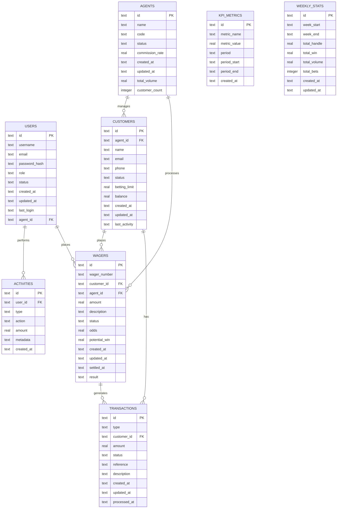

# Fire22 Dashboard Database Schemas

## Overview

Complete documentation of database schemas, table structures, relationships, and
database management for the Fire22 Dashboard system.

## Table of Contents

- [Database Overview](#database-overview)
- [Table Schemas](#table-schemas)
- [Relationships](#relationships)
- [Indexes](#indexes)
- [Migrations](#migrations)
- [Data Types](#data-types)
- [Constraints](#constraints)
- [Performance](#performance)
- [Backup and Recovery](#backup-and-recovery)
- [Security](#security)

---

## Database Overview

### Database Technology

- **Primary Database**: SQLite (Development/Testing)
- **Production Database**: Cloudflare D1
- **ORM**: Drizzle ORM
- **Migration Tool**: Drizzle Kit

### Database Architecture

```
[Application Layer] → [Drizzle ORM] → [SQLite/D1] → [Storage]
       ↓                   ↓              ↓           ↓
   Business Logic    Query Builder    SQL Engine   Data Files
       ↓                   ↓              ↓           ↓
   Data Models       Type Safety    Transactions   Persistence
```

### Database Features

1. **ACID Compliance**

   - Atomicity
   - Consistency
   - Isolation
   - Durability

2. **Transaction Support**
   - Read committed
   - Serializable
   - Deadlock detection
   - Rollback support

---

## Table Schemas

### Users Table

```sql
CREATE TABLE users (
    id TEXT PRIMARY KEY,
    username TEXT UNIQUE NOT NULL,
    email TEXT UNIQUE NOT NULL,
    password_hash TEXT NOT NULL,
    role TEXT NOT NULL CHECK (role IN ('admin', 'agent', 'customer')),
    status TEXT NOT NULL DEFAULT 'active' CHECK (status IN ('active', 'inactive', 'suspended')),
    created_at TEXT NOT NULL DEFAULT CURRENT_TIMESTAMP,
    updated_at TEXT NOT NULL DEFAULT CURRENT_TIMESTAMP,
    last_login TEXT,
    agent_id TEXT,
    FOREIGN KEY (agent_id) REFERENCES agents(id)
);
```

### Agents Table

```sql
CREATE TABLE agents (
    id TEXT PRIMARY KEY,
    name TEXT NOT NULL,
    code TEXT UNIQUE NOT NULL,
    status TEXT NOT NULL DEFAULT 'active' CHECK (status IN ('active', 'inactive', 'suspended')),
    commission_rate REAL NOT NULL DEFAULT 0.05,
    created_at TEXT NOT NULL DEFAULT CURRENT_TIMESTAMP,
    updated_at TEXT NOT NULL DEFAULT CURRENT_TIMESTAMP,
    total_volume REAL DEFAULT 0,
    customer_count INTEGER DEFAULT 0
);
```

### Customers Table

```sql
CREATE TABLE customers (
    id TEXT PRIMARY KEY,
    agent_id TEXT NOT NULL,
    name TEXT NOT NULL,
    email TEXT UNIQUE NOT NULL,
    phone TEXT,
    status TEXT NOT NULL DEFAULT 'active' CHECK (status IN ('active', 'inactive', 'suspended')),
    betting_limit REAL DEFAULT 1000,
    balance REAL DEFAULT 0,
    created_at TEXT NOT NULL DEFAULT CURRENT_TIMESTAMP,
    updated_at TEXT NOT NULL DEFAULT CURRENT_TIMESTAMP,
    last_activity TEXT,
    FOREIGN KEY (agent_id) REFERENCES agents(id)
);
```

### Wagers Table

```sql
CREATE TABLE wagers (
    id TEXT PRIMARY KEY,
    wager_number TEXT UNIQUE NOT NULL,
    customer_id TEXT NOT NULL,
    agent_id TEXT NOT NULL,
    amount REAL NOT NULL CHECK (amount > 0),
    description TEXT NOT NULL,
    status TEXT NOT NULL DEFAULT 'pending' CHECK (status IN ('pending', 'active', 'settled', 'cancelled', 'voided')),
    odds REAL,
    potential_win REAL,
    created_at TEXT NOT NULL DEFAULT CURRENT_TIMESTAMP,
    updated_at TEXT NOT NULL DEFAULT CURRENT_TIMESTAMP,
    settled_at TEXT,
    result TEXT CHECK (result IN ('win', 'loss', 'push', 'void')),
    FOREIGN KEY (customer_id) REFERENCES customers(id),
    FOREIGN KEY (agent_id) REFERENCES agents(id)
);
```

### Transactions Table

```sql
CREATE TABLE transactions (
    id TEXT PRIMARY KEY,
    type TEXT NOT NULL CHECK (type IN ('deposit', 'withdrawal', 'wager', 'settlement', 'refund')),
    customer_id TEXT NOT NULL,
    amount REAL NOT NULL,
    status TEXT NOT NULL DEFAULT 'pending' CHECK (status IN ('pending', 'completed', 'failed', 'cancelled')),
    reference TEXT,
    description TEXT,
    created_at TEXT NOT NULL DEFAULT CURRENT_TIMESTAMP,
    updated_at TEXT NOT NULL DEFAULT CURRENT_TIMESTAMP,
    processed_at TEXT,
    FOREIGN KEY (customer_id) REFERENCES customers(id)
);
```

### Activities Table

```sql
CREATE TABLE activities (
    id TEXT PRIMARY KEY,
    user_id TEXT NOT NULL,
    type TEXT NOT NULL CHECK (type IN ('login', 'logout', 'wager_placed', 'wager_settled', 'payment', 'withdrawal')),
    action TEXT NOT NULL,
    amount REAL,
    metadata TEXT, -- JSON string for additional data
    created_at TEXT NOT NULL DEFAULT CURRENT_TIMESTAMP,
    FOREIGN KEY (user_id) REFERENCES users(id)
);
```

### KPI Metrics Table

```sql
CREATE TABLE kpi_metrics (
    id TEXT PRIMARY KEY,
    metric_name TEXT NOT NULL,
    metric_value REAL NOT NULL,
    period TEXT NOT NULL CHECK (period IN ('daily', 'weekly', 'monthly')),
    period_start TEXT NOT NULL,
    period_end TEXT NOT NULL,
    created_at TEXT NOT NULL DEFAULT CURRENT_TIMESTAMP,
    UNIQUE(metric_name, period, period_start)
);
```

### Weekly Stats Table

```sql
CREATE TABLE weekly_stats (
    id TEXT PRIMARY KEY,
    week_start TEXT NOT NULL,
    week_end TEXT NOT NULL,
    total_handle REAL NOT NULL DEFAULT 0,
    total_win REAL NOT NULL DEFAULT 0,
    total_volume REAL NOT NULL DEFAULT 0,
    total_bets INTEGER NOT NULL DEFAULT 0,
    created_at TEXT NOT NULL DEFAULT CURRENT_TIMESTAMP,
    updated_at TEXT NOT NULL DEFAULT CURRENT_TIMESTAMP,
    UNIQUE(week_start)
);
```

---

## Relationships

### Entity Relationship Diagram



### Relationship Details

1. **Users → Agents** (Many-to-One)

   - Users can be assigned to agents
   - Agent can have multiple users
   - Foreign key: `users.agent_id`

2. **Agents → Customers** (One-to-Many)

   - Agent manages multiple customers
   - Customer belongs to one agent
   - Foreign key: `customers.agent_id`

3. **Customers → Wagers** (One-to-Many)

   - Customer places multiple wagers
   - Wager belongs to one customer
   - Foreign key: `wagers.customer_id`

4. **Agents → Wagers** (One-to-Many)

   - Agent processes multiple wagers
   - Wager processed by one agent
   - Foreign key: `wagers.agent_id`

5. **Users → Activities** (One-to-Many)
   - User performs multiple activities
   - Activity belongs to one user
   - Foreign key: `activities.user_id`

---

## Indexes

### Primary Indexes

```sql
-- Users table
CREATE INDEX idx_users_username ON users(username);
CREATE INDEX idx_users_email ON users(email);
CREATE INDEX idx_users_role ON users(role);
CREATE INDEX idx_users_agent_id ON users(agent_id);

-- Agents table
CREATE INDEX idx_agents_code ON agents(code);
CREATE INDEX idx_agents_status ON agents(status);

-- Customers table
CREATE INDEX idx_customers_agent_id ON customers(agent_id);
CREATE INDEX idx_customers_email ON customers(email);
CREATE INDEX idx_customers_status ON customers(status);

-- Wagers table
CREATE INDEX idx_wagers_wager_number ON wagers(wager_number);
CREATE INDEX idx_wagers_customer_id ON wagers(customer_id);
CREATE INDEX idx_wagers_agent_id ON wagers(agent_id);
CREATE INDEX idx_wagers_status ON wagers(status);
CREATE INDEX idx_wagers_created_at ON wagers(created_at);

-- Transactions table
CREATE INDEX idx_transactions_customer_id ON transactions(customer_id);
CREATE INDEX idx_transactions_type ON transactions(type);
CREATE INDEX idx_transactions_status ON transactions(status);
CREATE INDEX idx_transactions_created_at ON transactions(created_at);

-- Activities table
CREATE INDEX idx_activities_user_id ON activities(user_id);
CREATE INDEX idx_activities_type ON activities(type);
CREATE INDEX idx_activities_created_at ON activities(created_at);

-- KPI Metrics table
CREATE INDEX idx_kpi_metrics_period ON kpi_metrics(period);
CREATE INDEX idx_kpi_metrics_period_start ON kpi_metrics(period_start);

-- Weekly Stats table
CREATE INDEX idx_weekly_stats_week_start ON weekly_stats(week_start);
```

### Composite Indexes

```sql
-- Wagers by customer and status
CREATE INDEX idx_wagers_customer_status ON wagers(customer_id, status);

-- Wagers by agent and status
CREATE INDEX idx_wagers_agent_status ON wagers(agent_id, status);

-- Transactions by customer and type
CREATE INDEX idx_transactions_customer_type ON transactions(customer_id, type);

-- Activities by user and type
CREATE INDEX idx_activities_user_type ON activities(user_id, type);

-- KPI metrics by period and name
CREATE INDEX idx_kpi_metrics_period_name ON kpi_metrics(period, metric_name);
```

---

## Migrations

### Migration Strategy

1. **Version Control**

   - Each migration has a unique version
   - Timestamp-based naming convention
   - Rollback support for each migration

2. **Migration Types**
   - Schema changes
   - Data migrations
   - Index creation
   - Constraint updates

### Migration Files

````typescript
// Example migration file: 001_initial_schema.ts
```javascript
import { sql } from 'drizzle-orm';
````

```javascript
import { sqliteTable, text, real, integer } from 'drizzle-orm/sqlite-core';
```

export async function up(db: any) { // Create tables await
db.run(sql`CREATE TABLE users (...)`); await
db.run(sql`CREATE TABLE agents (...)`); // ... more tables }

export async function down(db: any) { // Drop tables in reverse order await
db.run(sql`DROP TABLE IF EXISTS users`); await
db.run(sql`DROP TABLE IF EXISTS agents`); // ... more drops }

````

### Migration Commands
```bash
# Generate migration
bun run drizzle-kit generate

# Apply migrations
bun run drizzle-kit migrate

# Rollback migration
bun run drizzle-kit rollback

# Check migration status
bun run drizzle-kit status
````

---

## Data Types

### SQLite Data Types

1. **TEXT**

   - Strings, dates, JSON
   - Variable length
   - UTF-8 encoding

2. **REAL**

   - Floating point numbers
   - 8-byte precision
   - Currency amounts

3. **INTEGER**

   - Whole numbers
   - 1, 2, 4, or 8 bytes
   - Counts, IDs

4. **BLOB**
   - Binary data
   - Variable length
   - File uploads

### Type Mapping

```typescript
// TypeScript to SQLite mapping
interface TypeMapping {
  string: 'TEXT';
  number: 'REAL' | 'INTEGER';
  boolean: 'INTEGER';
  Date: 'TEXT';
  Buffer: 'BLOB';
}
```

---

## Constraints

### Primary Key Constraints

```sql
-- Single column primary key
id TEXT PRIMARY KEY

-- Composite primary key (if needed)
PRIMARY KEY (user_id, session_id)
```

### Foreign Key Constraints

```sql
-- Reference to parent table
FOREIGN KEY (agent_id) REFERENCES agents(id)

-- Cascade delete
FOREIGN KEY (customer_id) REFERENCES customers(id) ON DELETE CASCADE

-- Set null on delete
FOREIGN KEY (agent_id) REFERENCES agents(id) ON DELETE SET NULL
```

### Check Constraints

```sql
-- Status validation
status TEXT NOT NULL CHECK (status IN ('active', 'inactive', 'suspended'))

-- Amount validation
amount REAL NOT NULL CHECK (amount > 0)

-- Role validation
role TEXT NOT NULL CHECK (role IN ('admin', 'agent', 'customer'))
```

### Unique Constraints

```sql
-- Single column unique
username TEXT UNIQUE NOT NULL

-- Composite unique
UNIQUE(metric_name, period, period_start)
```

---

## Performance

### Query Optimization

1. **Index Usage**

   - Use appropriate indexes
   - Avoid table scans
   - Monitor query plans

2. **Query Structure**
   - Limit result sets
   - Use pagination
   - Avoid SELECT \*
   - Use appropriate JOINs

### Performance Monitoring

```sql
-- Check table sizes
SELECT name, sql FROM sqlite_master WHERE type='table';

-- Analyze table statistics
ANALYZE;

-- Check index usage
SELECT * FROM sqlite_stat1;
```

### Optimization Strategies

1. **Database Design**

   - Normalize appropriately
   - Use proper data types
   - Implement constraints

2. **Query Optimization**
   - Use prepared statements
   - Implement caching
   - Monitor slow queries

---

## Backup and Recovery

### Backup Strategies

1. **Full Backups**

   - Complete database copy
   - Scheduled backups
   - Offsite storage

2. **Incremental Backups**
   - Changed data only
   - Faster backup process
   - Less storage space

### Backup Commands

```bash
# SQLite backup
sqlite3 database.db ".backup backup.db"

# D1 backup (Cloudflare)
wrangler d1 export database-name --output backup.sql

# Automated backup script
bun run backup:database
```

### Recovery Procedures

1. **Data Recovery**

   - Restore from backup
   - Point-in-time recovery
   - Data validation

2. **Disaster Recovery**
   - System restoration
   - Data integrity checks
   - Service validation

---

## Security

### Access Control

1. **User Permissions**

   - Role-based access
   - Resource-level permissions
   - Audit logging

2. **Database Security**
   - Connection encryption
   - Query parameterization
   - SQL injection prevention

### Data Protection

1. **Sensitive Data**

   - Encrypt sensitive fields
   - Mask data in logs
   - Implement data retention

2. **Audit Trail**
   - Log all changes
   - Track user actions
   - Monitor access patterns

---

## Maintenance

### Regular Maintenance

1. **Database Maintenance**

   - VACUUM database
   - Update statistics
   - Check integrity

2. **Performance Tuning**
   - Monitor performance
   - Optimize queries
   - Update indexes

### Maintenance Commands

```sql
-- Vacuum database
VACUUM;

-- Update statistics
ANALYZE;

-- Check integrity
PRAGMA integrity_check;

-- Optimize database
PRAGMA optimize;
```

---

## Future Enhancements

### Planned Features

1. **Advanced Indexing**

   - Partial indexes
   - Expression indexes
   - Covering indexes

2. **Partitioning**

   - Time-based partitioning
   - Range partitioning
   - Hash partitioning

3. **Replication**
   - Master-slave replication
   - Read replicas
   - Failover support

### Technology Roadmap

- **Short-term**: Performance optimization
- **Medium-term**: Advanced features
- **Long-term**: Scalability improvements
- **Continuous**: Security enhancements

---

_Last Updated: 2024-01-20_ _Version: 1.0_ _Maintainer: Fire22 Development Team_
