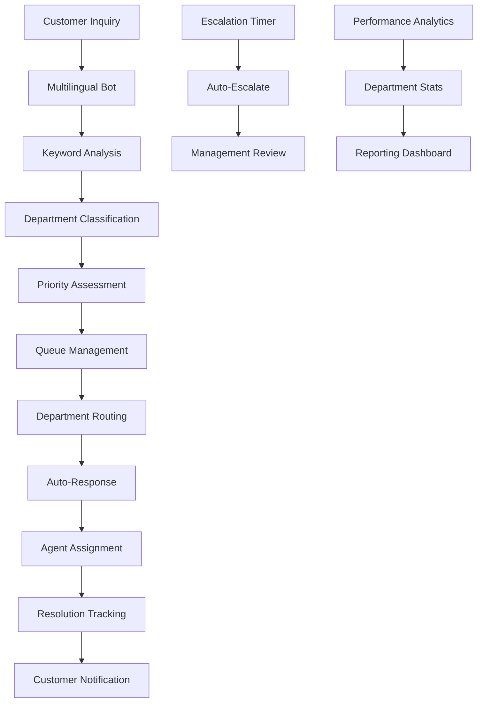

# 📱🏢 Fire22 Telegram Department System

Complete documentation for Fire22's departmental Telegram customer support
system with multilingual capabilities and intelligent routing.

## Table of Contents

- [Overview](#overview)
- [Department Channels](#department-channels)
- [System Architecture](#system-architecture)
- [Customer Experience](#customer-experience)
- [Department Management](#department-management)
- [API Reference](#api-reference)
- [Setup Guide](#setup-guide)
- [Troubleshooting](#troubleshooting)

## Overview

The Fire22 Telegram Department System provides intelligent customer support
routing across specialized department channels with multilingual support
(English, Spanish, Portuguese, French) and automated escalation workflows.

### Key Features

- ✅ **11 Specialized Department Channels**
- ✅ **Intelligent Keyword-Based Routing**
- ✅ **4-Language Multilingual Support**
- ✅ **Real-Time Queue Management**
- ✅ **Automated Escalation System**
- ✅ **Performance Analytics & Reporting**
- ✅ **24/7 Operations Support**

## Department Channels

### Primary Support Departments

| Department           | Channel                    | Keywords                                                          | Priority | Hours           |
| -------------------- | -------------------------- | ----------------------------------------------------------------- | -------- | --------------- |
| **Finance**          | `@fire22_finance_support`  | payment, deposit, withdrawal, balance, transaction, money, refund | High     | 09:00-18:00 EST |
| **Customer Support** | `@fire22_customer_support` | help, problem, issue, support, question, account, login           | Normal   | 24/7            |
| **Compliance**       | `@fire22_compliance`       | kyc, verification, document, identity, compliance, regulation     | High     | 09:00-17:00 EST |
| **Technology**       | `@fire22_tech_support`     | bug, error, technical, app, website, crash, loading               | Urgent   | 24/7            |
| **Operations**       | `@fire22_operations`       | betting, odds, game, casino, sports, live, wager                  | Normal   | 24/7            |

### Secondary Departments

| Department            | Channel                  | Purpose                             | Hours           |
| --------------------- | ------------------------ | ----------------------------------- | --------------- |
| **Marketing**         | `@fire22_marketing`      | Campaigns, promotions, partnerships | 09:00-18:00 EST |
| **Management**        | `@fire22_executive`      | Executive escalations, VIP support  | 09:00-17:00 EST |
| **Communications**    | `@fire22_communications` | Company updates, announcements      | 09:00-18:00 EST |
| **Design**            | `@fire22_design`         | UI/UX feedback, visual issues       | 09:00-18:00 EST |
| **Team Contributors** | `@fire22_team`           | Internal coordination, team updates | 24/7            |

### Special Purpose Channels

| Channel              | Purpose                                        | Access Level               |
| -------------------- | ---------------------------------------------- | -------------------------- |
| `@fire22_emergency`  | Critical system issues, security incidents     | All departments            |
| `@fire22_escalation` | Escalated inquiries requiring urgent attention | Management + Senior agents |
| `@fire22_help`       | General help desk, routing assistance          | Public                     |

### Bot Accounts

- **Main Bot**: `@Fire22SupportBot` - Primary customer interaction
- **Multilingual Bot**: `@Fire22MultiBot` - Language-specific routing

## System Architecture



### Core Components

#### 1. DepartmentalTelegramBot Class

- **File**: `src/telegram/departmental-telegram-bot.ts`
- **Purpose**: Main routing and management system
- **Features**: Keyword classification, queue management, escalation handling

#### 2. API Routes

- **File**: `src/api/routes/telegram-department.routes.ts`
- **Purpose**: RESTful endpoints for system interaction
- **Features**: Inquiry submission, stats retrieval, resolution tracking

#### 3. Team Directory Integration

- **File**: `src/communications/team-directory.json`
- **Purpose**: Channel configuration and contact information
- **Features**: Quick actions, channel mappings, department details

## Customer Experience

### Inquiry Flow

1. **Initial Contact**: Customer messages any Fire22 channel or bot
2. **Language Detection**: System detects user's preferred language
3. **Department Routing**: AI classifies inquiry and routes to appropriate
   department
4. **Auto-Response**: Immediate acknowledgment with queue position and wait time
5. **Agent Assignment**: Available agent claims the inquiry
6. **Resolution**: Agent resolves issue and marks as complete
7. **Feedback**: Optional satisfaction survey

### Sample Customer Interaction

```
Customer: "My withdrawal has been pending for 2 days, need help urgently"

Bot Response:
🏦 Hi! Thank you for contacting Fire22 Financial services and payment support.

You are currently #3 in queue.
Estimated wait time: 8 minutes.
Your inquiry has been marked as URGENT.
Support hours: 09:00 - 18:00

We'll respond as soon as possible!
```

### Multilingual Support

#### Supported Languages

- **English (en)**: Primary language, full feature support
- **Spanish (es)**: Complete translation, regional banking terms
- **Portuguese (pt)**: Brazilian Portuguese, local payment methods
- **French (fr)**: European French, regulatory compliance terms

#### Auto-Response Templates

All departments provide immediate responses in the customer's preferred language
with:

- Department-specific greeting
- Current queue position
- Estimated wait time
- Priority acknowledgment (if urgent)
- Support hours
- Encouraging closing message

## Department Management

### Performance Metrics

Each department tracks:

| Metric                    | Description                    | Target  |
| ------------------------- | ------------------------------ | ------- |
| **Total Inquiries**       | All inquiries received         | N/A     |
| **Pending Inquiries**     | Currently waiting for response | <10     |
| **Average Response Time** | Time to first agent response   | <15 min |
| **Satisfaction Score**    | Customer rating (1-5)          | >4.0    |
| **Active Agents**         | Currently online agents        | 2-8     |

### Escalation Workflow

#### Automatic Escalation

- **Finance**: 15 minutes without response
- **Customer Support**: 30 minutes without response
- **Compliance**: 20 minutes without response
- **Technology**: 10 minutes without response (urgent issues)
- **Operations**: 25 minutes without response

#### Manual Escalation

Agents can escalate inquiries immediately with reasons:

- Customer VIP status
- Regulatory compliance issue
- Technical system failure
- Fraud suspicion
- Executive request

### Agent Workflow

1. **Monitor Channel**: Watch for new inquiries in department channel
2. **Claim Inquiry**: React with ✅ to claim an inquiry
3. **Customer Contact**: Respond directly to customer via DM or channel
4. **Resolution**: Resolve issue and update inquiry status
5. **Documentation**: Add resolution notes for future reference

## API Reference

### Base URL

```
https://api.fire22.ag/api/telegram
```

### Endpoints

#### Submit Customer Inquiry

```http
POST /api/telegram/inquiry
Content-Type: application/json

{
  "user": {
    "id": 123456789,
    "username": "customer123",
    "first_name": "John",
    "last_name": "Doe",
    "language_code": "en"
  },
  "message": "I need help with my withdrawal",
  "priority": "high"
}
```

**Response:**

```json
{
  "success": true,
  "data": {
    "inquiryId": "F22-1A2B3C4D-XYZ89",
    "department": "finance",
    "estimatedWaitTime": 8,
    "autoResponse": "Hi! Thank you for contacting Fire22..."
  },
  "message": "Inquiry submitted successfully"
}
```

#### Get Department Statistics

```http
GET /api/telegram/departments/stats
GET /api/telegram/departments/finance/stats
```

**Response:**

```json
{
  "success": true,
  "data": {
    "totalInquiries": 245,
    "pendingInquiries": 3,
    "averageResponseTime": 12,
    "satisfactionScore": 4.3,
    "activeAgents": 4
  },
  "timestamp": "2025-08-28T15:30:00.000Z"
}
```

#### Get Available Departments

```http
GET /api/telegram/departments
```

#### Get Pending Inquiries

```http
GET /api/telegram/departments/finance/pending
```

#### Get Inquiry Details

```http
GET /api/telegram/inquiry/F22-1A2B3C4D-XYZ89
```

#### Escalate Inquiry

```http
POST /api/telegram/inquiry/F22-1A2B3C4D-XYZ89/escalate
Content-Type: application/json

{
  "reason": "Customer VIP status requires immediate attention"
}
```

#### Resolve Inquiry

```http
POST /api/telegram/inquiry/F22-1A2B3C4D-XYZ89/resolve
Content-Type: application/json

{
  "agentId": "agent123",
  "resolutionNotes": "Withdrawal processed successfully after verification"
}
```

#### Get Performance Report

```http
GET /api/telegram/reports/performance
```

#### Test System (Development)

```http
POST /api/telegram/test-inquiry
```

## Setup Guide

### For Department Administrators

#### 1. Channel Setup

```bash
# Create your department channel
# Example: @fire22_finance_support

# Add Fire22SupportBot as admin
/addadmin @Fire22SupportBot

# Configure channel description
/setdescription Fire22 Finance Department - Payment & Withdrawal Support

# Set channel rules
/setrules
1. React with ✅ to claim inquiries
2. Respond within department SLA times
3. Update inquiry status when resolved
4. Escalate if unable to resolve within time limit
```

#### 2. Agent Training

- **Response Templates**: Use consistent, professional language
- **Escalation Guidelines**: Know when and how to escalate
- **System Commands**: Learn bot commands for inquiry management
- **Language Support**: Basic phrases in supported languages

#### 3. Performance Monitoring

- Daily stats review via `/stats` command
- Weekly performance reports
- Customer satisfaction tracking
- Response time optimization

### For System Administrators

#### 1. Bot Configuration

```javascript
// Add new department
const newDepartment = {
  name: 'risk-management',
  channel: '@fire22_risk_management',
  keywords: ['risk', 'fraud', 'suspicious', 'review'],
  description: {
    en: 'Risk management and fraud prevention',
    es: 'Gestión de riesgos y prevención de fraude',
    pt: 'Gestão de riscos e prevenção de fraude',
    fr: 'Gestion des risques et prévention de la fraude',
  },
  priority: 'urgent',
  autoResponder: true,
  escalationTime: 5,
  supportHours: { start: '24/7', end: '24/7', timezone: 'UTC' },
};
```

#### 2. Monitoring Setup

```bash
# Enable performance monitoring
bun run monitor:telegram-departments

# Set up alerts for high queue volumes
bun run alerts:configure --department finance --threshold 20

# Generate daily reports
bun run reports:daily-telegram-stats
```

#### 3. Integration Testing

```bash
# Test all department routing
bun run test:telegram-routing

# Test multilingual responses
bun run test:telegram-languages

# Test escalation workflows
bun run test:telegram-escalation
```

## Troubleshooting

### Common Issues

#### Bot Not Responding

1. Check bot token validity
2. Verify channel permissions
3. Review API rate limits
4. Check error logs

#### Incorrect Routing

1. Review keyword configuration
2. Test classification algorithm
3. Update department mappings
4. Verify message preprocessing

#### Missing Languages

1. Confirm language code support
2. Update translation files
3. Test language detection
4. Verify template completeness

#### High Response Times

1. Check agent availability
2. Review queue management
3. Optimize escalation times
4. Add additional agents

### Performance Optimization

#### Queue Management

- Monitor peak hours and adjust staffing
- Implement priority queuing for VIP customers
- Use predictive analytics for demand forecasting

#### Response Templates

- Create context-specific auto-responses
- Implement dynamic wait time calculations
- Add proactive status updates for long waits

#### Agent Efficiency

- Provide real-time dashboard for agents
- Implement inquiry categorization shortcuts
- Create knowledge base integration

### Monitoring Commands

```bash
# Real-time department stats
curl https://api.fire22.ag/api/telegram/departments/stats

# Performance report
curl https://api.fire22.ag/api/telegram/reports/performance

# Test system health
curl -X POST https://api.fire22.ag/api/telegram/test-inquiry
```

## Best Practices

### For Agents

- ✅ Respond within department SLA times
- ✅ Use professional, friendly tone
- ✅ Provide clear, actionable solutions
- ✅ Update inquiry status promptly
- ✅ Escalate proactively when needed

### For Customers

- 🔍 Use specific keywords for faster routing
- 📱 Include account details when relevant
- 🕐 Check department support hours
- 💬 Be patient during peak hours
- ⭐ Provide feedback after resolution

### For Managers

- 📊 Review daily performance metrics
- 👥 Ensure adequate agent coverage
- 🎯 Set realistic SLA targets
- 🔄 Regularly update department keywords
- 📈 Monitor satisfaction scores

## Integration Points

### Fire22 Platform Integration

- Customer account lookup via customer ID
- Real-time balance and transaction data
- KYC status and document verification
- VIP status and service tier identification

### Internal Systems

- CRM system for inquiry tracking
- Knowledge base for quick responses
- Escalation workflows to management
- Performance analytics dashboard

---

## Support

For technical support with the Telegram Department System:

- **Documentation**: This file and inline code comments
- **API Testing**: Use `/api/telegram/test-inquiry` endpoint
- **Performance Issues**: Check `/api/telegram/reports/performance`
- **Emergency**: Contact `@fire22_emergency` channel

**Last Updated**: August 28, 2025  
**Version**: 1.0.0  
**Maintainer**: Fire22 Technology Team
