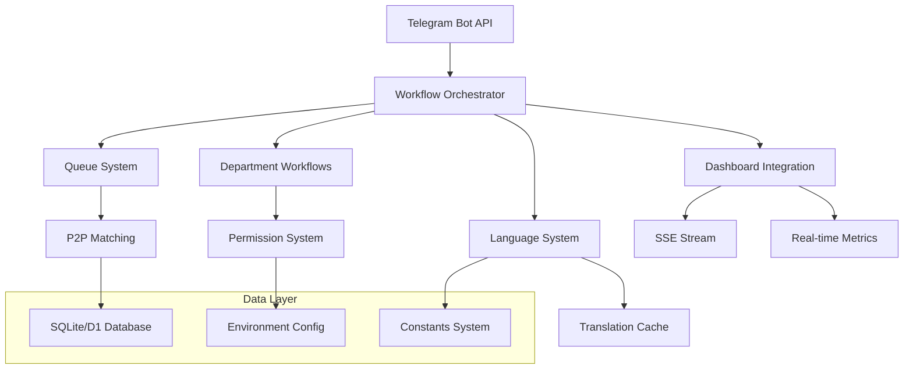

# 🔥📱 Fire22 Telegram System Integration

Complete documentation for the Fire22 Telegram bot system integration with
multilingual support, queue management, departmental workflows, and dashboard
connectivity.

## 📋 Table of Contents

1. [System Overview](#system-overview)
2. [Architecture](#architecture)
3. [Components](#components)
4. [Environment Configuration](#environment-configuration)
5. [Workflow System](#workflow-system)
6. [Queue Integration](#queue-integration)
7. [Dashboard Integration](#dashboard-integration)
8. [Language System](#language-system)
9. [Deployment](#deployment)
10. [API Reference](#api-reference)

## 🎯 System Overview

The Fire22 Telegram integration provides a complete multilingual bot system
with:

- **4 Languages**: English, Spanish, Portuguese, French
- **6 Departments**: Customer Service, Finance, Operations, Compliance,
  Management, Technical
- **P2P Queue System**: Intelligent transaction matching
- **Real-time Dashboard**: Live metrics and monitoring
- **Workflow Orchestration**: Department-specific command flows
- **Environment Management**: Secure configuration handling

## 🏗️ Architecture



## 📦 Components

### Core Components

| Component                 | File                                             | Purpose                                   |
| ------------------------- | ------------------------------------------------ | ----------------------------------------- |
| **Integration Master**    | `src/telegram/telegram-integration.ts`           | Main orchestrator combining all systems   |
| **Workflow Orchestrator** | `src/telegram/telegram-workflow.ts`              | Command handling and department workflows |
| **Language System**       | `src/telegram/multilingual-telegram-bot.ts`      | 77 language codes across 4 languages      |
| **Environment Config**    | `src/telegram/telegram-env.ts`                   | Secure configuration and validation       |
| **Constants System**      | `src/telegram/telegram-constants.ts`             | Centralized configuration constants       |
| **Dashboard Integration** | `src/telegram/telegram-dashboard-integration.ts` | Real-time dashboard connectivity          |
| **Queue System**          | `src/queue-system.ts`                            | P2P transaction matching                  |

### Language Codes (77 Total)

```typescript
// Core system codes (L-1000 to L-1499)
L-1001: "Select Language"
L-1002: "User Management"
// ... 56 existing codes

// Telegram-specific codes (L-1500 to L-1520)
L-1500: "Welcome" - Bot welcome message
L-1501: "Account Linked" - Account linking confirmation
L-1502: "Transaction Alert" - Transaction notifications
L-1503: "System Alert" - System notifications
L-1504: "View Dashboard" - Dashboard button
L-1505: "Dismiss" - Dismiss button
L-1506: "New Deposit" - New deposit notification
L-1507: "Approve" - Approve button
L-1508: "Reject" - Reject button
L-1509: "Details" - Details button
L-1510: "P2P Match Found" - P2P match notification
L-1511: "Process Best Match" - Process match button
L-1512: "View All" - View all button
L-1513: "Wait for Better" - Wait for better match
L-1514: "Support Ticket Created" - Support ticket confirmation
L-1515: "Ticket Escalated" - Escalation notification
L-1516: "Acknowledge" - Acknowledge button
L-1517: "Escalate" - Escalate button
L-1518: "Registration Failed" - Registration error
L-1519: "Linking Failed" - Account linking error
L-1520: "Language Changed" - Language switch confirmation
```

## ⚙️ Environment Configuration

### Required Variables

```bash
# Bot Configuration (Required)
TELEGRAM_BOT_TOKEN=your_telegram_bot_token_here
TELEGRAM_WEBHOOK_URL=https://your-domain.com/telegram/webhook
TELEGRAM_WEBHOOK_SECRET=your_webhook_secret

# Database Configuration
DATABASE_URL=sqlite:./data/fire22.db
# DB binding handled automatically in Cloudflare Workers

# Fire22 API Integration
FIRE22_API_URL=https://api.fire22.ag
FIRE22_API_KEY=your_fire22_api_key
FIRE22_AGENT_TOKEN=your_fire22_agent_token

# Security (Production Required)
JWT_SECRET=your_jwt_secret_here
ENCRYPTION_KEY=your_32_character_encryption_key
SESSION_TIMEOUT=3600000

# Feature Flags
ENABLE_MULTILINGUAL=true
ENABLE_P2P_MATCHING=true
ENABLE_DEPARTMENT_WORKFLOWS=true
ENABLE_NOTIFICATIONS=true
ENABLE_METRICS=true

# Environment
ENVIRONMENT=development|staging|production
LOG_LEVEL=debug|info|warn|error
```

### Configuration Validation

```typescript
import { TelegramEnvironment } from './src/telegram/telegram-env';

const env = TelegramEnvironment.getInstance(process.env);
const validation = env.validateRequiredSecrets();

if (!validation.valid) {
  throw new Error(`Missing: ${validation.missing.join(', ')}`);
}
```

## 🔄 Workflow System

### Department Access Levels

```typescript
// Customer Service
CS_AGENT: Basic support access
CS_SENIOR: Escalation permissions
CS_MANAGER: Full CS management

// Finance
CASHIER: Transaction limit $5,000
SENIOR_CASHIER: Higher transaction limits
CASHIER_MANAGER: Approval permissions
FINANCE_DIRECTOR: Full finance access

// Operations
OPS_ANALYST: Queue viewing
OPS_SPECIALIST: Queue management
QUEUE_MANAGER: Full queue control ($100,000 limit)
OPS_DIRECTOR: Operations oversight

// Compliance
KYC_SPECIALIST: Document verification
COMPLIANCE_ANALYST: Risk assessment
SENIOR_COMPLIANCE: Investigation tools
CCO: Compliance oversight

// Management
MANAGER: Department management
DIRECTOR: Multi-department access
VP: Executive access
C_SUITE: Full system access

// Technical
DEVELOPER: System access
DEVOPS_ENGINEER: Infrastructure control
SENIOR_DEVOPS: Advanced system control
CTO: Technical oversight
```

### Command Flows

#### Customer Service Workflow

```
/start → CS Welcome → [Active Tickets | New Ticket | Stats | Escalate]
/support → Ticket Type → [Technical | Payment | Account | Security]
/escalate → Escalation Path → [Senior → Manager → Director]
```

#### Finance Workflow

```
/start → Finance Welcome → [Pending Approvals | Balances | Summary | Risk]
/balance → Balance Overview → [Refresh | Transactions | Deposit | Withdraw]
/approve → Transaction Review → [Approve | Reject | Details]
```

#### Operations Workflow

```
/start → Operations Welcome → [Queue Status | Process | Performance | Alerts]
/queue → Queue Overview → [Refresh | Process | Details]
/process → Queue Processing → [Start | Monitor | Complete]
```

## 🎯 Queue Integration

### P2P Matching Algorithm

```typescript
// Match scoring factors
const matchScore = calculateMatchScore(withdrawal, deposit);

// Factors:
// - Amount proximity (40% weight)
// - Payment type match (20% bonus)
// - Wait time priority (20% bonus)
// - Maximum wait bonus (20% bonus)

// Example match:
{
  withdrawalId: "uuid-1",
  depositId: "uuid-2",
  amount: 1000,
  matchScore: 95,
  processingTime: 0,
  status: "pending"
}
```

### Queue Configuration

```typescript
QUEUE_CONFIG = {
  MAX_RETRIES: 3,
  MATCH_TIMEOUT: 300000, // 5 minutes
  CLEANUP_INTERVAL: 3600000, // 1 hour
  MAX_AGE: 604800000, // 7 days

  PRIORITY_LEVELS: {
    LOW: 1,
    NORMAL: 2,
    HIGH: 3,
    URGENT: 4,
    CRITICAL: 5,
  },
};
```

### Queue Operations

```typescript
// Add to queue
const queueId = await queueSystem.addToQueue({
  type: 'withdrawal',
  customerId: 'customer123',
  amount: 1000,
  paymentType: 'bank_transfer',
  paymentDetails: 'account_info',
  priority: 2,
});

// Check status
const stats = queueSystem.getQueueStats();
// Returns: { totalItems, pendingWithdrawals, pendingDeposits,
//           matchedPairs, averageWaitTime, processingRate }

// Process matches
await queueSystem.processMatchedItems();
```

## 📊 Dashboard Integration

### Real-time Data Flow

```typescript
import TelegramDashboardIntegration from './src/telegram/telegram-dashboard-integration';

const dashboardIntegration = new TelegramDashboardIntegration(env);
await dashboardIntegration.start();

// Subscribe to real-time updates
dashboardIntegration.subscribeToUpdates(data => {
  console.log('New telegram data:', data);
});

// Get current data
const currentData = dashboardIntegration.getDashboardData();
```

### Dashboard Widgets

1. **Bot Status Widget**

   - Online/Offline status
   - Uptime tracking
   - Active users count
   - Messages per hour

2. **Queue Status Widget**

   - Pending withdrawals/deposits
   - Matched pairs count
   - Average wait time
   - Processing rate

3. **Language Distribution**

   - Users by language
   - Translation cache hits
   - Language switch frequency

4. **Department Activity**
   - Active tickets (CS)
   - Pending approvals (Finance)
   - Queue matches (Operations)

### SSE Integration

```typescript
// Server-Sent Events endpoint
const sseEndpoint = dashboardIntegration.createSSEEndpoint();

// Client-side connection
const eventSource = new EventSource('/api/telegram/stream');
eventSource.onmessage = event => {
  const data = JSON.parse(event.data);
  updateDashboard(data.data);
};
```

## 🌐 Language System

### Supported Languages

| Code | Language  | Flag | Users     |
| ---- | --------- | ---- | --------- |
| `en` | English   | 🇺🇸   | Primary   |
| `es` | Español   | 🇪🇸   | Secondary |
| `pt` | Português | 🇵🇹   | Secondary |
| `fr` | Français  | 🇫🇷   | Secondary |

### Translation Usage

```typescript
import { Fire22LanguageSystem } from './src/telegram/multilingual-telegram-bot';

const languageSystem = new Fire22LanguageSystem();

// Translate message
const message = await languageSystem.translate(
  'L-1500', // Welcome code
  'es', // Target language
  { name: 'Usuario' } // Variables
);

// Detect user language
const detectedLang = await languageSystem.detectUserLanguage(userId);

// Set user preference
await languageSystem.setUserLanguage(userId, 'pt');
```

### Language Switching

Users can switch languages via:

- `/language` command
- Inline keyboard buttons
- Automatic detection from Telegram settings

## 🚀 Deployment

### Development Setup

```bash
# Install dependencies
bun install --frozen-lockfile

# Set up environment
cp .env.example .env
# Edit .env with your configuration

# Start development
bun run dev
```

### Production Deployment

```bash
# Build for production
bun run build:production

# Deploy to Cloudflare Workers
bun run deploy

# Health check
curl https://your-domain.com/api/telegram/health
```

### Environment-Specific Configuration

```typescript
// Development
ENVIRONMENT = development;
LOG_LEVEL = debug;
ENABLE_METRICS = true;

// Production
ENVIRONMENT = production;
LOG_LEVEL = info;
ENABLE_METRICS = true;
CF_ZONE_ID = your_zone_id;
```

## 📡 API Reference

### Core Endpoints

```typescript
// Health check
GET /api/telegram/health
Response: { status: "healthy", checks: {...}, uptime: 3600 }

// System status
GET /api/telegram/status
Response: { status: "running", metrics: {...}, queue: {...} }

// Real-time stream
GET /api/telegram/stream
Response: Server-Sent Events stream

// Webhook handler
POST /telegram/webhook
Body: Telegram update object

// Send notification
POST /api/telegram/notify
Body: { userId: "123", message: "Hello", options: {} }
```

### Integration Methods

```typescript
// Start complete system
import Fire22TelegramIntegration from './src/telegram/telegram-integration';

const integration = await Fire22TelegramIntegration.createAndStart(env);

// Get system status
const status = integration.getSystemStatus();

// Process webhook
await integration.processWebhookUpdate(telegramUpdate);

// Send notification
await integration.sendNotification(userId, message);

// Add to queue
const queueId = await integration.addToQueue(queueItem);
```

## 🔧 Maintenance

### Monitoring

```bash
# Check system health
curl /api/telegram/health | jq '.checks'

# View real-time metrics
curl /api/telegram/status | jq '.metrics'

# Monitor queue
curl /api/telegram/status | jq '.queue'
```

### Troubleshooting

#### Common Issues

1. **Bot Not Responding**

   - Check `TELEGRAM_BOT_TOKEN`
   - Verify webhook URL accessibility
   - Review error logs

2. **Language Switching Not Working**

   - Verify translation files loaded
   - Check language code mapping
   - Review user preference storage

3. **Queue Matches Failing**

   - Check database connectivity
   - Verify queue configuration
   - Review matching algorithm

4. **Dashboard Not Updating**
   - Check SSE connection
   - Verify data collection interval
   - Review WebSocket fallback

### Performance Optimization

```typescript
// Configuration tuning
TRANSLATION_CACHE_SIZE = 1000; // Increase for more users
TRANSLATION_CACHE_TTL = 3600000; // 1 hour cache
RATE_LIMIT_COMMANDS = 20; // Commands per minute
QUEUE_PROCESSING_INTERVAL = 5000; // 5 second intervals
```

## 📈 Metrics & Analytics

### Key Performance Indicators

- **Response Time**: Target < 1 second
- **Uptime**: Target 99.9%
- **Match Rate**: Target 85%+
- **Error Rate**: Target < 5%
- **User Satisfaction**: Target 4.0+/5.0

### Monitoring Dashboard

The system provides comprehensive metrics through:

1. **Real-time Status**: Live bot and queue metrics
2. **Performance Tracking**: Response times and error rates
3. **Usage Analytics**: Language distribution and command frequency
4. **Department Metrics**: Ticket resolution and approval rates
5. **Queue Analytics**: Match rates and processing times

---

## 🎯 Quick Start

```typescript
// 1. Import the integration
import Fire22TelegramIntegration from './src/telegram/telegram-integration';

// 2. Create and start
const integration = await Fire22TelegramIntegration.createAndStart(env);

// 3. Check status
const status = integration.getSystemStatus();
console.log('Bot Status:', status.status);

// 4. Monitor health
const health = integration.getHealthCheck();
console.log('System Health:', health.status);
```

✅ **The Fire22 Telegram system is now fully integrated and ready for production
use!**

---

_For detailed implementation examples, see the individual component files in
`src/telegram/`_
