# Fire22 Dashboard API Data Flows

## Overview

Complete documentation of API data flows, endpoints, and data transformation
processes in the Fire22 Dashboard system.

## Table of Contents

- [API Architecture Overview](#api-architecture-overview)
- [Data Flow Patterns](#data-flow-patterns)
- [Authentication Flow](#authentication-flow)
- [Manager API Flows](#manager-api-flows)
- [Agent API Flows](#agent-api-flows)
- [Customer API Flows](#customer-api-flows)
- [Webhook Data Flows](#webhook-data-flows)
- [Real-Time Data Flows](#real-time-data-flows)
- [Data Transformation](#data-transformation)
- [Error Handling](#error-handling)
- [Rate Limiting](#rate-limiting)
- [Security Considerations](#security-considerations)

---

## API Architecture Overview

### System Components

```
[Client Applications] → [API Gateway] → [Service Layer] → [Database Layer]
                              ↓
                       [Authentication]
                              ↓
                       [Rate Limiting]
                              ↓
                       [Logging & Monitoring]
```

### API Layers

1. **Presentation Layer**

   - REST API endpoints
   - WebSocket connections
   - GraphQL queries (future)

2. **Business Logic Layer**

   - Wager processing
   - Commission calculations
   - Risk management
   - User management

3. **Data Access Layer**
   - Database queries
   - External API calls
   - Cache management
   - File operations

---

## Data Flow Patterns

### Request-Response Pattern

```
Client → API Gateway → Service → Database → Service → API Gateway → Client
   ↓         ↓         ↓         ↓         ↓         ↓         ↓
Request   Auth      Process   Query     Transform  Format   Response
```

### Event-Driven Pattern

```
Event Source → Event Bus → Event Handlers → Database → Notifications
     ↓           ↓            ↓            ↓           ↓
  Wager      Publish      Process      Store      Update UI
  Placement   Event       Business     Data       Real-time
```

### WebSocket Pattern

```
Client ←→ WebSocket Server ←→ Event System ←→ Database
   ↓           ↓                ↓            ↓
Subscribe   Connection      Event Loop    Data Changes
to Events   Management     Processing    Monitoring
```

---

## Authentication Flow

### JWT Token Flow

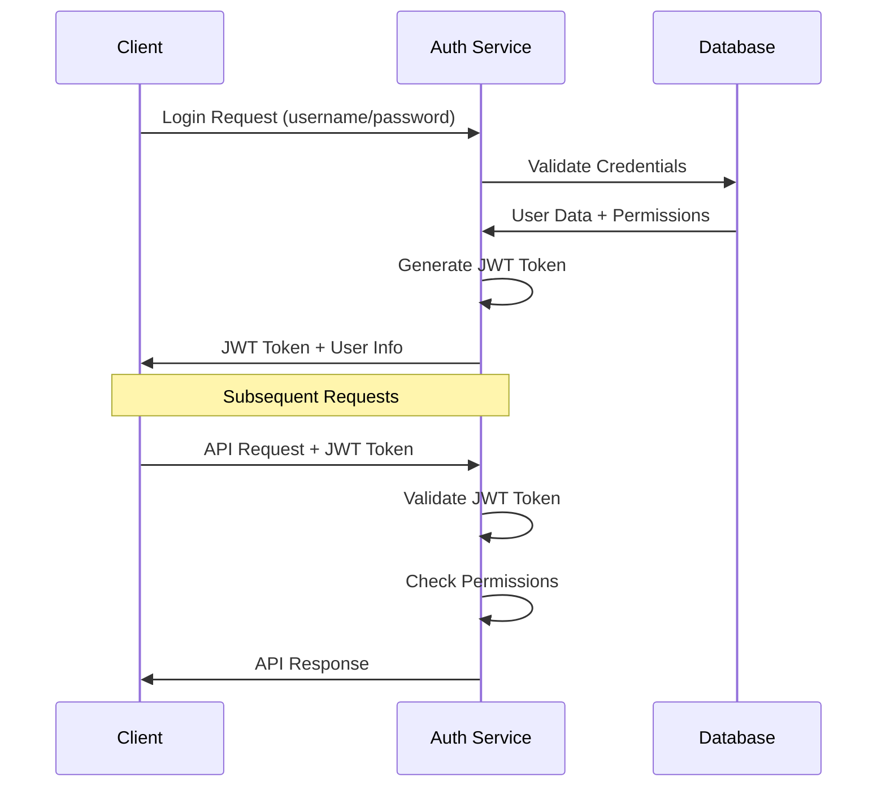

### Token Validation Process

1. **Extract Token**

   - Parse Authorization header
   - Extract JWT token
   - Validate format

2. **Verify Token**

   - Check signature
   - Validate expiration
   - Verify issuer

3. **Check Permissions**
   - Extract user role
   - Validate endpoint access
   - Check resource permissions

---

## Manager API Flows

### Weekly Analytics Flow

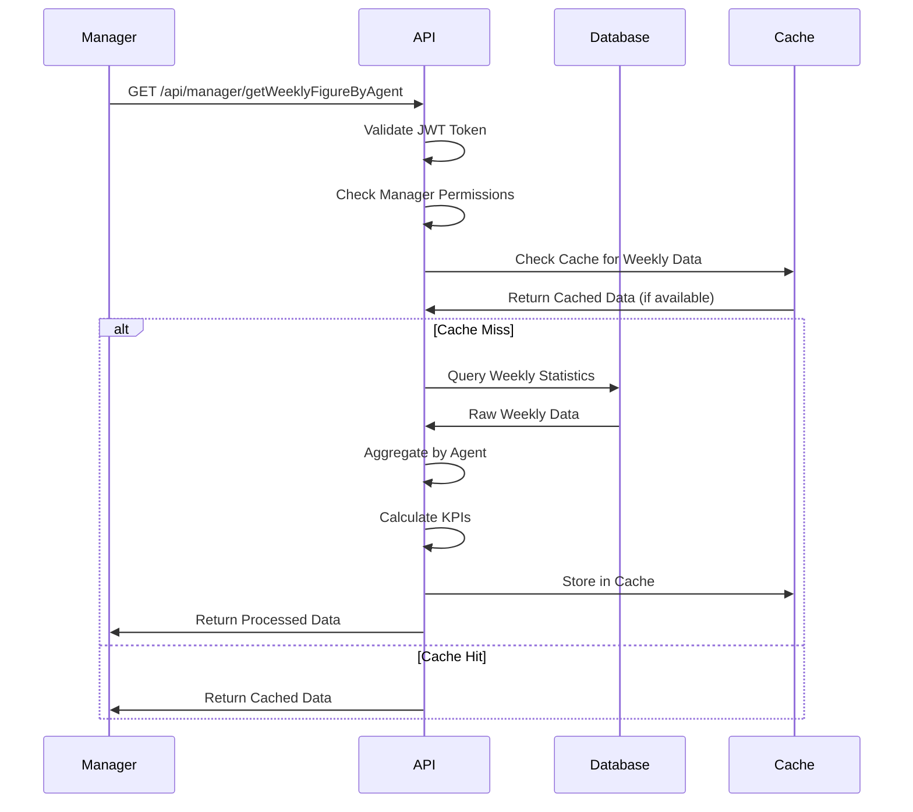

### Pending Operations Flow

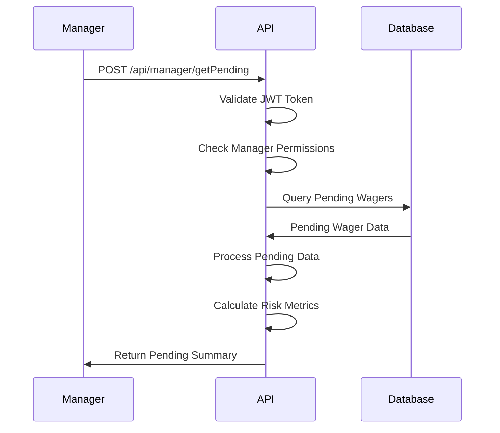

### Agent KPI Flow

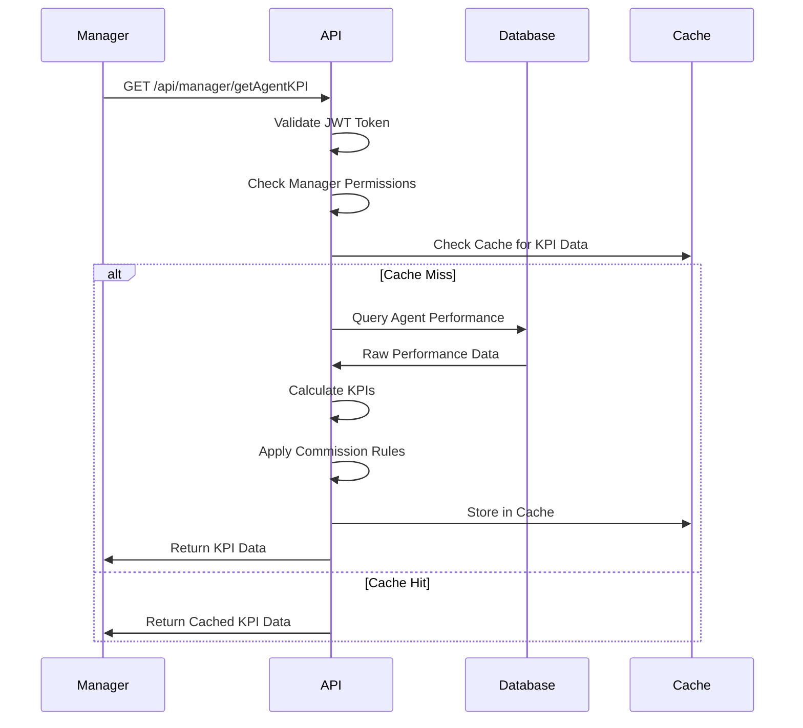

---

## Agent API Flows

### Customer Management Flow

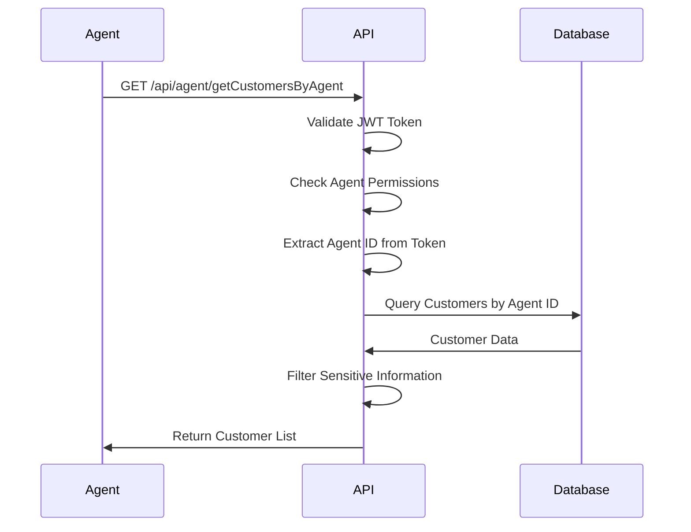

### Wager Management Flow

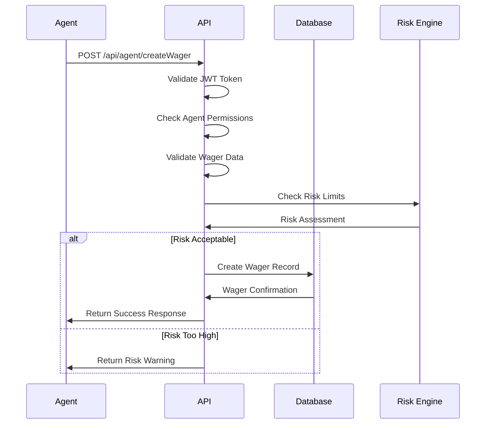

---

## Customer API Flows

### Wager Placement Flow

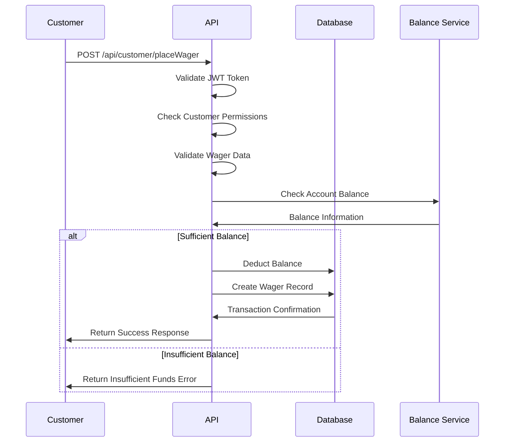

### Balance Management Flow

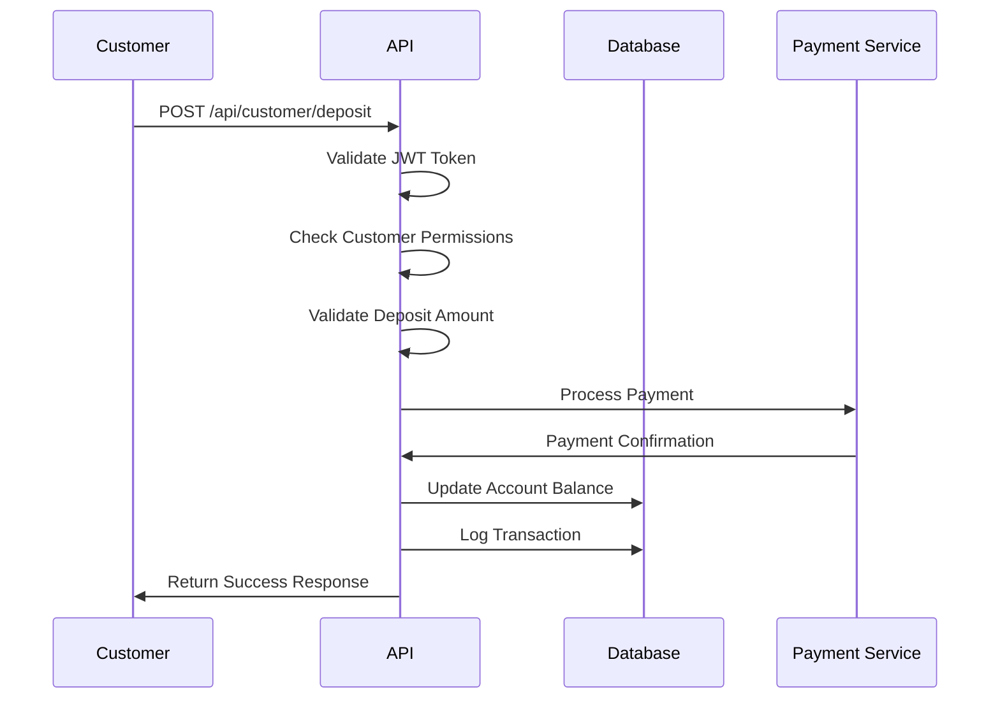

---

## Webhook Data Flows

### Stripe Webhook Flow

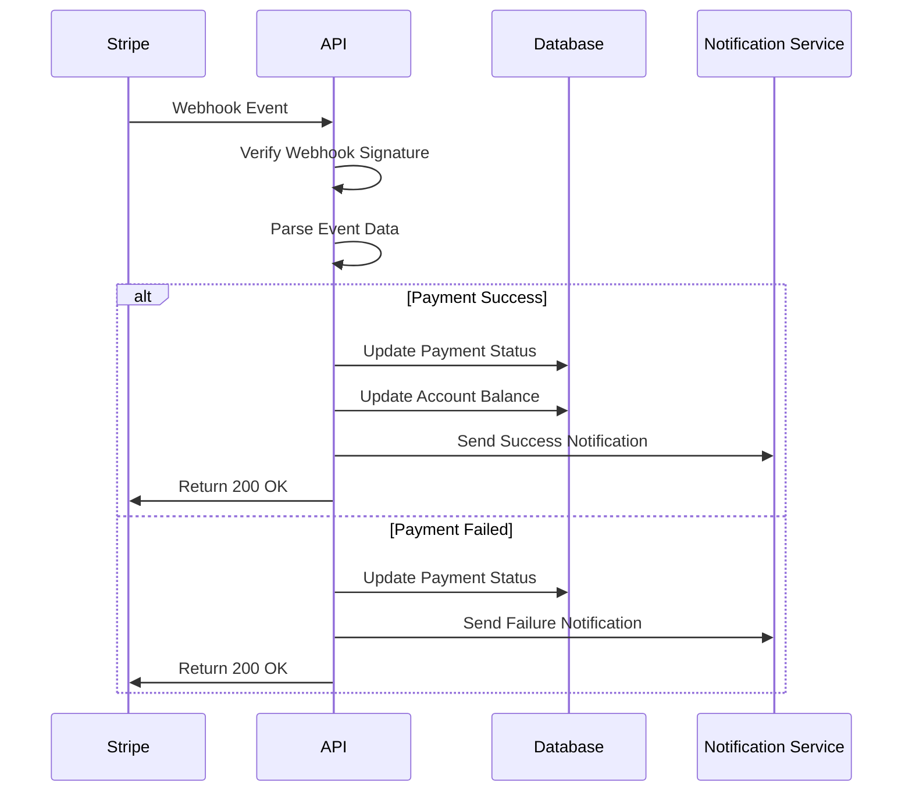

### Fire22 Webhook Flow

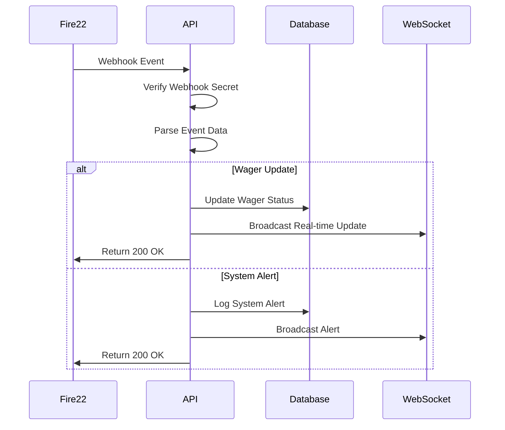

---

## Real-Time Data Flows

### WebSocket Data Flow

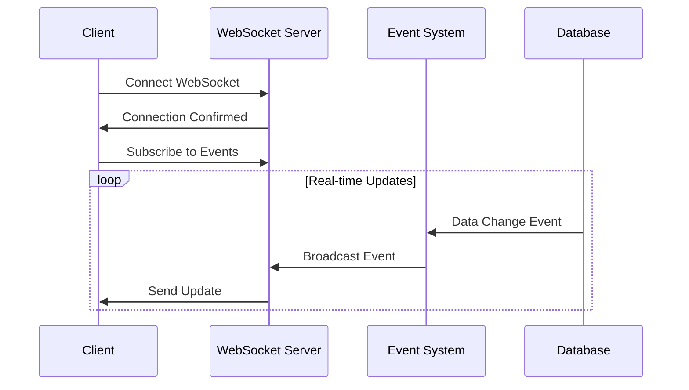

### Real-Time Update Types

1. **KPI Updates**

   - Revenue changes
   - Active player count
   - Pending wager count
   - Liability updates

2. **Wager Updates**

   - New wager placement
   - Wager status changes
   - Settlement results
   - Cancellation notices

3. **System Updates**
   - Performance alerts
   - Error notifications
   - Maintenance notices
   - Security alerts

---

## Data Transformation

### Input Validation

```typescript
interface ValidationSchema {
  required: string[];
  types: Record<string, string>;
  constraints: Record<string, any>;
  sanitization: Record<string, string>;
}
```

### Data Processing Pipeline

```
Raw Input → Validation → Sanitization → Transformation → Storage → Response
    ↓           ↓           ↓            ↓           ↓         ↓
  HTTP      Schema      Clean Data   Business    Database   Formatted
  Request   Check      (XSS/Injection) Logic     Storage    Response
```

### Response Formatting

```typescript
interface APIResponse<T> {
  success: boolean;
  data?: T;
  error?: string;
  message?: string;
  timestamp: string;
  requestId: string;
}
```

---

## Error Handling

### Error Response Structure

```typescript
interface ErrorResponse {
  success: false;
  error: {
    code: string;
    message: string;
    details?: any;
    timestamp: string;
    requestId: string;
  };
}
```

### Error Categories

1. **Client Errors (4xx)**

   - Validation errors
   - Authentication failures
   - Permission denied
   - Resource not found

2. **Server Errors (5xx)**
   - Internal server errors
   - Database connection issues
   - External service failures
   - System overload

### Error Handling Flow

```
Error Occurs → Log Error → Classify Error → Format Response → Send Response
     ↓           ↓          ↓              ↓              ↓
  Exception   Error      Error Type    Response      Client
  Thrown      Logging    Detection     Formatting    Response
```

---

## Rate Limiting

### Rate Limit Strategy

```typescript
interface RateLimitConfig {
  windowMs: number; // Time window in milliseconds
  maxRequests: number; // Maximum requests per window
  skipSuccessfulRequests: boolean;
  skipFailedRequests: boolean;
}
```

### Rate Limit Implementation

1. **Token Bucket Algorithm**

   - Fixed bucket size
   - Refill rate per second
   - Burst handling

2. **Sliding Window**
   - Rolling time window
   - Request counting
   - Smooth rate limiting

### Rate Limit Headers

```
X-RateLimit-Limit: 1000
X-RateLimit-Remaining: 999
X-RateLimit-Reset: 1642680000
```

---

## Security Considerations

### API Security Measures

1. **Authentication**

   - JWT token validation
   - Token expiration
   - Refresh token rotation

2. **Authorization**

   - Role-based access control
   - Resource-level permissions
   - API endpoint protection

3. **Data Protection**
   - Input sanitization
   - SQL injection prevention
   - XSS protection
   - CSRF protection

### Security Headers

```
X-Content-Type-Options: nosniff
X-Frame-Options: DENY
X-XSS-Protection: 1; mode=block
Strict-Transport-Security: max-age=31536000
```

---

## API Monitoring

### Key Metrics

1. **Performance Metrics**

   - Response time
   - Throughput
   - Error rates
   - Availability

2. **Business Metrics**
   - API usage patterns
   - User behavior
   - Feature adoption
   - Revenue impact

### Monitoring Tools

- **Real-time Monitoring**: Live API performance
- **Alert Systems**: Automated notifications
- **Logging**: Comprehensive request/response logs
- **Analytics**: Usage pattern analysis

---

## API Versioning

### Versioning Strategy

1. **URL Versioning**

   - `/api/v1/endpoint`
   - `/api/v2/endpoint`
   - Clear version separation

2. **Header Versioning**
   - `Accept: application/vnd.api+json;version=1`
   - Clean URLs
   - Flexible versioning

### Migration Strategy

- **Backward Compatibility**: Maintain old versions
- **Gradual Migration**: Phased rollout
- **Deprecation Notices**: Clear communication
- **Migration Tools**: Automated assistance

---

## Future API Enhancements

### Planned Features

1. **GraphQL Support**

   - Flexible queries
   - Reduced over-fetching
   - Schema introspection

2. **API Gateway**

   - Centralized routing
   - Load balancing
   - Circuit breakers

3. **Advanced Caching**
   - Redis integration
   - Cache invalidation
   - Smart caching strategies

### Technology Roadmap

- **Short-term**: Performance optimization
- **Medium-term**: New API features
- **Long-term**: Architecture evolution
- **Continuous**: Security improvements

---

_Last Updated: 2024-01-20_ _Version: 1.0_ _Maintainer: Fire22 Development Team_
