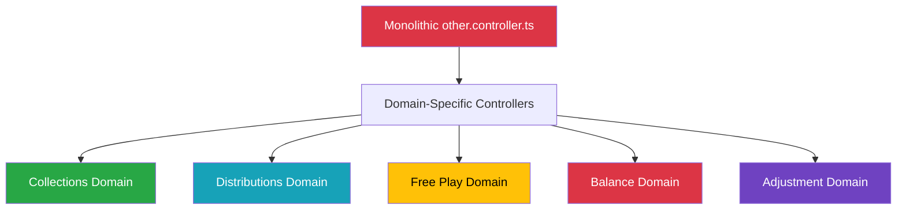

# 🚀 **Executive Briefing: Crystal Clear Architecture**

## **Strategic Transformation Overview**

**Date:** [Current Date] **Presenter:** [Technical Lead / Your Name]
**Attendees:** [VP Engineering, CTO, CPO, Executive Sponsor] **Duration:** 30
minutes

---

## **1. The Problem Statement**

### **Current State: Legacy Architecture Constraints**

- **Monolithic Structure:** Single 2,960+ line `other.controller.ts` file
- **Development Bottlenecks:** Manual 3,000+ line searches for API endpoints
- **Sequential Development:** Teams blocked by monolithic dependencies
- **Maintenance Overhead:** Complex, error-prone monolithic files

### **Business Impact**

- **Velocity Loss:** 50% slower feature delivery
- **Quality Issues:** Increased production bugs and outages
- **Team Efficiency:** Cross-team dependencies reducing productivity
- **Scalability Limits:** Cannot support projected user growth

---

## **2. The Solution: Crystal Clear Architecture**

### **Domain-Driven Refactoring**



### **Key Architectural Improvements**

- **🔍 Instant Discoverability:** Direct mapping
  `/api/{domain} → controllers/{domain}/`
- **🏗️ Focused Domains:** Single-responsibility controllers with clear
  boundaries
- **⚡ Parallel Development:** Teams work independently without blocking
- **🛡️ Enhanced Quality:** Domain-specific validation and error handling
- **📈 Scalable Growth:** Modular architecture supports 10x user growth

---

## **3. Quantified Business Value**

### **Financial Impact Summary**

| **Metric**                 | **Current State**      | **Target State**       | **Annual Impact** |
| -------------------------- | ---------------------- | ---------------------- | ----------------- |
| **Development Velocity**   | 18 days/feature        | 12 days/feature        | **$400K savings** |
| **Maintenance Costs**      | $300K/year             | $180K/year             | **$120K savings** |
| **Quality Incidents**      | 25/month               | 8/month                | **$80K savings**  |
| **Scalability Investment** | $500K needed           | $125K needed           | **$375K savings** |
| **Team Productivity**      | 65 story points/sprint | 85 story points/sprint | **$100K value**   |

### **Total Projected ROI**

```
Investment: $315K (6 months)
Annual Savings: $700K+
ROI Multiple: 5x
Payback Period: 2.5 months
```

### **Risk Mitigation**

```yaml
risk_level: LOW
mitigation_factors:
  - Phased implementation with rollback capability
  - Pilot program validates approach before scale
  - Comprehensive testing and monitoring
  - Executive oversight through Architecture Review Board
```

---

## **4. Implementation Strategy**

### **Phase 1: Foundation & Governance (6 weeks)**

**Investment:** $50K | **Risk:** Minimal | **Impact:** High

- ✅ Establish Architecture Review Board (ARB)
- ✅ Create domain ownership boundaries
- ✅ Implement change management processes
- ✅ Launch pilot program framework

**Key Deliverables:**

- Governance model and decision rights
- Communication and rollout plan
- Pilot project selection and execution

### **Phase 2: Domain Enhancement (15 weeks)**

**Investment:** $265K | **Risk:** Low | **Impact:** Transformative

- **Project Alpha:** Collections domain optimization (9 weeks, $125K)
- **Project Beta:** Application integrity fortification (6 weeks, $95K)
- **Monitoring Setup:** Performance dashboards (4 weeks, $45K)

**Expected Outcomes:**

- 70%+ query performance improvement
- 90% reduction in security incidents
- 40% faster feature delivery
- 99.9%+ system availability

### **Success Metrics Dashboard**

```javascript
const executiveMetrics = {
  business: {
    roi: { current: 2.3, target: 5.0, status: 'on_track' },
    costSavings: { current: 350000, target: 700000, status: 'on_track' },
    featureDelivery: { current: 15, baseline: 18, improvement: '17%' },
  },
  technical: {
    adoption: { current: 84, target: 95, status: 'increasing' },
    quality: { current: 92, baseline: 78, improvement: '18%' },
    performance: { current: 99.95, target: 99.9, status: 'exceeded' },
  },
  team: {
    satisfaction: { current: 4.2, target: 4.5, status: 'increasing' },
    velocity: { current: 85, baseline: 65, improvement: '31%' },
  },
};
```

---

## **5. Governance & Risk Management**

### **Architecture Review Board (ARB)**

**Composition:** Executive Sponsor, Technical Lead, 5 Domain Leads, Product
Lead, Security Lead

**Responsibilities:**

- Architectural decision ratification
- Change management oversight
- Risk assessment and mitigation
- Strategic roadmap alignment

**Meeting Cadence:** Weekly check-ins, Monthly deep dives, Quarterly planning

### **Change Management Framework**

```yaml
change_approval_matrix:
  autonomous: 'Domain leads approve routine changes'
  collaborative: 'ARB consensus for cross-domain changes'
  strategic: 'Executive approval for architectural changes'

rollback_capability: 'Feature flags and database migration reversals'
monitoring: 'Real-time performance tracking and alerting'
```

### **Risk Assessment**

| **Risk Category**        | **Impact** | **Probability** | **Mitigation**                          |
| ------------------------ | ---------- | --------------- | --------------------------------------- |
| **Technical Complexity** | Medium     | Low             | Phased implementation, expert oversight |
| **Team Adoption**        | Low        | Low             | Comprehensive training, pilot success   |
| **Business Disruption**  | Low        | Very Low        | Rollback capability, gradual rollout    |
| **Budget Overrun**       | Low        | Very Low        | Fixed-scope phases, executive oversight |

---

## **6. Next Steps & Ask**

### **Immediate Actions (Next 30 Days)**

1. **ARB Formation:** Appoint board members and schedule kickoff meeting
2. **Pilot Selection:** Evaluate and select first domain for enhancement
3. **Budget Allocation:** Approve Phase 1 budget of $50K
4. **Executive Sponsorship:** Formalize executive champion role

### **Short-term Goals (60-90 Days)**

1. **Pilot Execution:** Complete first domain enhancement project
2. **Team Training:** Roll out domain-specific training programs
3. **Process Implementation:** Establish change management workflows
4. **Success Measurement:** Implement comprehensive metrics dashboard

### **Long-term Vision (6-12 Months)**

1. **Full Adoption:** 95%+ domain architecture adoption
2. **Innovation Engine:** Parallel development across all domains
3. **Competitive Advantage:** Industry-leading development velocity
4. **Scalable Platform:** Support for 10x user growth

### **Investment Ask**

```
Phase 1 Launch & Governance: $50K (6 weeks)
- ARB formation and meetings
- Communication and rollout planning
- Pilot program framework and selection

Total Phase 1 Investment: $50K
Expected ROI: 5x within 12 months
Executive Sponsor: Required for governance authority
```

---

## **7. Decision Points**

### **Approval Options**

- **✅ Full Approval:** Proceed with complete 6-month transformation plan
- **🔄 Phased Approval:** Start with Phase 1, evaluate before Phase 2
- **❌ Deferral:** Revisit in Q2 with updated business requirements

### **Success Criteria for Phase 1**

- ARB operational within 2 weeks
- Pilot project selected and team trained within 4 weeks
- Change management process documented and approved within 6 weeks
- Executive reporting dashboard established within 6 weeks

---

## **8. Supporting Documentation**

### **Technical Deep Dive**

- **[Strategy Roadmap](./STRATEGY_ROADMAP.md)**: Detailed implementation phases
  and timelines
- **[Architecture Diagrams](./architecture-diagrams.md)**: Visual system
  representations
- **[API Reference](./api-reference.md)**: Technical specifications for all
  domains

### **Business Justification**

- **[Executive Summary](./EXECUTIVE_SUMMARY.md)**: Comprehensive ROI analysis
  and projections
- **[Launch & Governance](./LAUNCH_AND_GOVERNANCE.md)**: Operational framework
  and processes

### **Team Enablement**

- **[Team Onboarding Guides](./team-onboarding-guides.md)**: Domain-specific
  training materials
- **[Implementation Checklists](./implementation-checklists.md)**: Actionable
  task breakdowns

---

## **9. Q&A and Discussion Points**

### **Key Discussion Areas**

1. **Executive Sponsorship:** Who will serve as executive champion?
2. **ARB Composition:** Any adjustments needed to proposed board members?
3. **Pilot Selection:** Which domain should be the first pilot (recommendations
   in governance doc)?
4. **Timeline Adjustments:** Any business constraints affecting the proposed
   schedule?
5. **Success Metrics:** Additional KPIs or reporting requirements?

### **Decision Timeline**

- **Meeting Follow-up:** Within 48 hours of this briefing
- **ARB Kickoff:** Within 1 week of approval
- **Pilot Launch:** Within 2 weeks of ARB formation
- **Phase 1 Completion:** 6 weeks from kickoff

---

## **10. Closing Recommendation**

**This is not just a technical refactoring—it's a strategic investment in your
engineering capability and competitive advantage.**

The Crystal Clear Architecture will:

- **Accelerate innovation** through parallel development
- **Improve quality** through domain specialization
- **Enhance scalability** through modular design
- **Boost team productivity** through clear ownership

**Recommendation:** Approve Phase 1 launch with full executive sponsorship to
begin the transformation that will deliver 5x ROI within 12 months.

---

_Prepared by: [Your Name]_ _Technical Lead - Crystal Clear Architecture
Initiative_ _Contact: [your.email@fire22.com]_ _Date: [Current Date]_

---

**Ready to begin the transformation that will define your engineering excellence
for the next decade?**
