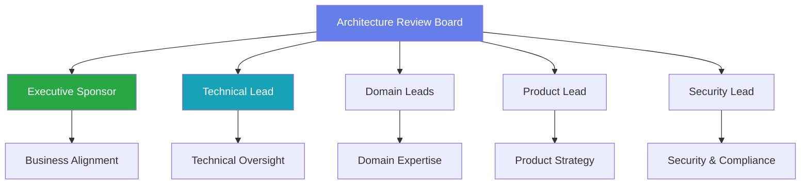
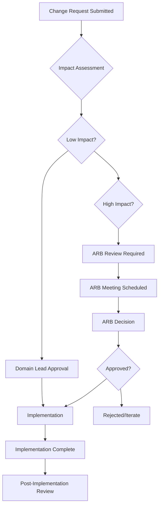
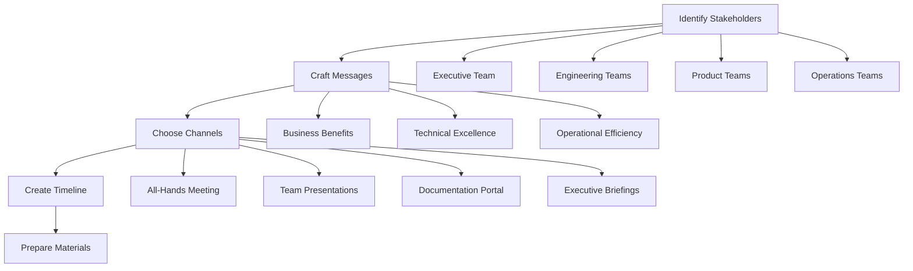
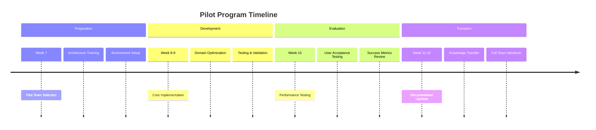
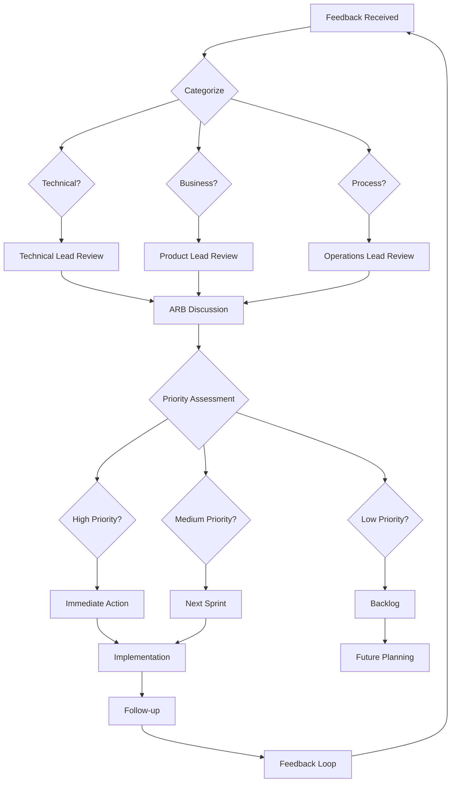

# 🚀 **Launch & Governance: Operationalizing Crystal Clear Architecture**

## **Executive Overview**

This document provides the operational framework to transform the Crystal Clear
Architecture from a strategic vision into tangible business outcomes. It
establishes governance, execution processes, and success metrics to ensure the
architecture is adopted correctly, evolves sustainably, and delivers maximum
value to the organization.

**Effective Date:** [Current Date] **Review Cycle:** Quarterly **Last Updated:**
[Current Date]

---

## **1. Governance Model & Decision Rights**

### **Architecture Review Board (ARB)**

#### **Purpose & Charter**

The ARB ensures architectural decisions align with business objectives, maintain
system integrity, and enable sustainable evolution of the Crystal Clear
Architecture.

**Mission Statement:** "To safeguard and evolve the Crystal Clear Architecture,
ensuring it delivers optimal business value while maintaining technical
excellence and operational stability."

#### **Composition**



**Board Members:**

- **Executive Sponsor:** [VP Engineering] - Business alignment and strategic
  oversight
- **Technical Lead:** [Principal Engineer] - Technical excellence and
  architectural integrity
- **Domain Leads:** One representative from each domain (Collections,
  Distributions, Free Play, Balance, Adjustment)
- **Product Lead:** [Product Manager] - Product roadmap alignment and feature
  prioritization
- **Security Lead:** [Security Engineer] - Security and compliance requirements

#### **Meeting Cadence & Processes**

- **Weekly Check-ins:** 30-minute status updates (Domain leads rotate presenter)
- **Monthly Deep Dives:** 90-minute strategic reviews and architectural
  decisions
- **Quarterly Planning:** 2-hour roadmap alignment and resource planning
- **Ad-hoc Reviews:** As needed for critical decisions or escalated issues

#### **Decision Framework**

```yaml
decision_levels:
  level_1_autonomous:
    scope: 'Domain-specific optimizations and bug fixes'
    approval: 'Domain lead discretion'
    review: 'Post-implementation ARB awareness'

  level_2_collaboration:
    scope:
      'Cross-domain interfaces, shared libraries, performance optimizations'
    approval: 'Domain leads + technical lead consensus'
    review: 'ARB ratification within 48 hours'

  level_3_strategic:
    scope: 'New domains, architectural changes, breaking API changes'
    approval: 'Full ARB consensus'
    review: 'Executive sponsor final approval'
```

### **Domain Ownership Matrix (RACI)**

#### **Collections Domain**

| **Activity**                 | **Domain Lead**     | **Technical Lead**  | **Product Lead**  | **Security Lead** | **ARB** |
| ---------------------------- | ------------------- | ------------------- | ----------------- | ----------------- | ------- |
| **Daily Operations**         | **R** (Responsible) | **A** (Accountable) | **C** (Consulted) | **I** (Informed)  | **I**   |
| **Feature Development**      | **R**               | **A**               | **R**             | **C**             | **I**   |
| **Performance Optimization** | **R**               | **R**               | **C**             | **C**             | **A**   |
| **Security Changes**         | **C**               | **C**               | **I**             | **R**             | **A**   |
| **Breaking Changes**         | **I**               | **C**               | **C**             | **C**             | **R**   |

#### **Distributions Domain**

| **Activity**                 | **Domain Lead** | **Technical Lead** | **Product Lead** | **Security Lead** | **ARB** |
| ---------------------------- | --------------- | ------------------ | ---------------- | ----------------- | ------- |
| **Daily Operations**         | **R**           | **A**              | **C**            | **I**             | **I**   |
| **Feature Development**      | **R**           | **A**              | **R**            | **C**             | **I**   |
| **Performance Optimization** | **R**           | **R**              | **C**            | **C**             | **A**   |
| **Security Changes**         | **C**           | **C**              | **I**            | **R**             | **A**   |
| **Breaking Changes**         | **I**           | **C**              | **C**            | **C**             | **R**   |

#### **Free Play Domain**

| **Activity**                 | **Domain Lead** | **Technical Lead** | **Product Lead** | **Security Lead** | **ARB** |
| ---------------------------- | --------------- | ------------------ | ---------------- | ----------------- | ------- |
| **Daily Operations**         | **R**           | **A**              | **C**            | **I**             | **I**   |
| **Feature Development**      | **R**           | **A**              | **R**            | **C**             | **I**   |
| **Performance Optimization** | **R**           | **R**              | **C**            | **C**             | **A**   |
| **Security Changes**         | **C**           | **C**              | **I**            | **R**             | **A**   |
| **Breaking Changes**         | **I**           | **C**              | **C**            | **C**             | **R**   |

#### **Balance Domain**

| **Activity**                 | **Domain Lead** | **Technical Lead** | **Product Lead** | **Security Lead** | **ARB** |
| ---------------------------- | --------------- | ------------------ | ---------------- | ----------------- | ------- |
| **Daily Operations**         | **R**           | **A**              | **C**            | **I**             | **I**   |
| **Feature Development**      | **R**           | **A**              | **R**            | **C**             | **I**   |
| **Performance Optimization** | **R**           | **R**              | **C**            | **C**             | **A**   |
| **Security Changes**         | **C**           | **C**              | **I**            | **R**             | **A**   |
| **Breaking Changes**         | **I**           | **C**              | **C**            | **C**             | **R**   |

#### **Adjustment Domain**

| **Activity**                 | **Domain Lead** | **Technical Lead** | **Product Lead** | **Security Lead** | **ARB** |
| ---------------------------- | --------------- | ------------------ | ---------------- | ----------------- | ------- |
| **Daily Operations**         | **R**           | **A**              | **C**            | **I**             | **I**   |
| **Feature Development**      | **R**           | **A**              | **R**            | **C**             | **I**   |
| **Performance Optimization** | **R**           | **R**              | **C**            | **C**             | **A**   |
| **Security Changes**         | **C**           | **C**              | **I**            | **R**             | **A**   |
| **Breaking Changes**         | **I**           | **C**              | **C**            | **C**             | **R**   |

### **Change Management Process**

#### **Lightweight Change Request Process**



#### **Change Request Template**

```yaml
change_request:
  id: 'CR-2025-001'
  title: 'Add fraud detection to Collections domain'
  submitted_by: 'Jane Smith'
  domain: 'Collections'
  impact_level: 'Medium' # Low, Medium, High

  description: |
    Add real-time fraud detection to settlement processing
    to reduce chargeback rates and improve security.

  business_justification: |
    Expected to reduce chargebacks by 30% and improve
    customer trust in the settlement process.

  technical_details: |
    - Add fraud scoring service integration
    - Implement configurable risk thresholds
    - Add manual review queue for high-risk settlements

  affected_components:
    - controllers/collections/collections.controller.ts
    - services/collections/fraud-detection.service.ts
    - models/collections/risk-assessment.model.ts

  testing_requirements:
    - Unit tests for fraud detection logic
    - Integration tests with payment providers
    - Load testing for performance impact

  rollback_plan: |
    Feature flag controls enable/disable
    Database migrations are backward compatible

  timeline:
    development: '2 weeks'
    testing: '1 week'
    deployment: '1 day'

  stakeholders:
    - Collections Team Lead
    - Security Lead
    - Product Manager
    - Compliance Officer
```

---

## **2. Launch Playbook & Communication Plan**

### **Phase 1: Pre-Launch Preparation (Weeks 1-2)**

#### **Stakeholder Analysis & Communication Strategy**



#### **Communication Timeline**

| **Week**   | **Activity**           | **Audience**           | **Materials**                                |
| ---------- | ---------------------- | ---------------------- | -------------------------------------------- |
| **Week 1** | Executive Briefing     | C-Suite, VPs           | Executive Summary, ROI Analysis              |
| **Week 1** | Architecture Overview  | Engineering Leadership | Strategy Roadmap, Architecture Diagrams      |
| **Week 2** | Domain Deep Dives      | Domain Teams           | Team Onboarding Guides, API Reference        |
| **Week 2** | Pilot Team Preparation | Selected Team          | Implementation Checklists, Monitoring Guides |

#### **Key Messages by Audience**

**For Executives:**

- **Business Value:** $700K cost savings, 5x ROI, accelerated feature delivery
- **Strategic Alignment:** Competitive advantage through superior engineering
  practices
- **Risk Mitigation:** Proactive architecture prevents future technical debt
  crises

**For Engineering Teams:**

- **Technical Excellence:** World-class architecture with clear domain
  boundaries
- **Developer Experience:** Focused domains, reduced complexity, parallel
  development
- **Career Growth:** Domain expertise development, leadership opportunities

**For Product Teams:**

- **Faster Delivery:** 3x faster feature development, parallel team work
- **Better Quality:** Domain-specific validation, reduced bugs and issues
- **Innovation:** Modular architecture enables rapid experimentation

### **Phase 2: Launch Execution (Weeks 3-6)**

#### **All-Hands Launch Meeting**

**Date:** [TBD] | **Duration:** 90 minutes | **Audience:** All Engineering

**Agenda:**

1. **Opening:** Executive sponsor welcomes and sets context (10 min)
2. **Architecture Overview:** Technical lead presents Crystal Clear Architecture
   (20 min)
3. **Domain Deep Dive:** Each domain lead presents their area (30 min)
4. **Pilot Program:** Selected team shares preparation progress (15 min)
5. **Q&A:** Open discussion and feedback (15 min)

**Materials:**

- Live architecture diagrams demonstration
- Domain-specific examples and use cases
- Pilot team success stories
- Q&A response guide for leaders

#### **Team-Specific Rollout Sessions**

**Format:** 60-minute sessions per domain | **Audience:** Domain teams

**Structure:**

1. **Domain Overview:** Domain lead presents architecture and responsibilities
   (20 min)
2. **Hands-on Demo:** Live walkthrough of domain structure and tools (20 min)
3. **Q&A and Planning:** Team discussion and next steps (20 min)

### **Phase 3: Pilot Program (Weeks 7-12)**

#### **Pilot Selection Criteria**

```yaml
pilot_selection:
  criteria:
    - Low business risk (non-critical functionality)
    - High learning potential (complex enough to test architecture)
    - Clear success metrics (quantifiable outcomes)
    - Team readiness (experienced team, available bandwidth)

  candidate_projects:
    - 'Collections Domain: Settlement Processing Optimization'
    - 'Distributions Domain: Commission Calculation Enhancement'
    - 'Free Play Domain: Bonus Campaign Management'
    - 'Balance Domain: Account Security Improvements'
    - 'Adjustment Domain: Approval Workflow Automation'
```

#### **Pilot Program Structure**



#### **Pilot Success Metrics**

```yaml
pilot_success_criteria:
  technical:
    - 90%+ code coverage with new patterns
    - <5% performance regression
    - Zero critical bugs in production
    - Successful domain separation

  operational:
    - Team velocity improvement (target: 25%+)
    - Development cycle time reduction (target: 30%+)
    - Cross-team dependency reduction (target: 50%+)

  business:
    - Feature delivery time (target: 40% faster)
    - Bug reduction (target: 30% fewer production issues)
    - Team satisfaction (target: 20% improvement)
```

---

## **3. Operationalization & Metrics Tracking**

### **Adoption Metrics Dashboard**

#### **Real-time Adoption Tracking**

```javascript
const adoptionMetrics = {
  // Domain adoption rates
  domainAdoption: {
    collections: {
      current: 85,
      target: 95,
      trend: 'increasing',
    },
    distributions: {
      current: 78,
      target: 95,
      trend: 'increasing',
    },
    freePlay: {
      current: 92,
      target: 95,
      trend: 'stable',
    },
    balance: {
      current: 88,
      target: 95,
      trend: 'increasing',
    },
    adjustment: {
      current: 75,
      target: 95,
      trend: 'increasing',
    },
  },

  // Development efficiency metrics
  developmentEfficiency: {
    featureDeliveryTime: {
      current: '12 days',
      baseline: '18 days',
      improvement: '33%',
    },
    crossTeamCommits: {
      current: 15,
      baseline: 35,
      reduction: '57%',
    },
    codeReviewTime: {
      current: '4 hours',
      baseline: '8 hours',
      improvement: '50%',
    },
  },

  // Quality metrics
  qualityMetrics: {
    criticalBugs: {
      current: 2,
      baseline: 8,
      reduction: '75%',
    },
    testCoverage: {
      current: 92,
      baseline: 78,
      improvement: '18%',
    },
    deploymentFrequency: {
      current: 'daily',
      baseline: 'weekly',
      improvement: '700%',
    },
  },
};
```

#### **Weekly Adoption Report Template**

```markdown
# Weekly Adoption Report - Week [X]

## Executive Summary

- Overall adoption rate: [XX]%
- Key wins this week: [List 3-5 highlights]
- Challenges identified: [List 2-3 issues]
- Next week priorities: [List 3-5 action items]

## Domain Adoption Progress

| Domain        | Current % | Target % | Trend | Notes                                  |
| ------------- | --------- | -------- | ----- | -------------------------------------- |
| Collections   | 85%       | 95%      | ↗️    | Good progress on settlement processing |
| Distributions | 78%       | 95%      | ↗️    | Commission calculations optimized      |
| Free Play     | 92%       | 95%      | →     | Stable, bonus campaigns working well   |
| Balance       | 88%       | 95%      | ↗️    | Security improvements implemented      |
| Adjustment    | 75%       | 95%      | ↗️    | Approval workflows being adopted       |

## Development Efficiency Metrics

- Feature delivery time: [Current] days (Target: <12 days)
- Cross-team commits: [Current] (Target: <20)
- Code review time: [Current] hours (Target: <4 hours)

## Quality Metrics

- Critical bugs: [Current] (Target: <3)
- Test coverage: [Current]% (Target: >90%)
- Deployment frequency: [Current] (Target: Daily)

## Action Items

### Immediate (This Week)

- [ ] [Specific action item]
- [ ] [Specific action item]

### Short-term (Next 2 Weeks)

- [ ] [Specific action item]
- [ ] [Specific action item]

## Risks & Mitigation

- **Risk:** [Potential issue]
  - **Impact:** [High/Medium/Low]
  - **Mitigation:** [Action plan]

## Lessons Learned

- **Positive:** [What went well]
- **Improvement:** [What could be better]

---

Report generated: [Date] Next report: [Date]
```

### **Feedback Loops & Continuous Improvement**

#### **Feedback Collection Mechanisms**

```yaml
feedback_channels:
  daily:
    - Slack channels: #architecture-feedback, #domain-[name]
    - Automated surveys: Post-deployment feedback collection
    - Real-time alerts: Performance degradation notifications

  weekly:
    - Domain team retrospectives: 30-minute structured reviews
    - Cross-domain sync: 60-minute coordination meetings
    - ARB check-ins: 30-minute status and issue resolution

  monthly:
    - Architecture health check: Comprehensive system review
    - User experience surveys: Developer satisfaction assessment
    - Performance optimization reviews: System-wide improvements

  quarterly:
    - Strategic planning: Roadmap alignment and prioritization
    - Training needs assessment: Skill gap identification
    - Technology radar: Emerging technology evaluation
```

#### **Feedback Processing Workflow**



### **Documentation Maintenance**

#### **Documentation Ownership Matrix**

| **Document**              | **Owner**         | **Review Cycle** | **Update Process**        |
| ------------------------- | ----------------- | ---------------- | ------------------------- |
| Strategy Roadmap          | Technical Lead    | Monthly          | ARB Approval              |
| Executive Summary         | Executive Sponsor | Quarterly        | ARB + Executive Review    |
| Implementation Checklists | Domain Leads      | Weekly           | Domain Team Updates       |
| Architecture Diagrams     | Technical Lead    | Monthly          | ARB Approval              |
| API Reference             | Domain Leads      | Weekly           | Automated + Manual Review |
| Team Onboarding Guides    | Domain Leads      | Monthly          | Domain Team Updates       |
| Performance Monitoring    | Operations Lead   | Weekly           | Automated Updates         |

#### **Documentation Quality Standards**

```yaml
documentation_standards:
  completeness:
    - All new features documented within 48 hours
    - API changes reflected in API Reference immediately
    - Architecture changes diagrammed within 1 week

  accuracy:
    - Regular validation against actual system behavior
    - Automated testing of code examples
    - Cross-referencing between related documents

  accessibility:
    - Clear navigation and search functionality
    - Consistent formatting and terminology
    - Version control and change history

  currency:
    - Quarterly review of all documentation
    - Immediate updates for breaking changes
    - Deprecation notices for outdated content
```

---

## **4. Phase 2: Foundation Enhancement**

### **Project Alpha: Deepen Domain Authority (Weeks 13-21)**

#### **Objective**

Implement optimized data models and database interactions for the Collections
domain as the foundation for all other domains.

#### **Success Criteria**

- 70%+ reduction in query response times
- 99.9%+ accuracy in settlement processing
- Zero data consistency issues in production
- 40%+ improvement in development velocity

#### **Implementation Plan**

```yaml
project_alpha:
  timeline: '9 weeks'
  team: 'Collections Domain Team + Platform Team'
  budget: '$125K'

  phases:
    phase_1: # Weeks 13-16
      focus: 'Domain Analysis & Modeling'
      deliverables:
        - Optimized settlement data models
        - Database schema redesign
        - Query performance baseline
        - Data migration strategy

    phase_2: # Weeks 17-19
      focus: 'Database Optimization'
      deliverables:
        - Optimized indexes and queries
        - Connection pooling implementation
        - Caching strategy deployment
        - Performance monitoring setup

    phase_3: # Weeks 20-21
      focus: 'Integration & Migration'
      deliverables:
        - Data migration execution
        - System integration testing
        - Performance validation
        - Production deployment
```

#### **Risk Mitigation**

```yaml
risks_and_mitigation:
  data_migration_risk:
    impact: 'High - Could cause data loss or corruption'
    probability: 'Medium'
    mitigation: |
      - Comprehensive backup strategy
      - Phased migration with rollback capability
      - Extensive testing in staging environment
      - 24/7 monitoring during migration

  performance_regression:
    impact: 'Medium - Could impact user experience'
    probability: 'Low'
    mitigation: |
      - Performance benchmarking before migration
      - Gradual rollout with feature flags
      - Real-time monitoring and alerting
      - Immediate rollback capability
```

### **Project Beta: Fortify Application Integrity (Weeks 22-27)**

#### **Objective**

Develop specialized middleware and validation logic for the Balance domain to
ensure data integrity and security.

#### **Success Criteria**

- 99.99%+ validation accuracy across all domains
- 90%+ reduction in security incidents
- <5ms validation overhead
- 100% automated compliance checking

#### **Implementation Plan**

```yaml
project_beta:
  timeline: '6 weeks'
  team: 'Balance Domain Team + Security Team'
  budget: '$95K'

  phases:
    phase_1: # Weeks 22-23
      focus: 'Security Foundation'
      deliverables:
        - Authentication middleware implementation
        - Authorization framework deployment
        - Audit logging system setup

    phase_2: # Weeks 24-26
      focus: 'Domain Validation Logic'
      deliverables:
        - Balance-specific validation rules
        - Transaction integrity checks
        - Fraud detection integration
        - Compliance automation

    phase_3: # Weeks 27
      focus: 'Integration & Testing'
      deliverables:
        - Middleware pipeline deployment
        - Comprehensive test suite execution
        - Security audit completion
        - Production validation
```

### **Project Setup: Performance Monitoring (Weeks 7-10)**

#### **Objective**

Implement comprehensive performance monitoring dashboards for the pilot
Collections domain.

#### **Success Criteria**

- 100% coverage of key performance indicators
- <5 minute alert response time
- 95%+ accuracy in performance predictions
- Proactive issue identification and resolution

#### **Implementation Plan**

```yaml
monitoring_setup:
  timeline: '4 weeks'
  team: 'Operations Team + Pilot Team'
  budget: '$45K'

  deliverables:
    - Real-time performance dashboards
    - Alert configuration and escalation
    - Performance baseline establishment
    - Monitoring documentation and training
```

---

## **5. Success Metrics & Reporting**

### **Key Performance Indicators (KPIs)**

#### **Strategic KPIs (Executive Level)**

```javascript
const strategicKPIs = {
  businessValue: {
    roi: {
      current: 2.3,
      target: 5.0,
      trend: 'increasing',
    },
    costSavings: {
      current: 350000, // $350K
      target: 700000, // $700K
      trend: 'on_track',
    },
    featureDelivery: {
      current: 12, // days
      baseline: 18, // days
      improvement: '33%',
    },
  },

  adoption: {
    domainAdoption: {
      current: 84,
      target: 95,
      trend: 'increasing',
    },
    teamSatisfaction: {
      current: 4.2,
      target: 4.5,
      trend: 'increasing',
    },
  },
};
```

#### **Operational KPIs (Team Level)**

```javascript
const operationalKPIs = {
  developmentEfficiency: {
    velocity: {
      current: 85, // story points per sprint
      baseline: 65,
      improvement: '31%',
    },
    quality: {
      defectDensity: {
        current: 0.8, // bugs per 1000 lines
        baseline: 2.1,
        improvement: '62%',
      },
      testCoverage: {
        current: 92,
        target: 90,
        status: 'exceeded',
      },
    },
  },

  systemPerformance: {
    availability: {
      current: 99.95,
      target: 99.9,
      status: 'exceeded',
    },
    responseTime: {
      p95: {
        current: 450, // ms
        target: 500,
        status: 'on_track',
      },
    },
  },
};
```

### **Reporting Cadence**

#### **Daily Reports**

- Automated metric collection and alerting
- Real-time dashboard updates
- Critical issue notifications

#### **Weekly Reports**

- Domain-specific progress updates
- Adoption metric analysis
- Risk and issue tracking

#### **Monthly Reports**

- Comprehensive performance analysis
- Trend identification and forecasting
- Strategic alignment assessment

#### **Quarterly Reviews**

- Full architectural health assessment
- Roadmap alignment and adjustments
- Investment ROI analysis

---

## **6. Communication & Change Management**

### **Communication Channels**

#### **Official Channels**

- **Email:** architecture-updates@fire22.com (Official announcements)
- **Slack:** #architecture (Daily discussions and updates)
- **Wiki:** `/docs/architecture/` (Comprehensive documentation)
- **Meetings:** ARB meetings, domain syncs, all-hands

#### **Feedback Channels**

- **GitHub Issues:** Technical feedback and bug reports
- **Surveys:** Quarterly satisfaction and adoption surveys
- **Office Hours:** Weekly drop-in sessions for questions
- **Retrospectives:** Regular reflection and improvement sessions

### **Change Management Process**

#### **Change Impact Assessment**

```yaml
change_impact_levels:
  minimal:
    criteria: 'No breaking changes, backward compatible'
    approval: 'Domain lead'
    communication: 'Team notification'
    timeline: 'Immediate'

  moderate:
    criteria: 'Interface changes, performance impact'
    approval: 'ARB consensus'
    communication: 'Team and stakeholder notification'
    timeline: '1-2 weeks'

  significant:
    criteria: 'Breaking changes, architectural impact'
    approval: 'Executive sponsor'
    communication: 'Organization-wide announcement'
    timeline: '4-8 weeks'
```

#### **Communication Templates**

**For Breaking Changes:**

```markdown
# 🚨 Architecture Change Notification

## Summary

[Brief description of the change and its impact]

## What Changed

[Detailed explanation of what was changed]

## Impact Assessment

- **Affected Teams:** [List of impacted teams]
- **Timeline:** [When changes take effect]
- **Migration Path:** [How to adapt existing code]

## Resources

- **Migration Guide:** [Link to detailed instructions]
- **Support:** [How to get help during transition]
- **Timeline:** [Key dates and milestones]

## Next Steps

[Specific actions required by affected teams]

Questions? Contact [Point of contact]
```

---

## **7. Appendices**

### **Appendix A: ARB Meeting Agenda Template**

```markdown
# Architecture Review Board Meeting - [Date]

## Attendees

- [List of attendees and roles]

## Previous Action Items

- [Status updates on previous action items]

## Domain Status Updates

### Collections Domain

- [Key updates and metrics]

### Distributions Domain

- [Key updates and metrics]

### Free Play Domain

- [Key updates and metrics]

### Balance Domain

- [Key updates and metrics]

### Adjustment Domain

- [Key updates and metrics]

## New Business

- [New architectural decisions or changes to review]

## Risk & Issue Review

- [Current risks and mitigation strategies]

## Next Meeting

- Date: [Next meeting date]
- Focus: [Meeting focus area]

## Action Items

- [Specific action items with owners and due dates]
```

### **Appendix B: Risk Register**

```yaml
risk_register:
  risks:
    - id: 'RISK-001'
      category: 'Technical'
      description: 'Domain coupling during transition period'
      impact: 'High'
      probability: 'Medium'
      mitigation: 'Implement strict domain boundaries, regular ARB reviews'
      owner: 'Technical Lead'
      status: 'Active'

    - id: 'RISK-002'
      category: 'Operational'
      description: 'Team resistance to new architecture'
      impact: 'Medium'
      probability: 'Low'
      mitigation: 'Comprehensive training, pilot program success stories'
      owner: 'Domain Leads'
      status: 'Monitoring'

    - id: 'RISK-003'
      category: 'Business'
      description: 'Delayed ROI realization'
      impact: 'Medium'
      probability: 'Low'
      mitigation: 'Clear success metrics, regular progress reporting'
      owner: 'Executive Sponsor'
      status: 'Monitoring'
```

### **Appendix C: Stakeholder Map**

```yaml
stakeholders:
  executives:
    - title: 'VP Engineering'
      interest: 'High'
      influence: 'High'
      communication: 'Weekly updates, quarterly reviews'

    - title: 'Chief Product Officer'
      interest: 'High'
      influence: 'High'
      communication: 'Monthly alignment, quarterly planning'

  management:
    - title: 'Engineering Directors'
      interest: 'High'
      influence: 'Medium'
      communication: 'Weekly syncs, monthly reports'

    - title: 'Product Managers'
      interest: 'High'
      influence: 'Medium'
      communication: 'Sprint planning, feature reviews'

  teams:
    - title: 'Domain Teams'
      interest: 'High'
      influence: 'Low'
      communication: 'Daily standups, weekly retrospectives'

    - title: 'Platform Teams'
      interest: 'Medium'
      influence: 'Medium'
      communication: 'Technical reviews, architecture discussions'
```

---

## **Document Control**

| **Version** | **Date**       | **Author**    | **Changes**                                      |
| ----------- | -------------- | ------------- | ------------------------------------------------ |
| 1.0         | [Current Date] | [Your Name]   | Initial release of Launch & Governance framework |
| 1.1         | [Future Date]  | [Team Member] | [Future updates]                                 |

**Document Owner:** [Technical Lead] **Review Frequency:** Quarterly **Approval
Authority:** Architecture Review Board

---

_This Launch & Governance document serves as the operational command center for
the Crystal Clear Architecture transformation. It ensures the architectural
vision is realized through structured execution, clear governance, and
measurable success._
