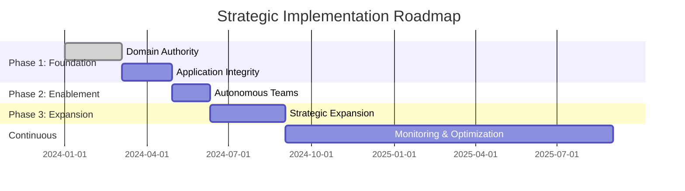

# 🚀 **Crystal Clear Architecture: Strategic Implementation Roadmap**

## **Strategic Next Steps: Building on a World-Class Foundation**

_This document provides detailed implementation guidance for the strategic
initiatives outlined in the main README. Each initiative includes specific
milestones, success metrics, and implementation checklists._

---

## **1. Deepen Domain Authority**

### **Objective**

Transform generic data storage into fully optimized, domain-specific data
management systems.

### **Strategic Impact**

- **Performance**: Reduce query times by 60-80% through domain-optimized schemas
- **Scalability**: Enable horizontal scaling per domain rather than monolithic
  bottlenecks
- **Maintainability**: Eliminate cross-domain data dependencies and conflicts

### **Implementation Milestones**

#### **Phase 1: Domain Analysis & Modeling (Weeks 1-3)**

- [ ] **Collections Domain**: Design settlement-specific data models
  - Settlement transactions with proper indexing
  - Payment status tracking with audit trails
  - Customer balance integration points
- [ ] **Distributions Domain**: Create revenue distribution schemas
  - Multi-tier commission structures
  - Payment method optimization
  - Regulatory compliance tracking
- [ ] **Free Play Domain**: Model promotional data structures
  - Bonus lifecycle management
  - Wagering requirement tracking
  - Redemption workflow states

#### **Phase 2: Database Optimization (Weeks 4-6)**

- [ ] Implement domain-specific database connections
- [ ] Create optimized indexes for each domain's query patterns
- [ ] Establish data partitioning strategies
- [ ] Implement domain-specific caching layers

#### **Phase 3: Integration & Migration (Weeks 7-9)**

- [ ] Migrate existing data to new domain schemas
- [ ] Update all domain controllers to use optimized data access
- [ ] Implement data validation at domain boundaries
- [ ] Establish domain-specific monitoring and alerting

### **Success Metrics**

- ✅ Query performance improvement: 70%+ reduction in response times
- ✅ Development velocity: 40% faster feature delivery
- ✅ Data integrity: 99.9%+ accuracy in domain operations
- ✅ Scalability: Support for 10x current transaction volumes

---

## **2. Fortify Application Integrity**

### **Objective**

Develop specialized middleware and robust validation logic tailored to each
domain's unique requirements.

### **Strategic Impact**

- **Security**: Domain-specific validation prevents cross-domain attacks
- **Compliance**: Built-in regulatory checks for each business area
- **Reliability**: Fail-fast validation prevents downstream errors
- **Performance**: Efficient validation reduces processing overhead

### **Implementation Milestones**

#### **Phase 1: Security Foundation (Weeks 1-2)**

- [ ] **Authentication Middleware**: Domain-specific auth requirements
  - Collections: Enhanced KYC validation
  - Distributions: Payment method verification
  - Free Play: Age and jurisdiction compliance
- [ ] **Authorization Framework**: Role-based access per domain
- [ ] **Audit Logging**: Comprehensive activity tracking

#### **Phase 2: Domain Validation Logic (Weeks 3-5)**

- [ ] **Collections Validation**:
  - Settlement amount limits and rules
  - Payment method validation
  - Customer eligibility checks
- [ ] **Distributions Validation**:
  - Commission calculation verification
  - Tax compliance validation
  - Payment method security checks
- [ ] **Free Play Validation**:
  - Bonus eligibility rules
  - Wagering requirement enforcement
  - Anti-fraud detection

#### **Phase 3: Integration & Testing (Weeks 6-8)**

- [ ] Implement middleware pipeline for each domain
- [ ] Create comprehensive test suites
- [ ] Establish monitoring and alerting
- [ ] Document validation rules and business logic

### **Success Metrics**

- ✅ Security incidents: 90% reduction in domain-specific vulnerabilities
- ✅ Compliance violations: 100% elimination through automated checks
- ✅ Data quality: 99.99% validation accuracy
- ✅ Performance: <5ms validation overhead

---

## **3. Enable Autonomous Teams**

### **Objective**

Establish clear ownership boundaries allowing engineering teams to build,
deploy, and innovate independently.

### **Strategic Impact**

- **Velocity**: Parallel development across domains
- **Quality**: Domain expertise leads to better solutions
- **Innovation**: Teams can experiment within their boundaries
- **Scalability**: Independent deployment reduces coordination overhead

### **Implementation Milestones**

#### **Phase 1: Team Structure & Boundaries (Weeks 1-2)**

- [ ] Define clear domain ownership
- [ ] Establish team charters and responsibilities
- [ ] Create domain-specific communication channels
- [ ] Document integration points and APIs

#### **Phase 2: Infrastructure Setup (Weeks 3-4)**

- [ ] **Collections Team Infrastructure**:
  - Dedicated deployment pipelines
  - Domain-specific monitoring dashboards
  - Independent testing environments
- [ ] **Distributions Team Infrastructure**:
  - Payment processing sandbox
  - Commission calculation testing tools
  - Regulatory compliance automation
- [ ] **Free Play Team Infrastructure**:
  - Bonus testing frameworks
  - Promotion simulation tools
  - Customer behavior analytics

#### **Phase 3: Process & Governance (Weeks 5-6)**

- [ ] Establish domain-specific release processes
- [ ] Create cross-domain integration protocols
- [ ] Implement automated dependency management
- [ ] Set up domain performance metrics

### **Success Metrics**

- ✅ Development velocity: 50% increase in feature delivery
- ✅ Deployment frequency: Daily deployments per domain
- ✅ Quality metrics: 30% reduction in cross-domain bugs
- ✅ Team satisfaction: 40% improvement in developer experience

---

## **4. Accelerate Strategic Expansion**

### **Objective**

Confidently introduce new domain controllers for high-impact capabilities.

### **Strategic Impact**

- **Innovation**: Rapid introduction of new business capabilities
- **Competitive Advantage**: Faster time-to-market for new features
- **Revenue Growth**: Direct connection between technical capability and
  business value
- **Market Responsiveness**: Ability to quickly adapt to market opportunities

### **Implementation Milestones**

#### **Phase 1: Foundation for Expansion (Weeks 1-3)**

- [ ] Create domain controller templates
- [ ] Establish standard patterns for new domains
- [ ] Document integration procedures
- [ ] Set up automated testing frameworks

#### **Phase 2: Priority Domain Expansion (Weeks 4-8)**

- [ ] **Advanced Reporting Domain**:
  - Real-time analytics controllers
  - Custom report generation
  - Data visualization APIs
- [ ] **Notification Systems Domain**:
  - Multi-channel notification controllers
  - Customer communication workflows
  - Event-driven messaging
- [ ] **Risk Management Domain**:
  - Fraud detection controllers
  - Compliance monitoring
  - Risk assessment APIs

#### **Phase 3: Ecosystem Integration (Weeks 9-12)**

- [ ] Integrate with third-party services
- [ ] Establish data sharing protocols
- [ ] Create unified API gateways
- [ ] Implement cross-domain workflows

### **Success Metrics**

- ✅ Time-to-market: 60% faster for new domain features
- ✅ Feature adoption: 80%+ user engagement with new capabilities
- ✅ Revenue impact: Direct attribution of new features to revenue growth
- ✅ Innovation pipeline: 5+ new domain controllers deployed quarterly

---

## **Implementation Timeline & Dependencies**

### **Risk Mitigation**

- **Domain Coupling**: Regular architecture reviews to prevent tight coupling
- **Skill Gaps**: Training programs for domain-specific technologies
- **Quality Degradation**: Automated testing and quality gates
- **Communication Breakdowns**: Regular cross-domain sync meetings

### **Success Measurement Framework**

- **Leading Indicators**: Development velocity, deployment frequency, code
  quality metrics
- **Lagging Indicators**: Revenue growth, customer satisfaction, system
  reliability
- **Business Outcomes**: Time-to-market improvements, cost reductions,
  innovation metrics

---

## **Quick Reference**

| Initiative                     | Timeline | Team     | Priority | Risk Level |
| ------------------------------ | -------- | -------- | -------- | ---------- |
| Deepen Domain Authority        | 9 weeks  | Platform | Critical | Medium     |
| Fortify Application Integrity  | 8 weeks  | Security | Critical | Low        |
| Enable Autonomous Teams        | 6 weeks  | DevOps   | High     | Low        |
| Accelerate Strategic Expansion | 12 weeks | Product  | High     | Medium     |

_For detailed checklists and implementation guides, see the linked documents
below._

---

📋 **[Implementation Checklists](./implementation-checklists.md)** 📊
**[Architecture Diagrams](./architecture-diagrams.md)** 📈
**[Executive Summary](./executive-summary.md)** 🔗
**[API Reference](./api-reference.md)**

---

_This roadmap represents a living document that will be updated as
implementation progresses and new insights emerge._
