# 🏗️ **Crystal Clear Architecture: Visual Diagrams**

## **Overview**

This document provides comprehensive visual representations of the domain-based
architecture, showing the relationships between domains, data flows, and
integration points.

---

## **1. Domain Architecture Overview**

```mermaid
graph TB
    subgraph "🎯 API Layer"
        Router[HTTP Router]
        Middleware[Domain Middleware]
        Validation[Input Validation]
    end

    subgraph "🏗️ Domain Layer"
        Collections[📊 Collections Domain]
        Distributions[💰 Distributions Domain]
        FreePlay[🎮 Free Play Domain]
        Balance[💳 Balance Domain]
        Adjustment[⚖️ Adjustment Domain]
    end

    subgraph "💾 Data Layer"
        DB[(SQLite Database)]
        Cache[(Redis Cache)]
        Files[(File Storage)]
    end

    subgraph "🔗 Integration Layer"
        Payments[💳 Payment Gateways]
        Notifications[📱 Notification Services]
        Analytics[📊 Analytics Platform]
        External[🔌 Third-party APIs]
    end

    Router --> Middleware
    Middleware --> Validation
    Validation --> Collections
    Validation --> Distributions
    Validation --> FreePlay
    Validation --> Balance
    Validation --> Adjustment

    Collections --> DB
    Distributions --> DB
    FreePlay --> DB
    Balance --> DB
    Adjustment --> DB

    DB --> Cache
    Cache --> Files

    Collections --> Payments
    Distributions --> Payments
    Balance --> Payments

    Collections --> Notifications
    Distributions --> Notifications
    FreePlay --> Notifications
    Balance --> Notifications
    Adjustment --> Notifications

    Collections --> Analytics
    Distributions --> Analytics
    FreePlay --> Analytics
    Balance --> Analytics
    Adjustment --> Analytics

    Payments --> External
    Notifications --> External
    Analytics --> External

    style Router fill:#667eea,color:#fff
    style Collections fill:#28a745,color:#fff
    style Distributions fill:#17a2b8,color:#fff
    style FreePlay fill:#ffc107,color:#000
    style Balance fill:#dc3545,color:#fff
    style Adjustment fill:#6f42c1,color:#fff
```



---

## **2. Domain-Specific Data Flow**

### **Collections Domain Data Flow**


### **Distributions Domain Data Flow**


### **Free Play Domain Data Flow**


---

## **3. Domain Relationships & Dependencies**


---

## **4. Error Handling & Resilience Patterns**


---

## **5. Performance Optimization Architecture**

```mermaid
graph TD
    subgraph "🌐 Client Layer"
        CDN[CDN / Edge Network]
        LoadBalancer[Load Balancer]
    end

    subgraph "🚀 Application Layer"
        API[API Gateway]
        RateLimiter[Rate Limiter]
        Cache[Response Cache]
    end

    subgraph "🏗️ Domain Layer"
        Collections[Collections Domain]
        Distributions[Distributions Domain]
        FreePlay[Free Play Domain]
        Balance[Balance Domain]
        Adjustment[Adjustment Domain]
    end

    subgraph "💾 Data Layer"
        ReadReplica[(Read Replica)]
        WriteDB[(Primary DB)]
        CacheLayer[(Redis Cache)]
        SearchIndex[(Search Index)]
    end

    subgraph "📊 Monitoring Layer"
        Metrics[Metrics Collection]
        Alerts[Alert System]
        Logs[Centralized Logging]
    end

    CDN --> LoadBalancer
    LoadBalancer --> API
    API --> RateLimiter
    RateLimiter --> Cache

    Cache --> Collections
    Cache --> Distributions
    Cache --> FreePlay
    Cache --> Balance
    Cache --> Adjustment

    Collections --> ReadReplica
    Distributions --> ReadReplica
    FreePlay --> ReadReplica
    Balance --> ReadReplica
    Adjustment --> ReadReplica

    Collections --> WriteDB
    Distributions --> WriteDB
    FreePlay --> WriteDB
    Balance --> WriteDB
    Adjustment --> WriteDB

    ReadReplica --> WriteDB
    AllDomains --> CacheLayer
    AllDomains --> SearchIndex

    AllDomains --> Metrics
    Metrics --> Alerts
    AllDomains --> Logs

    style CDN fill:#e3f2fd,stroke:#1976d2
    style API fill:#f3e5f5,stroke:#7b1fa2
    style Collections fill:#e8f5e8,stroke:#2e7d32
    style Distributions fill:#fff3e0,stroke:#ef6c00
    style FreePlay fill:#fce4ec,stroke:#c2185b
    style Balance fill:#e0f2f1,stroke:#00695c
    style Adjustment fill:#f9fbe7,stroke:#827717
```



---

## **6. Security Architecture**

```mermaid
graph TD
    subgraph "🔒 Security Perimeter"
        WAF[Web Application Firewall]
        DDoS[DDoS Protection]
        SSL[SSL/TLS Termination]
    end

    subgraph "🔐 Authentication & Authorization"
        Auth[Authentication Service]
        JWT[JWT Token Validation]
        RBAC[Role-Based Access Control]
        Permissions[Permission Management]
    end

    subgraph "🛡️ Domain Security"
        InputValidation[Input Validation]
        DataSanitization[Data Sanitization]
        RateLimiting[Rate Limiting]
        AuditLogging[Audit Logging]
    end

    subgraph "🔍 Monitoring & Response"
        IDS[Intrusion Detection]
        SIEM[Security Information & Event Management]
        IncidentResponse[Incident Response]
        Compliance[Compliance Monitoring]
    end

    WAF --> DDoS
    DDoS --> SSL
    SSL --> Auth

    Auth --> JWT
    JWT --> RBAC
    RBAC --> Permissions

    Permissions --> InputValidation
    InputValidation --> DataSanitization
    DataSanitization --> RateLimiting
    RateLimiting --> AuditLogging

    AuditLogging --> IDS
    IDS --> SIEM
    SIEM --> IncidentResponse
    IncidentResponse --> Compliance

    style WAF fill:#ffebee,stroke:#d32f2f
    style Auth fill:#e8f5e8,stroke:#2e7d32
    style InputValidation fill:#e3f2fd,stroke:#1976d2
    style IDS fill:#fff3e0,stroke:#f57c00
```



---

## **7. Deployment Architecture**

```mermaid
graph TD
    subgraph "🏗️ CI/CD Pipeline"
        Code[Source Code]
        Build[Build Process]
        Test[Test Suite]
        Security[Security Scan]
        Deploy[Deployment]
    end

    subgraph "☁️ Cloud Infrastructure"
        LoadBalancer[Load Balancer]
        WebServers[Web Server Cluster]
        AppServers[Application Server Cluster]
        Database[Database Cluster]
        Cache[Cache Cluster]
        Storage[Object Storage]
    end

    subgraph "🔧 DevOps Tools"
        Monitoring[Monitoring Stack]
        Logging[Centralized Logging]
        Backup[Automated Backups]
        Scaling[Auto Scaling]
    end

    Code --> Build
    Build --> Test
    Test --> Security
    Security --> Deploy

    Deploy --> LoadBalancer
    LoadBalancer --> WebServers
    WebServers --> AppServers
    AppServers --> Database
    AppServers --> Cache
    AppServers --> Storage

    WebServers --> Monitoring
    AppServers --> Monitoring
    Database --> Monitoring
    Cache --> Monitoring

    AllServices --> Logging
    Database --> Backup
    AppServers --> Scaling

    style Code fill:#e8f5e8,stroke:#2e7d32
    style LoadBalancer fill:#e3f2fd,stroke:#1976d2
    style Monitoring fill:#fff3e0,stroke:#f57c00
```



---

## **8. Domain-Specific Performance Metrics**

### **Collections Domain KPIs**

```mermaid
gauge title Collections Domain Performance
95%:Settlement Processing Time:<2s
98%:Success Rate
85%:Throughput:1000 txn/min
92%:Customer Satisfaction
```

### **Distributions Domain KPIs**

```mermaid
gauge title Distributions Domain Performance
90%:Payment Processing Time:<3s
97%:Payment Success Rate
88%:Commission Accuracy
94%:Recipient Satisfaction
```

### **Free Play Domain KPIs**

```mermaid
gauge title Free Play Domain Performance
85%:Redemption Processing Time:<1s
96%:Bonus Calculation Accuracy
89%:Customer Engagement
91%:Redemption Rate
```

---

## **Legend & Key**

| Symbol | Meaning                |
| ------ | ---------------------- |
| 🎯     | API Endpoints          |
| 🏗️     | Domain Controllers     |
| 💾     | Data Storage           |
| 🔗     | External Integrations  |
| 📊     | Analytics & Monitoring |
| 🔒     | Security Components    |
| ☁️     | Cloud Infrastructure   |
| 📈     | Performance Metrics    |

**For detailed API specifications, see the [API Reference](./api-reference.md)**
