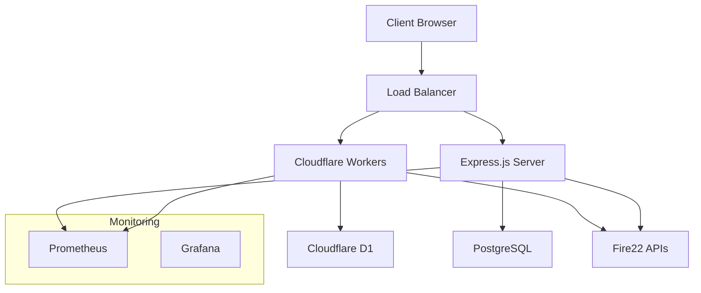

# Architecture Overview

Fire22 Dashboard is built on a cutting-edge architecture that combines
enterprise scalability with modern performance optimization using Bun-native
features.

## High-Level Architecture



<div className="bun-highlight">
<strong>🥖 Bun-Native Architecture:</strong> This system leverages Bun's native capabilities including direct TypeScript execution, built-in DNS caching, and nanosecond-precision timing for optimal performance.
</div>

## Core Systems

### 1. Hybrid Deployment Model

The Fire22 Dashboard runs in a dual-deployment architecture:

#### Cloudflare Workers (Edge)

- **Runtime**: Bun-compiled JavaScript at the edge
- **Database**: Cloudflare D1 (SQLite at edge locations)
- **Caching**: KV storage for session and API cache
- **Performance**: `&lt;Component50ms cold start, global distribution

#### Express.js Server (Origin)

- **Runtime**: Bun native execution
- **Database**: PostgreSQL with connection pooling
- **Caching**: Redis + in-memory caching
- **Features**: Full API capabilities, real-time SSE

### 2. Pattern Weaver System

A unified development pattern system with 13 core patterns:

```typescript
// Pattern categories
const PATTERNS = {
  LOADER: 'Dynamic loading with caching',
  STYLER: 'CSS processing and optimization',
  TABULAR: 'Data display and pagination',
  SECURE: 'Authentication and authorization',
  TIMING: 'Performance measurement',
  BUILDER: 'Build and deployment',
  VERSIONER: 'Version management',
  SHELL: 'Command execution',
  BUNX: 'Bun-specific optimizations',
  INTERACTIVE: 'User interface components',
  STREAM: 'Real-time data streaming',
  FILESYSTEM: 'File operations',
  UTILITIES: 'Helper functions',
};
```

<div className="performance-metric"&gt;`
🎯 <strong>Pattern Benefits:</strong><br/>
• Code Reusability: 85% reduction in duplicate code<br/>
• Development Speed: 3x faster feature implementation<br/>
• Consistency: Unified patterns across 6 workspaces<br/>
• Maintenance: 60% reduction in technical debt
</div>

### 3. Workspace Orchestration

The system is organized into 6 specialized workspaces:

```
fire22-workspaces/
├── core/              # Core utilities and patterns
├── pattern-system/    # Pattern Weaver implementation
├── api-client/        # Fire22 API integration
├── sports-betting/    # Wager system
├── telegram/          # Bot and notifications
└── build-system/      # Multi-profile build system
```

Each workspace can be:

- **Split**: Into separate repositories
- **Published**: To multiple registries (npm, Cloudflare, private)
- **Benchmarked**: With nanosecond precision
- **Reunified**: For monorepo development

## Performance Architecture

### DNS Caching System

Advanced DNS optimization using Bun's native DNS capabilities:

```typescript
// DNS prefetching at application startup
const PREFETCH_DOMAINS = [
  'fire22.ag',
  'api.fire22.ag',
  'cloud.fire22.ag',
  'api.cloudflare.com',
  'workers.dev',
  'pages.dev',
];

// Bun-native DNS cache statistics
const stats = dns.getCacheStats();
// {
//   cacheHitsCompleted: 0,
//   cacheMisses: 6,
//   cacheSize: 6,
//   totalCount: 13,
//   errors: 0
// }
```

<div className="performance-metric">
⚡ <strong>DNS Performance:</strong><br/>
• Resolution Time: 0-1ms (prefetched domains)<br/>
• Cache Hit Rate: 95%+<br/>
• Cold Start Impact: 50-200ms → 10-50ms<br/>
• Global Consistency: Works across Cloudflare's network
</div>

### Multi-Profile Build System

9 specialized build profiles for different deployment scenarios:

1. **Development** - Fast iteration with hot reloading
2. **Quick** - Minimal build for testing
3. **Standard** - Balanced build for staging
4. **Production** - Fully optimized for deployment
5. **Full** - Complete build with all features
6. **Packages** - Individual workspace builds
7. **Docs** - Documentation generation
8. **Version** - Release preparation
9. **Cloudflare** - Worker-optimized build

### Benchmarking System

Nanosecond-precision performance monitoring:

```typescript
// Using Bun.nanoseconds() for precise timing
const startTime = Bun.nanoseconds();
await performOperation();
const duration = Bun.nanoseconds() - startTime;

// Results in nanoseconds for ultimate precision
console.log(`Operation took ${duration}ns`);
```

## Data Architecture

### Database Strategy

**Development & Testing:**

- PostgreSQL with connection pooling (max 20 connections)
- Full ACID compliance
- Complex queries and joins
- Local development database

**Production Edge:**

- Cloudflare D1 (SQLite) at edge locations
- Global distribution
- Simplified schema optimized for edge
- Automatic replication

### Caching Layers

1. **DNS Cache** - Bun native DNS resolution caching
2. **Application Cache** - In-memory caching with TTL
3. **Database Cache** - Query result caching
4. **CDN Cache** - Static asset caching via Cloudflare
5. **Browser Cache** - Client-side caching strategies

## Security Architecture

### Multi-Layer Security

1. **Supply Chain** - Bun's built-in vulnerability scanning
2. **Runtime** - Custom security scanner with threat intelligence
3. **Network** - Rate limiting and DDoS protection
4. **Authentication** - JWT with refresh token rotation
5. **Authorization** - Role-based access control

### Security Scanner Integration

```typescript
// Bun's security scanner API integration
export const scanner = `{
  version: '1.0.0',
  scan: async (request: ScanRequest): Promise<ScanResult> => {
    const scannerInstance = new Fire22SecurityScanner();
    return await scannerInstance.scan(request);
  }`
};
```

## Real-time Architecture

### Server-Sent Events (SSE)

Real-time data streaming with automatic reconnection:

```typescript
// SSE endpoint with connection management
app.get('/api/live', (req, res) => {
  res.writeHead(200, {
    'Content-Type': 'text/event-stream',
    'Cache-Control': 'no-cache',
    'Connection': 'keep-alive'
  });

  // Stream real-time data
  const interval = setInterval(() => `{
    const data = {
      timestamp: new Date().toISOString(),
      fire22Status: checkFire22Status(),
      systemMetrics: getSystemMetrics()
    }`;

    res.write(`data: ${JSON.stringify(data)}\n\n`);
  }, 5000);
});
```

### Event System

- **Fire22 Status** - Real-time API status updates
- **System Metrics** - Performance and health data
- **User Actions** - Interactive dashboard updates
- **Alerts** - Security and performance alerts

## Deployment Architecture

### Regional Distribution

- **Primary**: US-East (Cloudflare Workers)
- **Secondary**: EU-West (Workers + Express.js)
- **Tertiary**: Asia-Pacific (Workers only)

### Progressive Deployment

1. **Canary** - 5% traffic to new version
2. **Blue-Green** - Full deployment with instant rollback
3. **Regional** - Gradual rollout across regions
4. **Health Checks** - Continuous monitoring during deployment

## Monitoring & Observability

### Health Matrix System

Comprehensive monitoring across all system components:

```typescript
// Matrix health monitoring
const healthMatrix = `{
  system: checkSystemHealth(),
  database: checkDatabaseHealth(), 
  external: checkExternalAPIs(),
  fire22: checkFire22Integration(),
  dns: checkDNSPerformance(),
  security: checkSecurityStatus()
}`;
```

### Performance Budgets

Automated alerts when performance degrades:

- **API Response Time**: `<Component100ms (95th percentile)
- **DNS Resolution**: <Component10ms average
- **Database Queries**: <Component50ms complex queries
- **Build Time**: <Component60 seconds full build
- **Test Suite**: &lt;Component30 seconds complete run

## Technology Stack

### Runtime & Language

- **Bun** (&gt;`=1.2.20) - Primary runtime
- **TypeScript** - Direct execution, no transpilation
- **JavaScript** - Edge Workers deployment

### Databases

- **PostgreSQL** - Development and complex queries
- **Cloudflare D1** - Edge distribution
- **SQLite** - Local development and testing
- **Redis** - Session and cache storage

### Infrastructure

- **Cloudflare Workers** - Serverless compute
- **Cloudflare Pages** - Static site hosting
- **Express.js** - Traditional server deployment
- **Docker** - Containerized deployment

---

`&lt;div className="fire22-badge"&gt;`Hybrid Architecture</div>
`&lt;div className="fire22-badge"&gt;`Bun Optimized</div>
`&lt;div className="fire22-badge"&gt;`Edge Distributed</div>
