# 📊 **Performance Monitoring Dashboards: Crystal Clear Architecture**

## **Overview**

This comprehensive monitoring guide provides domain-specific performance
dashboards, alerting configurations, and optimization strategies to ensure
optimal system performance and business outcomes.

---

## **1. System-Wide Performance Dashboard**

### **Global Metrics Overview**

```mermaid
graph LR
    subgraph "📈 Key Metrics"
        ResponseTime[Average Response Time]
        Throughput[Requests per Second]
        ErrorRate[Error Rate %]
        Uptime[System Uptime %]
    end

    subgraph "🚨 Alert Thresholds"
        RT_Alert[Response Time > 2s]
        TP_Alert[Throughput < 100 rps]
        ER_Alert[Error Rate > 1%]
        UP_Alert[Uptime < 99.9%]
    end

    ResponseTime --> RT_Alert
    Throughput --> TP_Alert
    ErrorRate --> ER_Alert
    Uptime --> UP_Alert
```



### **Real-time Monitoring Setup**

#### **Application Performance Monitoring (APM)**

```javascript
// Key APM metrics to monitor
const keyMetrics = {
  responseTime: {
    p50: '< 200ms',
    p95: '< 500ms',
    p99: '< 1000ms',
  },
  throughput: {
    current: '150 rps',
    peak: '500 rps',
    sustained: '200 rps',
  },
  errorRates: {
    total: '< 0.1%',
    byDomain: {
      collections: '< 0.05%',
      distributions: '< 0.08%',
      freePlay: '< 0.03%',
      balance: '< 0.02%',
      adjustment: '< 0.05%',
    },
  },
};
```

---

## **2. Collections Domain Performance Monitoring**

### **Key Performance Indicators (KPIs)**

#### **Settlement Processing Metrics**

```mermaid
gauge title Settlement Processing Performance
92%:Average Processing Time: < 30 minutes
98%:Success Rate
89%:Customer Satisfaction
95%:On-time Delivery
```

#### **Real-time Settlement Dashboard**

```javascript
const settlementMetrics = {
  pendingSettlements: 47,
  processingQueue: 12,
  completedToday: 156,
  overdueSettlements: 3,
  averageProcessingTime: '23 minutes',
  priorityDistribution: {
    high: 8,
    medium: 25,
    low: 14,
  },
};
```

### **Collections Domain Alerts**

#### **Critical Alerts** 🚨

```yaml
# Alert Configuration
settlement_overdue:
  condition: settlement_age > 24 hours AND priority = high
  severity: critical
  notification: immediate
  channels: [slack, email, sms]

payment_failure:
  condition: payment_status = failed AND amount > $1000
  severity: high
  notification: immediate
  channels: [slack, email]

queue_backup:
  condition: pending_settlements > 100
  severity: high
  notification: immediate
  channels: [slack]
```

#### **Warning Alerts** ⚠️

```yaml
processing_delay:
  condition: average_processing_time > 45 minutes
  severity: warning
  notification: daily
  channels: [slack]

high_error_rate:
  condition: error_rate > 1%
  severity: warning
  notification: hourly
  channels: [slack]
```

### **Collections Performance Optimization**

#### **Database Optimization**

```sql
-- Optimized settlement queries
CREATE INDEX idx_settlements_priority_due_date
ON settlements (priority DESC, due_date ASC)
WHERE status = 'pending';

CREATE INDEX idx_settlements_customer_status
ON settlements (customer_id, status)
WHERE status IN ('pending', 'processing');
```

#### **Caching Strategy**

```javascript
const settlementCache = {
  // Cache pending settlements for 5 minutes
  pendingSettlements: {
    ttl: 300000, // 5 minutes
    maxSize: 1000,
  },

  // Cache settlement templates for 1 hour
  settlementTemplates: {
    ttl: 3600000, // 1 hour
    maxSize: 100,
  },

  // Cache customer settlement history for 15 minutes
  customerHistory: {
    ttl: 900000, // 15 minutes
    maxSize: 5000,
  },
};
```

---

## **3. Distributions Domain Performance Monitoring**

### **Key Performance Indicators (KPIs)**

#### **Payment Processing Metrics**

```mermaid
gauge title Distribution Processing Performance
96%:Payment Success Rate
88%:On-time Delivery
94%:Recipient Satisfaction
89%:Processing Efficiency
```

#### **Distribution Analytics Dashboard**

```javascript
const distributionMetrics = {
  totalRevenue: 125000.0,
  distributedAmount: 87500.0,
  pendingPayments: 12500.0,
  distributionRate: 70.0,
  averageProcessingTime: '2.3 hours',
  paymentMethods: {
    wireTransfer: 45,
    paypal: 32,
    bankTransfer: 18,
  },
};
```

### **Distributions Domain Alerts**

#### **Critical Alerts** 🚨

```yaml
payment_failure_high_value:
  condition: payment_amount > $50000 AND status = failed
  severity: critical
  notification: immediate
  channels: [slack, email, sms, phone]

revenue_discrepancy:
  condition: revenue_variance > $10000
  severity: critical
  notification: immediate
  channels: [slack, email]
```

#### **Performance Alerts** ⚠️

```yaml
processing_delay:
  condition: average_processing_time > 4 hours
  severity: warning
  notification: hourly
  channels: [slack]

payment_queue_backup:
  condition: pending_payments > 50
  severity: warning
  notification: hourly
  channels: [slack]
```

### **Distributions Performance Optimization**

#### **Bulk Processing Optimization**

```javascript
const bulkProcessingConfig = {
  batchSize: 100, // Process 100 payments at once
  concurrency: 5, // Run 5 batches in parallel
  retryAttempts: 3,
  retryDelay: 1000, // 1 second between retries
  circuitBreaker: {
    failureThreshold: 5,
    resetTimeout: 60000, // 1 minute
  },
};
```

#### **Commission Calculation Optimization**

```javascript
const commissionCache = {
  // Cache commission rates for 1 hour
  rates: {
    ttl: 3600000,
    strategy: 'lru',
    maxSize: 10000,
  },

  // Cache calculated commissions for 30 minutes
  calculations: {
    ttl: 1800000,
    strategy: 'lfu',
    maxSize: 50000,
  },
};
```

---

## **4. Free Play Domain Performance Monitoring**

### **Key Performance Indicators (KPIs)**

#### **Bonus Performance Metrics**

```mermaid
gauge title Free Play Performance
97%:Redemption Success Rate
85%:Bonus Utilization
92%:Customer Engagement
89%:Campaign Effectiveness
```

#### **Free Play Analytics Dashboard**

```javascript
const freePlayMetrics = {
  totalBonusValue: 250000.0,
  redeemedAmount: 145000.0,
  utilizationRate: 58.0,
  averageBonusPerCustomer: 185.5,
  expirationRate: 15.0,
  topPerformingBonuses: [
    { type: 'welcome_bonus', redemptionRate: 67.5 },
    { type: 'deposit_match', redemptionRate: 61.2 },
    { type: 'free_bet', redemptionRate: 64.0 },
  ],
};
```

### **Free Play Domain Alerts**

#### **Critical Alerts** 🚨

```yaml
bonus_abuse_detected:
  condition: suspicious_redemption_pattern AND amount > $1000
  severity: critical
  notification: immediate
  channels: [slack, email, security]

campaign_budget_exceeded:
  condition: campaign_spend > allocated_budget * 1.1
  severity: critical
  notification: immediate
  channels: [slack, email]
```

#### **Performance Alerts** ⚠️

```yaml
high_expiration_rate:
  condition: bonus_expiration_rate > 25%
  severity: warning
  notification: daily
  channels: [slack]

low_redemption_rate:
  condition: redemption_rate < 40%
  severity: warning
  notification: weekly
  channels: [slack]
```

### **Free Play Performance Optimization**

#### **Bonus Calculation Optimization**

```javascript
const bonusOptimization = {
  // Pre-calculate common bonus amounts
  preCalculatedBonuses: new Map([
    ['welcome_100', { amount: 100, wageringReq: 10 }],
    ['deposit_match_50', { amount: 50, wageringReq: 15 }],
    ['free_bet_25', { amount: 25, wageringReq: 1 }],
  ]),

  // Cache customer bonus eligibility
  eligibilityCache: {
    ttl: 1800000, // 30 minutes
    maxSize: 100000,
  },

  // Optimize wagering requirement calculations
  wageringEngine: {
    useLookupTables: true,
    cacheIntermediateResults: true,
    parallelProcessing: true,
  },
};
```

#### **Campaign Performance Tracking**

```javascript
const campaignAnalytics = {
  realTimeMetrics: {
    activeCampaigns: 12,
    totalParticipants: 15420,
    conversionRate: 23.5,
    averageOrderValue: 87.5,
  },

  performanceTracking: {
    trackImpressions: true,
    trackClicks: true,
    trackConversions: true,
    attributionWindow: 30, // days
    cohortAnalysis: true,
  },
};
```

---

## **5. Balance Domain Performance Monitoring**

### **Key Performance Indicators (KPIs)**

#### **Account Performance Metrics**

```mermaid
gauge title Balance Management Performance
99.9%:Transaction Accuracy
95%:Processing Speed
98%:Account Security
97%:Customer Satisfaction
```

#### **Balance Operations Dashboard**

```javascript
const balanceMetrics = {
  totalAccounts: 25000,
  activeAccounts: 18750,
  totalBalance: 12500000.0,
  averageBalance: 667.5,
  transactionsToday: 12500,
  failedTransactions: 12,
  securityIncidents: 0,
  averageProcessingTime: '1.2 seconds',
};
```

### **Balance Domain Alerts**

#### **Critical Alerts** 🚨

```yaml
balance_discrepancy:
  condition: account_variance > $1000
  severity: critical
  notification: immediate
  channels: [slack, email, security]

fraud_detected:
  condition: fraud_score > 0.8 AND transaction_amount > $500
  severity: critical
  notification: immediate
  channels: [slack, email, security, compliance]
```

#### **Security Alerts** ⚠️

```yaml
unusual_activity:
  condition: transaction_pattern_anomaly
  severity: high
  notification: immediate
  channels: [slack, security]

large_transaction:
  condition: transaction_amount > $50000
  severity: warning
  notification: immediate
  channels: [slack, email]
```

### **Balance Performance Optimization**

#### **Transaction Processing Optimization**

```javascript
const transactionOptimization = {
  // Batch processing for bulk operations
  batchProcessing: {
    maxBatchSize: 1000,
    processingInterval: 5000, // 5 seconds
    retryAttempts: 3,
    idempotencyKeys: true,
  },

  // Real-time balance updates
  realTimeUpdates: {
    useWebSockets: true,
    optimisticUpdates: true,
    conflictResolution: 'last-writer-wins',
    consistencyChecks: true,
  },

  // Account security
  securityOptimization: {
    rateLimiting: {
      perMinute: 60,
      perHour: 1000,
      burstLimit: 10,
    },
    fraudDetection: {
      realTimeScoring: true,
      machineLearning: true,
      ruleEngine: true,
    },
  },
};
```

#### **Database Optimization**

```sql
-- Optimized balance queries
CREATE INDEX CONCURRENTLY idx_balances_customer_active
ON balances (customer_id, last_updated DESC)
WHERE account_status = 'active';

CREATE INDEX CONCURRENTLY idx_transactions_customer_date
ON transactions (customer_id, created_at DESC)
WHERE transaction_status = 'completed';

-- Partitioning strategy for large tables
CREATE TABLE balances_y2025m01 PARTITION OF balances
FOR VALUES FROM ('2025-01-01') TO ('2025-02-01');
```

---

## **6. Adjustment Domain Performance Monitoring**

### **Key Performance Indicators (KPIs)**

#### **Adjustment Processing Metrics**

```mermaid
gauge title Adjustment Processing Performance
94%:Approval Rate
89%:Processing Efficiency
96%:Accuracy Rate
92%:Customer Satisfaction
```

#### **Adjustment Operations Dashboard**

```javascript
const adjustmentMetrics = {
  pendingAdjustments: 23,
  processedToday: 47,
  approvalRate: 94.2,
  averageProcessingTime: '4.2 hours',
  byType: {
    balanceAdjustment: 12,
    betCorrection: 8,
    bonusAdjustment: 15,
    feeReversal: 7,
    limitAdjustment: 5,
  },
  byPriority: {
    high: 5,
    medium: 12,
    low: 6,
  },
};
```

### **Adjustment Domain Alerts**

#### **Critical Alerts** 🚨

```yaml
high_value_adjustment:
  condition: adjustment_amount > $10000 AND requires_approval = true
  severity: critical
  notification: immediate
  channels: [slack, email, manager]

adjustment_dispute:
  condition: customer_dispute = true AND adjustment_age > 48 hours
  severity: high
  notification: immediate
  channels: [slack, email]
```

#### **Workflow Alerts** ⚠️

```yaml
approval_delay:
  condition: pending_adjustment_age > 24 hours
  severity: warning
  notification: daily
  channels: [slack]

high_rejection_rate:
  condition: rejection_rate > 15%
  severity: warning
  notification: weekly
  channels: [slack]
```

### **Adjustment Performance Optimization**

#### **Approval Workflow Optimization**

```javascript
const approvalOptimization = {
  // Automated routing based on amount and type
  autoRouting: {
    rules: [
      { amount: '< 100', approver: 'auto', dualAuth: false },
      { amount: '100-1000', approver: 'supervisor', dualAuth: false },
      { amount: '1000-10000', approver: 'manager', dualAuth: true },
      { amount: '> 10000', approver: 'executive', dualAuth: true },
    ],
    escalationTime: 3600000, // 1 hour
  },

  // Batch approval for similar adjustments
  batchApproval: {
    enabled: true,
    maxBatchSize: 50,
    similarityThreshold: 0.8,
    autoApprove: true,
  },
};
```

#### **Audit Trail Optimization**

```javascript
const auditOptimization = {
  // Efficient audit logging
  auditConfig: {
    logLevel: 'detailed',
    retentionPeriod: 2555, // 7 years
    compression: 'gzip',
    indexing: {
      byCustomer: true,
      byType: true,
      byApprover: true,
      byDate: true,
    },
  },

  // Audit query optimization
  queryOptimization: {
    useMaterializedViews: true,
    cacheFrequentQueries: true,
    partitionByDate: true,
  },
};
```

---

## **7. Infrastructure Monitoring Setup**

### **Application Monitoring Stack**

#### **Metrics Collection**

```yaml
# Prometheus configuration
global:
  scrape_interval: 15s
  evaluation_interval: 15s

scrape_configs:
  - job_name: 'fire22-api'
    static_configs:
      - targets: ['localhost:9090']
    metrics_path: '/metrics'
    scrape_interval: 5s

  - job_name: 'fire22-database'
    static_configs:
      - targets: ['localhost:5432']
    metrics_path: '/metrics'
    scrape_interval: 30s
```

#### **Distributed Tracing**

```javascript
const tracingConfig = {
  serviceName: 'fire22-api',
  serviceVersion: '2.1.0',
  exporter: {
    type: 'otlp',
    endpoint: 'http://localhost:4318',
  },
  sampling: {
    ratio: 0.1, // Sample 10% of requests
    rules: [
      { service: 'collections', ratio: 0.5 },
      { service: 'distributions', ratio: 0.3 },
    ],
  },
};
```

### **Database Monitoring**

#### **Performance Monitoring**

```sql
-- Key database metrics to monitor
SELECT
  schemaname,
  tablename,
  seq_scan,
  idx_scan,
  n_tup_ins,
  n_tup_upd,
  n_tup_del
FROM pg_stat_user_tables
ORDER BY n_tup_ins + n_tup_upd + n_tup_del DESC;

-- Query performance monitoring
SELECT
  query,
  calls,
  total_time,
  mean_time,
  rows
FROM pg_stat_statements
ORDER BY total_time DESC
LIMIT 10;
```

#### **Connection Pool Monitoring**

```javascript
const connectionPoolConfig = {
  min: 5,
  max: 50,
  idleTimeoutMillis: 30000,
  acquireTimeoutMillis: 60000,
  createTimeoutMillis: 30000,
  destroyTimeoutMillis: 5000,
  reapIntervalMillis: 1000,
  createRetryIntervalMillis: 200,
};
```

---

## **8. Alerting & Incident Response**

### **Alert Escalation Matrix**

| Severity    | Response Time | Notification     | Escalation       |
| ----------- | ------------- | ---------------- | ---------------- |
| Critical 🚨 | Immediate     | SMS, Call, Slack | On-call engineer |
| High ⚠️     | < 15 minutes  | Slack, Email     | Team lead        |
| Medium 📢   | < 1 hour      | Slack            | Team member      |
| Low ℹ️      | < 4 hours     | Slack            | Best effort      |

### **Incident Response Playbook**

#### **Critical Incident Response**

```yaml
critical_incident_response:
  steps:
    1. Acknowledge alert within 5 minutes 2. Assess impact and scope 3. Notify
    stakeholders 4. Begin investigation 5. Implement temporary fix if needed 6.
    Develop permanent solution 7. Post-mortem analysis 8. Update
    monitoring/alerts

  communication:
    - Internal: Slack incident channel
    - External: Status page updates
    - Customers: Proactive communication for major incidents
```

#### **Performance Incident Response**

```yaml
performance_incident_response:
  steps:
    1. Identify performance bottleneck 2. Implement immediate optimization 3.
    Scale resources if needed 4. Monitor improvement 5. Implement permanent fix
    6. Update capacity planning

  tools:
    - APM dashboards
    - Load testing tools
    - Performance profiling
    - Auto-scaling policies
```

---

## **9. Capacity Planning & Scaling**

### **Resource Utilization Monitoring**

#### **Auto-scaling Configuration**

```yaml
autoScaling:
  cpu:
    targetUtilization: 70
    scaleUpThreshold: 80
    scaleDownThreshold: 50
    cooldownPeriod: 300

  memory:
    targetUtilization: 75
    scaleUpThreshold: 85
    scaleDownThreshold: 60
    cooldownPeriod: 300

  requestsPerSecond:
    targetRPS: 1000
    scaleUpThreshold: 1200
    scaleDownThreshold: 800
    cooldownPeriod: 180
```

#### **Load Testing Strategy**

```javascript
const loadTestConfig = {
  scenarios: [
    {
      name: 'Peak Settlement Processing',
      duration: '30 minutes',
      users: 1000,
      rampUp: '10 minutes',
      endpoints: ['/collections/process-settlement'],
    },
    {
      name: 'High Distribution Volume',
      duration: '45 minutes',
      users: 500,
      rampUp: '15 minutes',
      endpoints: ['/distributions/payment'],
    },
  ],
  thresholds: {
    responseTime: '< 2000ms',
    errorRate: '< 1%',
    throughput: '> 100 rps',
  },
};
```

---

## **10. Dashboard Access & Permissions**

### **Monitoring Dashboard Access**

| Role      | Dashboard Access | Alert Access | Configuration Access |
| --------- | ---------------- | ------------ | -------------------- |
| Developer | Read             | Read         | None                 |
| Team Lead | Read/Write       | Read/Write   | Read                 |
| Manager   | Read/Write       | Read/Write   | Read/Write           |
| Admin     | Full Access      | Full Access  | Full Access          |

### **Dashboard URLs**

| Dashboard            | URL                         | Refresh Rate |
| -------------------- | --------------------------- | ------------ |
| System Overview      | `/monitoring/system`        | 30 seconds   |
| Collections Domain   | `/monitoring/collections`   | 15 seconds   |
| Distributions Domain | `/monitoring/distributions` | 15 seconds   |
| Free Play Domain     | `/monitoring/free-play`     | 30 seconds   |
| Balance Domain       | `/monitoring/balance`       | 15 seconds   |
| Adjustment Domain    | `/monitoring/adjustment`    | 30 seconds   |

---

_This monitoring guide should be reviewed quarterly and updated based on system
evolution and new performance requirements._
