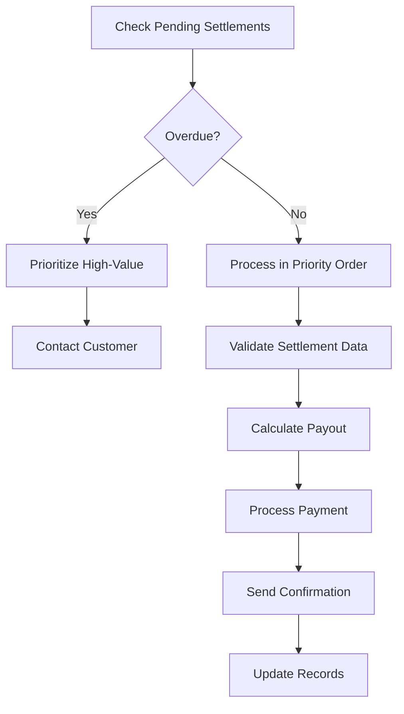
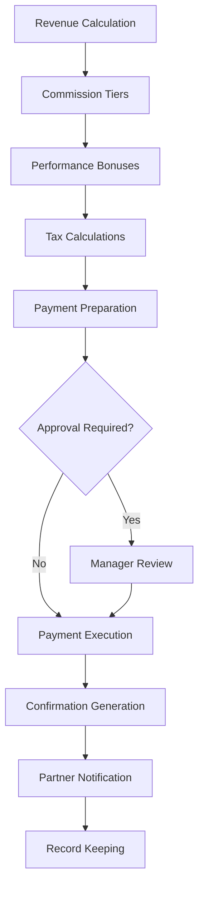
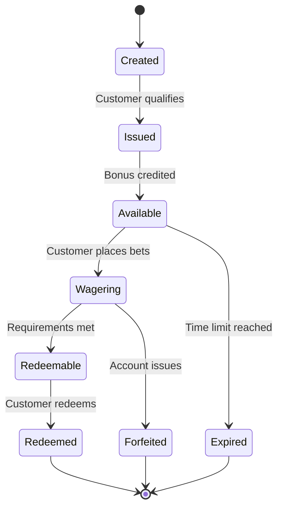
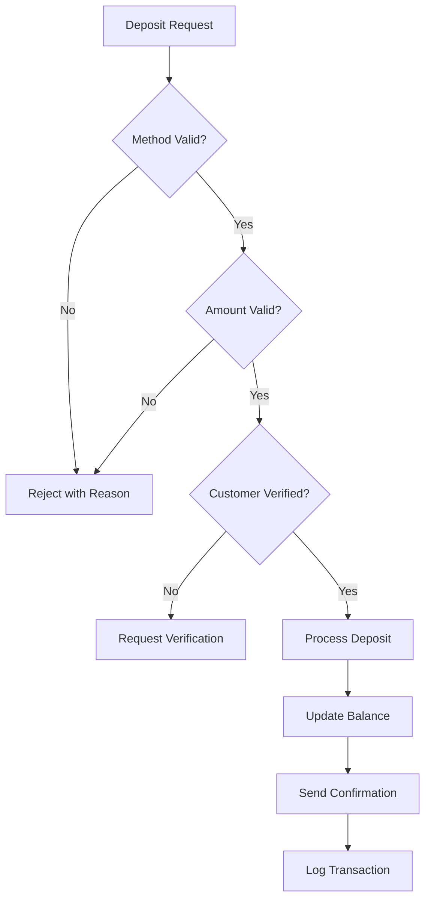
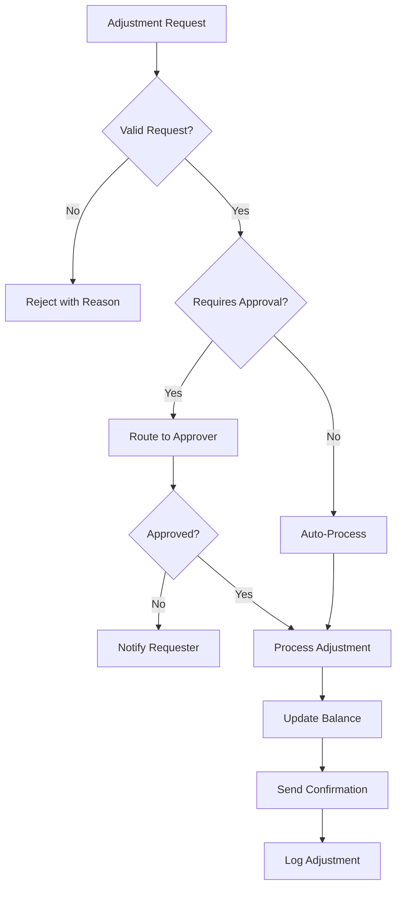

# 👥 **Team Onboarding Guides: Domain Expertise Development**

## **Overview**

This comprehensive onboarding guide is designed to accelerate team members'
understanding of their domain responsibilities within the Crystal Clear
Architecture. Each domain section includes technical knowledge, business
context, and practical workflows.

---

## **1. Collections Domain Team Onboarding**

### **Domain Overview**

**Purpose**: Manage settlement collections, payment processing, and customer
payout workflows **Business Impact**: Directly affects customer satisfaction and
cash flow management **Key Metrics**: Settlement processing time, customer
satisfaction, overdue rates

### **Technical Architecture**

```
📁 controllers/collections/
├── collections.controller.ts      # Main controller logic
├── collections.service.ts        # Business logic layer
├── collections.model.ts          # Data models
└── collections.middleware.ts     # Domain-specific middleware
```

### **Core Responsibilities**

#### **Settlement Processing**

1. **Validate Settlement Requests**

   - Check customer eligibility
   - Verify wager outcomes
   - Calculate payout amounts
   - Apply business rules

2. **Process Payments**

   - Initiate payment transactions
   - Handle different payment methods
   - Manage transaction states
   - Generate confirmations

3. **Monitor & Report**
   - Track settlement metrics
   - Identify processing bottlenecks
   - Generate performance reports
   - Alert on overdue settlements

### **Key Workflows**

#### **Daily Operations**



#### **Escalation Procedures**

- **Priority 1**: Overdue VIP settlements (>24 hours)
- **Priority 2**: Technical payment failures
- **Priority 3**: Customer disputes or corrections

### **Essential Knowledge**

#### **Business Rules**

- Settlement windows (24-72 hours post-event)
- Minimum payout thresholds ($10.00)
- Maximum daily payout limits ($100,000)
- Tax withholding requirements by jurisdiction

#### **Technical Skills**

- Payment gateway integrations
- Transaction state management
- Customer communication systems
- Regulatory compliance frameworks

### **Getting Started Checklist**

- [ ] Review settlement processing workflows
- [ ] Complete payment gateway training
- [ ] Shadow senior team member for 3 settlements
- [ ] Study common settlement scenarios
- [ ] Practice in staging environment
- [ ] Review regulatory compliance requirements

---

## **2. Distributions Domain Team Onboarding**

### **Domain Overview**

**Purpose**: Manage revenue distribution, commission payments, and partner
payouts **Business Impact**: Critical for partner relationships and revenue
sharing agreements **Key Metrics**: Payment accuracy, on-time delivery, partner
satisfaction

### **Technical Architecture**

```
📁 controllers/distributions/
├── distributions.controller.ts   # Distribution endpoints
├── commission.service.ts         # Commission calculations
├── payment.service.ts            # Payment processing
└── recipient.model.ts            # Partner/customer models
```

### **Core Responsibilities**

#### **Revenue Distribution**

1. **Calculate Commissions**

   - Apply tiered commission structures
   - Calculate performance bonuses
   - Handle multi-level distributions
   - Process referral payments

2. **Payment Processing**

   - Execute bulk payments
   - Manage payment schedules
   - Handle international transfers
   - Process tax documentation

3. **Partner Management**
   - Maintain partner profiles
   - Track payment history
   - Manage contract terms
   - Handle partner communications

### **Key Workflows**

#### **Monthly Distribution Cycle**



### **Essential Knowledge**

#### **Commission Structures**

- Base commission rates (15-25%)
- Performance multipliers (up to 2x)
- Multi-level referral bonuses
- Seasonal promotional rates

#### **Payment Methods**

- Wire transfers for large amounts
- PayPal for international partners
- Bank transfers for recurring payments
- Cryptocurrency options (future)

### **Getting Started Checklist**

- [ ] Study commission calculation formulas
- [ ] Review partner agreement templates
- [ ] Complete payment processing training
- [ ] Shadow monthly distribution cycle
- [ ] Practice bulk payment processing
- [ ] Learn tax compliance procedures

---

## **3. Free Play Domain Team Onboarding**

### **Domain Overview**

**Purpose**: Manage bonus programs, promotional campaigns, and customer rewards
**Business Impact**: Drives customer acquisition, retention, and engagement
**Key Metrics**: Redemption rates, customer lifetime value, campaign ROI

### **Technical Architecture**

```
📁 controllers/free-play/
├── free-play.controller.ts       # Bonus endpoints
├── bonus.service.ts              # Bonus logic
├── campaign.service.ts           # Campaign management
└── wagering.service.ts          # Wagering requirements
```

### **Core Responsibilities**

#### **Bonus Management**

1. **Campaign Creation**

   - Design bonus structures
   - Set wagering requirements
   - Define eligibility criteria
   - Configure expiration rules

2. **Redemption Processing**

   - Validate redemption requests
   - Calculate bonus amounts
   - Process wagering completions
   - Handle partial redemptions

3. **Campaign Analytics**
   - Track redemption rates
   - Monitor customer engagement
   - Calculate campaign ROI
   - Optimize bonus effectiveness

### **Key Workflows**

#### **Bonus Lifecycle**



### **Essential Knowledge**

#### **Bonus Types**

- **Welcome Bonuses**: New customer acquisition
- **Deposit Matches**: Encourage deposits
- **Free Bets**: Trial wagering opportunities
- **Loyalty Rewards**: Retention incentives
- **Referral Bonuses**: Viral growth incentives

#### **Wagering Requirements**

- Deposit wagering (1x-50x)
- Sportsbook restrictions
- Time limits (7-90 days)
- Game type limitations

### **Getting Started Checklist**

- [ ] Review bonus program catalog
- [ ] Study wagering requirement calculations
- [ ] Complete campaign creation training
- [ ] Shadow redemption processing
- [ ] Learn customer segmentation
- [ ] Practice campaign performance analysis

---

## **4. Balance Domain Team Onboarding**

### **Domain Overview**

**Purpose**: Manage customer account balances, transactions, and financial
records **Business Impact**: Core to customer trust and regulatory compliance
**Key Metrics**: Transaction accuracy, account security, customer satisfaction

### **Technical Architecture**

```
📁 controllers/balance/
├── balance.controller.ts         # Balance endpoints
├── transaction.service.ts        # Transaction processing
├── account.service.ts            # Account management
└── audit.service.ts              # Transaction auditing
```

### **Core Responsibilities**

#### **Account Management**

1. **Balance Tracking**

   - Monitor account balances
   - Track pending transactions
   - Calculate available funds
   - Handle multi-currency accounts

2. **Transaction Processing**

   - Process deposits and withdrawals
   - Handle balance transfers
   - Manage transaction reversals
   - Process fee calculations

3. **Account Security**
   - Monitor suspicious activity
   - Implement fraud detection
   - Manage account freezes
   - Handle security investigations

### **Key Workflows**

#### **Deposit Processing**



### **Essential Knowledge**

#### **Balance Types**

- **Available Balance**: Immediately accessible funds
- **Pending Balance**: Funds in processing
- **Bonus Balance**: Promotional funds
- **Restricted Balance**: Funds with conditions

#### **Transaction Types**

- Deposits (bank, card, crypto)
- Withdrawals (bank, wallet)
- Transfers (internal, external)
- Adjustments (manual corrections)
- Fees (processing, service)

### **Getting Started Checklist**

- [ ] Study balance calculation logic
- [ ] Review transaction processing flows
- [ ] Complete fraud detection training
- [ ] Shadow account investigations
- [ ] Learn multi-currency handling
- [ ] Practice transaction reversals

---

## **5. Adjustment Domain Team Onboarding**

### **Domain Overview**

**Purpose**: Manage account adjustments, corrections, and special requests
**Business Impact**: Critical for customer service and dispute resolution **Key
Metrics**: Resolution time, customer satisfaction, error rates

### **Technical Architecture**

```
📁 controllers/adjustment/
├── adjustment.controller.ts      # Adjustment endpoints
├── approval.service.ts           # Approval workflows
├── validation.service.ts         # Adjustment validation
└── audit.service.ts              # Adjustment auditing
```

### **Core Responsibilities**

#### **Adjustment Processing**

1. **Request Validation**

   - Verify adjustment requests
   - Check customer eligibility
   - Validate supporting documentation
   - Assess business justification

2. **Approval Workflows**

   - Route to appropriate approvers
   - Implement dual-authorization
   - Track approval history
   - Manage approval deadlines

3. **Execution & Tracking**
   - Process approved adjustments
   - Update account balances
   - Generate adjustment confirmations
   - Maintain audit trails

### **Key Workflows**

#### **Adjustment Lifecycle**



### **Essential Knowledge**

#### **Adjustment Types**

- **Balance Corrections**: Fix calculation errors
- **Bonus Adjustments**: Modify promotional credits
- **Fee Reversals**: Remove incorrect charges
- **Limit Adjustments**: Change betting limits
- **Account Corrections**: Fix account data issues

#### **Approval Levels**

- **Level 1**: <$100, auto-approved
- **Level 2**: $100-$1000, supervisor approval
- **Level 3**: >$1000, manager approval
- **Level 4**: >$10000, executive approval

### **Getting Started Checklist**

- [ ] Review adjustment request types
- [ ] Study approval workflow rules
- [ ] Complete validation training
- [ ] Shadow adjustment processing
- [ ] Learn audit trail requirements
- [ ] Practice complex approval scenarios

---

## **6. Cross-Domain Collaboration**

### **Shared Responsibilities**

- **Customer Experience**: All domains impact customer satisfaction
- **Regulatory Compliance**: Cross-domain regulatory requirements
- **System Performance**: Domain changes affect overall system
- **Security**: Domain-specific security impacts enterprise security

### **Communication Protocols**

- **Daily Standups**: Domain-specific updates
- **Weekly Syncs**: Cross-domain coordination
- **Incident Response**: Domain-specific escalation paths
- **Change Management**: Domain impact assessments

### **Knowledge Sharing**

- **Domain Deep Dives**: Monthly presentations
- **Cross-Training**: Shadowing across domains
- **Documentation**: Shared knowledge base
- **Best Practices**: Domain-agnostic learnings

---

## **7. Development Environment Setup**

### **Local Development**

```bash
# Clone repository
git clone https://github.com/fire22/dashboard-worker.git
cd dashboard-worker

# Install dependencies
bun install

# Setup environment
cp .env.example .env
bun run env:validate

# Start development server
bun run dev
```

### **Database Setup**

```bash
# Initialize database
bun run db:init

# Run migrations
bun run db:migrate

# Seed test data
bun run db:seed
```

### **Testing Environment**

```bash
# Run domain-specific tests
bun test --grep "collections"
bun test --grep "distributions"
bun test --grep "free-play"
bun test --grep "balance"
bun test --grep "adjustment"

# Run integration tests
bun run test:integration

# Generate test coverage
bun run test:coverage
```

---

## **8. Key Contacts & Resources**

### **Domain Leads**

- **Collections**: Sarah Johnson (sarah.johnson@fire22.com)
- **Distributions**: Mike Chen (mike.chen@fire22.com)
- **Free Play**: Emma Rodriguez (emma.rodriguez@fire22.com)
- **Balance**: David Kim (david.kim@fire22.com)
- **Adjustment**: Lisa Wong (lisa.wong@fire22.com)

### **Technical Resources**

- **Architecture Documentation**: `/docs/architecture/`
- **API Reference**: `/docs/architecture/api-reference.md`
- **Implementation Checklists**:
  `/docs/architecture/implementation-checklists.md`
- **Code Style Guide**: `/docs/contributing/style-guide.md`

### **Support Channels**

- **Slack Channels**: `#domain-collections`, `#domain-distributions`, etc.
- **GitHub Issues**: For technical issues and feature requests
- **Weekly Office Hours**: Domain-specific Q&A sessions

---

## **9. Performance Expectations**

### **Week 1-2: Learning Phase**

- Understand domain responsibilities
- Complete onboarding checklists
- Shadow experienced team members
- Begin contributing to simple tasks

### **Week 3-4: Contribution Phase**

- Handle routine domain tasks independently
- Participate in code reviews
- Contribute to documentation
- Assist with testing and validation

### **Week 5+: Full Contribution Phase**

- Own complex domain workflows
- Lead domain-specific initiatives
- Mentor junior team members
- Drive domain optimization projects

---

## **10. Success Metrics**

### **Individual Performance**

- **Task Completion**: 90%+ on-time delivery
- **Code Quality**: Zero critical bugs in production
- **Knowledge Sharing**: Regular contributions to documentation
- **Team Collaboration**: Positive peer feedback

### **Domain Performance**

- **Processing Time**: Meet or exceed SLA targets
- **Error Rates**: Maintain <0.1% error rate
- **Customer Satisfaction**: Achieve 95%+ satisfaction scores
- **System Reliability**: 99.9%+ uptime

---

_This onboarding guide is a living document. Regular updates ensure it reflects
current best practices and domain evolution. New team members should review this
guide quarterly to stay current with domain developments._
