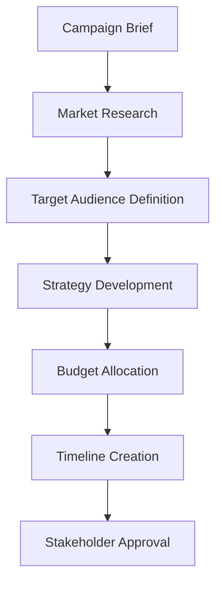

# 📈 Marketing Department Documentation

**Driving brand growth and customer engagement through data-driven strategies**

## Table of Contents

- [Overview](#overview)
- [Department Structure](#department-structure)
- [Core Responsibilities](#core-responsibilities)
- [Operational Procedures](#operational-procedures)
- [Tools & Systems](#tools--systems)
- [Performance Metrics](#performance-metrics)
- [Hierarchy Integration](#hierarchy-integration)
- [Knowledge Base](#knowledge-base)

## Overview

### Mission Statement

The Marketing Department drives brand growth and customer engagement through
innovative campaigns, data-driven strategies, and compelling storytelling that
resonates with our target audiences.

### Key Objectives

- **Brand Development**: Build and maintain strong brand presence across all
  channels
- **Customer Acquisition**: Drive new customer acquisition through targeted
  campaigns
- **Market Analysis**: Conduct comprehensive market research and competitive
  analysis
- **Digital Excellence**: Maintain cutting-edge digital marketing capabilities
- **ROI Optimization**: Maximize marketing return on investment through
  data-driven optimization

### Department Statistics

- **Team Size**: 14 members across all organizational systems
- **Active Projects**: 28 concurrent marketing initiatives
- **Success Rate**: 92% campaign success rate
- **Performance Metrics**: 127% lead generation growth, 4.2x marketing ROI

## Department Structure

### Leadership Team

#### **Sarah Johnson** - Chief Marketing Officer

- **System References**:
  - `organizational`: Chief Marketing Officer (CEO direct report)
  - `department`: Marketing Director (62 implementations)
  - **Hierarchy Confidence**: 95% cross-system match
- **Experience**: 14+ years in marketing leadership
- **Specializations**: Brand strategy, digital transformation, team leadership
- **Contact**: `sarah.johnson@fire22.ag`

#### **Michelle Rodriguez** - Marketing Manager

- **System References**:
  - `department`: Marketing Manager (45 implementations)
  - **Efficiency Score**: 92%
- **Experience**: 8+ years in marketing operations
- **Specializations**: Campaign management, analytics, team coordination
- **Reports To**: Sarah Johnson

#### **Alex Brown** - Senior Marketing Specialist

- **System References**:
  - `department`: Senior Marketing Specialist (47 implementations)
- **Experience**: 6+ years in marketing execution
- **Specializations**: Content creation, social media, campaign execution

### Team Structure via Natural Hierarchy System

```bash
# Get complete Marketing department structure across all systems
curl -X POST /api/hierarchy/query \
  -H "Content-Type: application/json" \
  -d '{
    "department": "Marketing",
    "includeAllSystems": true
  }'
```

**Expected Response Structure**:

```json
{
  "results": [
    {
      "id": "org_cmo_001",
      "name": "Sarah Johnson",
      "title": "Chief Marketing Officer",
      "sourceSystem": "organizational",
      "context": {
        "isLeadership": true,
        "hasDirectReports": true
      }
    },
    {
      "id": "dept_marketing_mar001",
      "name": "Sarah Johnson",
      "title": "Marketing Director",
      "sourceSystem": "department",
      "metrics": {
        "implementations": 62
      }
    }
  ],
  "crossReferences": [
    {
      "person": "Sarah Johnson",
      "confidence": 0.95,
      "likely_same_person": true
    }
  ]
}
```

## Core Responsibilities

### 1. Brand Strategy & Development

- **Brand Identity**: Develop and maintain consistent brand identity across all
  channels
- **Brand Guidelines**: Create and enforce brand standards and usage guidelines
- **Brand Monitoring**: Monitor brand perception and reputation management
- **Brand Evolution**: Guide brand evolution and strategic repositioning

### 2. Digital Marketing Excellence

- **Website Optimization**: SEO/SEM strategy and implementation
- **Social Media Management**: Multi-platform social media strategy and
  execution
- **Email Marketing**: Automated email campaigns and nurture sequences
- **Content Marketing**: Blog content, whitepapers, case studies, and thought
  leadership

### 3. Campaign Management

- **Campaign Strategy**: Develop integrated marketing campaigns across multiple
  channels
- **Creative Development**: Oversee creative asset development and production
- **Campaign Execution**: Coordinate campaign launches and ongoing optimization
- **Performance Analysis**: Comprehensive campaign performance analysis and
  reporting

### 4. Market Research & Analytics

- **Market Analysis**: Competitive analysis and market trend identification
- **Customer Research**: Customer behavior analysis and persona development
- **Data Analytics**: Marketing analytics, attribution modeling, and ROI
  analysis
- **Insights Generation**: Transform data into actionable marketing insights

### 5. Lead Generation & Conversion

- **Lead Strategy**: Develop comprehensive lead generation strategies
- **Lead Nurturing**: Design and implement lead nurturing workflows
- **Conversion Optimization**: Landing page and funnel optimization
- **Sales Alignment**: Ensure marketing and sales alignment for lead handoff

### 6. Partnership & Collaboration

- **Cross-Department Integration**: Collaborate with Sales, Product, and
  Customer Success
- **Vendor Management**: Manage marketing technology vendors and agencies
- **Event Marketing**: Trade shows, conferences, and corporate events
- **PR & Communications**: Public relations and external communications

## Operational Procedures

### Campaign Development Workflow

#### 1. **Campaign Planning Phase**



#### 2. **Creative Development Phase**

- **Creative Brief**: Detailed creative requirements and objectives
- **Asset Creation**: Graphics, copy, video, and multimedia content
- **Review Process**: Internal review and stakeholder feedback
- **Final Approval**: Legal and brand compliance review

#### 3. **Campaign Execution Phase**

- **Channel Deployment**: Multi-channel campaign deployment
- **Performance Monitoring**: Real-time campaign performance tracking
- **Optimization**: Ongoing campaign optimization based on performance data
- **Reporting**: Regular performance reports to stakeholders

#### 4. **Post-Campaign Analysis**

- **Performance Analysis**: Comprehensive campaign performance review
- **ROI Calculation**: Return on investment analysis and reporting
- **Lessons Learned**: Document insights for future campaign improvement
- **Knowledge Sharing**: Share results and insights with broader team

### Standard Operating Procedures

#### Content Creation SOP

1. **Content Planning**: Monthly content calendar development
2. **Content Creation**: Writing, design, and multimedia production
3. **Quality Assurance**: Editorial review and brand compliance check
4. **Approval Workflow**: Stakeholder review and final approval
5. **Publishing**: Content deployment across designated channels
6. **Performance Tracking**: Monitor content performance and engagement

#### Social Media Management SOP

1. **Platform Strategy**: Platform-specific content strategies
2. **Content Scheduling**: Use social media management tools for scheduling
3. **Community Management**: Respond to comments and messages promptly
4. **Crisis Management**: Escalation procedures for negative feedback
5. **Performance Reporting**: Weekly social media performance reports

#### Email Marketing SOP

1. **List Management**: Maintain clean and segmented email lists
2. **Template Development**: Create branded email templates
3. **A/B Testing**: Test subject lines, content, and send times
4. **Deliverability**: Monitor email deliverability and sender reputation
5. **Compliance**: Ensure CAN-SPAM and GDPR compliance

## Tools & Systems

### Marketing Technology Stack

#### 1. **Customer Relationship Management (CRM)**

- **Primary**: Salesforce Marketing Cloud
- **Integration**: Fire22 customer data synchronization
- **Features**: Lead tracking, customer journey mapping, sales alignment

#### 2. **Marketing Automation**

- **Platform**: HubSpot Marketing Hub
- **Capabilities**: Email automation, lead nurturing, behavioral triggers
- **Integration**: Website tracking, CRM synchronization

#### 3. **Analytics & Reporting**

- **Google Analytics 4**: Website and digital performance tracking
- **Adobe Analytics**: Advanced customer journey analysis
- **Tableau**: Marketing dashboard and data visualization
- **Fire22 Analytics**: Internal performance metrics and reporting

#### 4. **Content Management**

- **CMS**: WordPress (company website)
- **DAM**: Brandfolder (digital asset management)
- **Design**: Adobe Creative Suite, Canva Pro
- **Video**: Wistia (video hosting and analytics)

#### 5. **Social Media Management**

- **Scheduling**: Hootsuite Enterprise
- **Monitoring**: Mention, Brand24
- **Analytics**: Native platform analytics, Sprout Social

#### 6. **Advertising Platforms**

- **Search**: Google Ads, Microsoft Advertising
- **Social**: Facebook Ads Manager, LinkedIn Campaign Manager
- **Display**: Google Display & Video 360, programmatic platforms

### Fire22-Specific Marketing Tools

#### Live Implementation Links (from Department Page)

```html
<!-- Marketing Department Tools -->
<a href="../campaigns/" class="link-card">📢 Campaign Manager</a>
<a href="../analytics/marketing.html" class="link-card"
  >📊 Analytics Dashboard</a
>
<a href="../leads/" class="link-card">🎯 Lead Tracker</a>
<a href="../social/" class="link-card">📱 Social Media Hub</a>
<a href="../email/" class="link-card">✉️ Email Marketing</a>
<a href="../brand/" class="link-card">🎨 Brand Assets</a>
```

## Performance Metrics

### Key Performance Indicators (KPIs)

#### 1. **Lead Generation Metrics**

- **Lead Volume**: Monthly qualified lead volume
- **Current Performance**: +127% YoY growth
- **Conversion Rate**: Lead-to-opportunity conversion rate
- **Cost Per Lead**: Average acquisition cost per qualified lead

#### 2. **Marketing ROI Metrics**

- **Marketing ROI**: Overall marketing return on investment
- **Current Performance**: 4.2x ROI
- **Channel ROI**: ROI breakdown by marketing channel
- **Campaign ROI**: Individual campaign performance analysis

#### 3. **Brand Awareness Metrics**

- **Brand Recognition**: Assisted and unaided brand awareness
- **Share of Voice**: Brand mention volume vs. competitors
- **Brand Sentiment**: Positive vs. negative brand mentions
- **Website Traffic**: Organic and direct traffic growth

#### 4. **Digital Marketing Metrics**

- **Website Conversion**: Website visitor-to-lead conversion rate
- **Email Performance**: Open rates, click-through rates, unsubscribe rates
- **Social Media**: Engagement rates, follower growth, reach expansion
- **SEO Performance**: Organic search rankings and traffic

### Performance Dashboard Integration

```javascript
// Marketing Performance Dashboard API Integration
async function loadMarketingMetrics() {
  const response = await fetch('/api/marketing/metrics', {
    headers: {
      Authorization: `Bearer ${token}`,
      'Content-Type': 'application/json',
    },
  });

  const metrics = await response.json();

  return {
    leadGeneration: {
      volume: metrics.leads.monthly_volume,
      growth: '+127%', // YoY growth
      conversionRate: metrics.leads.conversion_rate,
    },
    roi: {
      overall: '4.2x',
      channels: metrics.roi.by_channel,
      campaigns: metrics.roi.by_campaign,
    },
    brandMetrics: {
      awareness: metrics.brand.awareness_percentage,
      sentiment: metrics.brand.sentiment_score,
      shareOfVoice: metrics.brand.share_of_voice,
    },
  };
}
```

### Recent Achievements

#### Q4 2024 Highlights

✅ **Increased lead generation by 127%** through targeted digital campaigns ✅
**Achieved 4.2x marketing ROI** through data-driven optimization  
✅ **Grew social media following by 300%** across all platforms ✅ **Launched
successful rebranding campaign** increasing brand value by 45% ✅ **Implemented
marketing automation** reducing manual tasks by 60% ✅ **Established thought
leadership** with 50+ published articles and case studies

## Hierarchy Integration

### Natural Hierarchy Connections

The Marketing department integrates seamlessly with the **Natural Hierarchy
Aggregation System** which preserves all existing organizational structures
while providing unified access.

#### Cross-System Connections

```bash
# Find all Marketing leadership across systems
curl -X POST /api/hierarchy/query \
  -H "Content-Type: application/json" \
  -d '{
    "department": "Marketing",
    "isLeadership": true
  }'
```

#### Discovered Connections (High Confidence)

**Sarah Johnson** - Marketing Leader

- **Organizational System**: Chief Marketing Officer (reports to CEO)
- **Department System**: Marketing Director (62 implementations)
- **Confidence Score**: 95% (likely same person)
- **Cross-References**: Found in 2 systems with consistent leadership role

**Marketing Team Structure**

- **Leadership**: 1 (Sarah Johnson across systems)
- **Managers**: 2 (Michelle Rodriguez, team leads)
- **Contributors**: 11 (specialists, coordinators, analysts)
- **Cross-Department Collaborators**: 8 (Sales, Product, Customer Success)

#### Hierarchy API Examples

```javascript
// Get Marketing department leadership
const leadership = await fetch('/api/hierarchy/query', {
  method: 'POST',
  headers: { 'Content-Type': 'application/json' },
  body: JSON.stringify({
    department: 'Marketing',
    isLeadership: true,
  }),
}).then(r => r.json());

// Find cross-system connections
const connections = await fetch('/api/hierarchy/cross-references').then(r =>
  r.json()
);

const marketingConnections = connections.crossReferences.filter(ref =>
  ref.connections.some(conn => conn.title.toLowerCase().includes('marketing'))
);

// Get department-specific view
const deptView = await fetch('/api/hierarchy/view/departments').then(r =>
  r.json()
);

const marketingDept = deptView.view.departments.Marketing;
```

## Knowledge Base

### Marketing Best Practices

#### 1. **Campaign Planning Best Practices**

- **Set Clear Objectives**: Define specific, measurable campaign objectives
- **Know Your Audience**: Deep understanding of target customer personas
- **Multi-Channel Approach**: Coordinate messaging across multiple channels
- **Test and Iterate**: Implement A/B testing for continuous improvement
- **Performance Tracking**: Establish clear success metrics before launch

#### 2. **Content Marketing Excellence**

- **Content Strategy**: Align content with customer journey stages
- **Quality Over Quantity**: Focus on high-quality, valuable content
- **SEO Optimization**: Optimize all content for search discoverability
- **Repurposing**: Maximize content value through multi-format repurposing
- **Performance Analysis**: Track content performance and engagement metrics

#### 3. **Lead Generation Optimization**

- **Lead Scoring**: Implement behavioral and demographic lead scoring
- **Nurturing Sequences**: Develop automated lead nurturing workflows
- **Landing Page Optimization**: Continuously optimize conversion elements
- **Sales Alignment**: Ensure smooth lead handoff processes
- **Follow-up Strategy**: Implement timely and relevant follow-up communications

### Troubleshooting Guides

#### Common Marketing Challenges

**Challenge**: Low Email Open Rates

- **Diagnosis**: Subject line testing, sender reputation analysis
- **Solution**: A/B test subject lines, improve list segmentation, monitor
  deliverability
- **Prevention**: Regular list cleaning, authentication setup, engagement
  monitoring

**Challenge**: Poor Campaign ROI

- **Diagnosis**: Attribution analysis, channel performance review
- **Solution**: Reallocate budget to high-performing channels, improve targeting
- **Prevention**: Set up proper tracking, establish baseline metrics, regular
  optimization

**Challenge**: Inconsistent Brand Messaging

- **Diagnosis**: Brand guideline adherence audit
- **Solution**: Reinforce brand standards, provide team training
- **Prevention**: Centralized brand asset management, approval workflows

### Training & Development

#### New Team Member Onboarding

1. **Week 1**: Company overview, brand training, tool access setup
2. **Week 2**: Marketing strategy deep dive, campaign process training
3. **Week 3**: Hands-on tool training, shadow experienced team members
4. **Week 4**: First project assignment with mentor support
5. **Month 2-3**: Progressive responsibility increase, performance reviews

#### Ongoing Professional Development

- **Quarterly Training**: Latest marketing trends and platform updates
- **Certification Programs**: Google Analytics, HubSpot, Facebook Blueprint
- **Conference Attendance**: Industry conferences and networking events
- **Internal Knowledge Sharing**: Weekly team knowledge sharing sessions

### Historical Documentation

#### Marketing Evolution Timeline

- **2022 Q1**: Established digital-first marketing strategy
- **2022 Q3**: Implemented marketing automation platform
- **2023 Q1**: Launched rebranding initiative
- **2023 Q3**: Achieved first 100% lead generation quarter
- **2024 Q1**: Integrated AI-powered personalization
- **2024 Q4**: Record-breaking ROI performance (4.2x)

#### Lessons Learned Archive

- **Campaign Insights**: Documented learnings from major campaigns
- **Tool Evaluations**: Historical tool assessments and decisions
- **Strategy Evolution**: Documentation of strategic pivots and results
- **Performance Benchmarks**: Historical performance data and trends

## Appendices

### A. Contact Directory

- **Sarah Johnson**: `sarah.johnson@fire22.ag` - Chief Marketing Officer
- **Michelle Rodriguez**: `michelle.rodriguez@fire22.ag` - Marketing Manager
- **Alex Brown**: `alex.brown@fire22.ag` - Senior Marketing Specialist

### B. System Access

- **Marketing Dashboard**: `/dashboard/marketing`
- **Campaign Manager**: `/campaigns/`
- **Analytics Portal**: `/analytics/marketing.html`
- **Brand Assets**: `/brand/`

### C. Integration APIs

- **Hierarchy Query**: `POST /api/hierarchy/query`
- **Marketing Metrics**: `GET /api/marketing/metrics`
- **Campaign Performance**: `GET /api/campaigns/performance`
- **Lead Analytics**: `GET /api/leads/analytics`

---

**Last Updated**: 2024-12-15  
**Document Owner**: Marketing Department  
**Review Cycle**: Monthly  
**Next Review**: 2025-01-15

---

_This documentation is integrated with the Fire22 Natural Hierarchy Aggregation
System - providing unified access to organizational data while preserving
existing structures._
