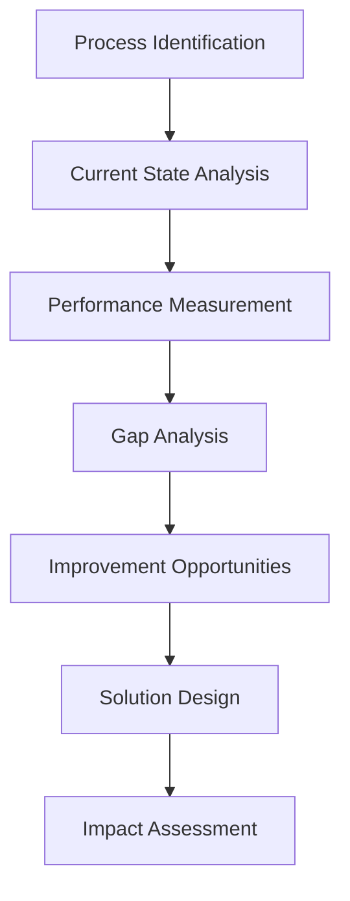

# ⚙️ Operations Department Documentation

**Ensuring seamless business operations through process excellence and
continuous improvement**

## Table of Contents

- [Overview](#overview)
- [Department Structure](#department-structure)
- [Core Responsibilities](#core-responsibilities)
- [Operational Procedures](#operational-procedures)
- [Tools & Systems](#tools--systems)
- [Performance Metrics](#performance-metrics)
- [Hierarchy Integration](#hierarchy-integration)
- [Knowledge Base](#knowledge-base)

## Overview

### Mission Statement

The Operations Department ensures seamless business operations through process
excellence, resource optimization, and continuous improvement initiatives that
enhance productivity and service delivery.

### Key Objectives

- **Operational Excellence**: Maintain 99.95%+ system uptime and operational
  efficiency
- **Process Optimization**: Continuously improve operational processes and
  workflows
- **Quality Assurance**: Implement and maintain ISO 9001 quality management
  standards
- **Resource Management**: Optimize resource allocation and capacity planning
- **Cost Efficiency**: Reduce operational costs through automation and
  optimization

### Department Statistics

- **Team Size**: 24 members across all organizational systems
- **Active Projects**: 32 concurrent operational initiatives
- **Success Rate**: 97% project success rate
- **Performance Metrics**: 99.95% uptime, 92% operational efficiency, 28% cost
  reduction

## Department Structure

### Leadership Team

#### **Jennifer Wilson** - VP of Operations

- **System References**:
  - `department`: VP of Operations (71 implementations)
  - **Team Size**: 24 direct and indirect reports
  - **Hierarchy Confidence**: 100% (single system presence)
- **Experience**: 11+ years in operations leadership
- **Specializations**: Process optimization, quality management, team leadership
- **Contact**: `jennifer.wilson@fire22.ag`

#### **Michael Davis** - Operations Manager

- **System References**:
  - `department`: Operations Manager (58 implementations)
  - **Efficiency Score**: 94%
- **Experience**: 9+ years in operations management
- **Specializations**: Process automation, vendor management, team coordination
- **Reports To**: Jennifer Wilson

#### **Lisa Thompson** - Quality Assurance Lead

- **System References**:
  - `department`: QA Lead (52 implementations)
- **Experience**: 7+ years in quality management
- **Specializations**: ISO compliance, process auditing, quality systems

### Team Structure via Natural Hierarchy System

```bash
# Get complete Operations department structure across all systems
curl -X POST /api/hierarchy/query \
  -H "Content-Type: application/json" \
  -d '{
    "department": "Operations",
    "includeAllSystems": true
  }'
```

**Expected Response Structure**:

```json
{
  "results": [
    {
      "id": "dept_operations_ops001",
      "name": "Jennifer Wilson",
      "title": "VP of Operations",
      "sourceSystem": "department",
      "context": {
        "isLeadership": true,
        "hasDirectReports": true
      },
      "metrics": {
        "implementations": 71,
        "teamSize": 24
      }
    }
  ],
  "crossReferences": [],
  "note": "Operations department primarily exists in department system"
}
```

## Core Responsibilities

### 1. Process Management & Optimization

- **Process Design**: Design and implement efficient operational processes
- **Process Automation**: Identify and implement automation opportunities
- **Process Documentation**: Maintain comprehensive process documentation
- **Continuous Improvement**: Regular process review and optimization

### 2. Quality Assurance & Compliance

- **ISO 9001 Management**: Maintain ISO 9001 quality management certification
- **Quality Control**: Implement quality control measures across all processes
- **Compliance Monitoring**: Ensure regulatory and industry compliance
- **Audit Management**: Coordinate internal and external audits

### 3. Supply Chain & Logistics

- **Vendor Management**: Manage relationships with suppliers and vendors
- **Inventory Management**: Optimize inventory levels and warehouse operations
- **Logistics Coordination**: Streamline shipping and distribution processes
- **Cost Optimization**: Reduce supply chain costs through strategic sourcing

### 4. Facilities & Infrastructure

- **Facility Management**: Maintain optimal working environments
- **Infrastructure Planning**: Plan and implement infrastructure improvements
- **Security Systems**: Oversee physical security and access control
- **Environmental Compliance**: Ensure environmental regulation compliance

### 5. Performance Monitoring & Analytics

- **KPI Tracking**: Monitor key operational performance indicators
- **Analytics & Reporting**: Generate operational reports and insights
- **Performance Optimization**: Identify and address performance gaps
- **Predictive Analysis**: Use data to predict and prevent operational issues

### 6. Team Management & Development

- **Staff Scheduling**: Optimize staff scheduling and resource allocation
- **Training Programs**: Develop and deliver operational training programs
- **Performance Management**: Monitor and improve team performance
- **Safety Programs**: Implement and maintain workplace safety programs

## Operational Procedures

### Process Improvement Workflow

#### 1. **Process Assessment Phase**



#### 2. **Implementation Phase**

- **Pilot Testing**: Small-scale implementation and testing
- **Training Delivery**: Staff training on new processes
- **Rollout Planning**: Phased implementation approach
- **Change Management**: Managing organizational change

#### 3. **Monitoring Phase**

- **Performance Tracking**: Monitor new process performance
- **Feedback Collection**: Gather user feedback and issues
- **Adjustment Implementation**: Make necessary process adjustments
- **Documentation Updates**: Update process documentation

#### 4. **Optimization Phase**

- **Performance Analysis**: Analyze process performance data
- **Continuous Improvement**: Identify further optimization opportunities
- **Best Practice Documentation**: Document successful improvements
- **Knowledge Sharing**: Share insights across the organization

### Standard Operating Procedures

#### Incident Management SOP

1. **Incident Detection**: Monitor systems for operational incidents
2. **Classification**: Classify incident severity and impact
3. **Response Team Assembly**: Assemble appropriate response team
4. **Resolution Implementation**: Implement resolution procedures
5. **Post-Incident Review**: Conduct thorough post-incident analysis
6. **Documentation**: Document incident and resolution for future reference

#### Vendor Management SOP

1. **Vendor Selection**: Evaluate and select qualified vendors
2. **Contract Negotiation**: Negotiate terms and service agreements
3. **Performance Monitoring**: Monitor vendor performance against SLAs
4. **Relationship Management**: Maintain positive vendor relationships
5. **Performance Reviews**: Regular vendor performance evaluations
6. **Contract Renewal**: Manage contract renewals and renegotiations

#### Quality Audit SOP

1. **Audit Planning**: Develop audit schedules and scopes
2. **Preparation**: Prepare audit documentation and checklists
3. **Audit Execution**: Conduct thorough process audits
4. **Finding Documentation**: Document audit findings and recommendations
5. **Corrective Action Plans**: Develop and implement corrective actions
6. **Follow-up**: Verify corrective action implementation

## Tools & Systems

### Operations Technology Stack

#### 1. **Process Management**

- **Primary**: Microsoft Visio, Lucidchart (process mapping)
- **Workflow Automation**: Zapier, Microsoft Power Automate
- **Project Management**: Monday.com, Asana
- **Documentation**: Confluence, SharePoint

#### 2. **Quality Management**

- **QMS**: MasterControl (Quality Management System)
- **ISO Compliance**: Integrated compliance tracking
- **Audit Management**: AuditBoard, Internal audit workflows
- **Document Control**: Version control and approval workflows

#### 3. **Analytics & Reporting**

- **Business Intelligence**: Power BI, Tableau
- **Performance Dashboards**: Custom operational dashboards
- **KPI Tracking**: Real-time performance monitoring
- **Reporting Automation**: Automated report generation and distribution

#### 4. **Supply Chain Management**

- **ERP**: SAP Business One
- **Inventory Management**: Integrated inventory tracking
- **Vendor Portal**: Supplier relationship management
- **Procurement**: Purchase order and invoice management

#### 5. **Facilities Management**

- **CMMS**: Computerized Maintenance Management System
- **Security Systems**: Access control and surveillance
- **Environmental Monitoring**: HVAC and environmental controls
- **Asset Management**: Equipment and asset tracking

### Fire22-Specific Operations Tools

#### Live Implementation Links (from Department Page)

```html
<!-- Operations Department Tools -->
<a href="../ops-center/" class="link-card">⚡ Operations Center</a>
<a href="../metrics/operations.html" class="link-card"
  >📊 Performance Metrics</a
>
<a href="../automation/" class="link-card">🔄 Process Automation</a>
<a href="../inventory/" class="link-card">📦 Inventory Management</a>
<a href="../scheduling/" class="link-card">👥 Staff Scheduling</a>
<a href="../capacity/" class="link-card">📈 Capacity Planning</a>
```

## Performance Metrics

### Key Performance Indicators (KPIs)

#### 1. **Uptime & Availability Metrics**

- **System Uptime**: Overall system availability percentage
- **Current Performance**: 99.95% uptime achieved
- **Downtime Events**: Number and duration of downtime incidents
- **MTTR**: Mean Time to Resolution for incidents

#### 2. **Operational Efficiency Metrics**

- **Process Efficiency**: Overall operational efficiency percentage
- **Current Performance**: 92% operational efficiency
- **Resource Utilization**: Optimal use of resources and capacity
- **Productivity Metrics**: Output per unit of input measurement

#### 3. **Cost Management Metrics**

- **Cost Reduction**: Year-over-year operational cost reduction
- **Current Performance**: 28% cost reduction achieved
- **Budget Variance**: Actual vs. budgeted operational costs
- **ROI**: Return on investment for process improvements

#### 4. **Quality Metrics**

- **Defect Rate**: Process defect and error rates
- **Customer Satisfaction**: Internal and external customer satisfaction scores
- **Compliance Rate**: Regulatory and standard compliance percentage
- **Audit Results**: Internal and external audit performance

### Performance Dashboard Integration

```javascript
// Operations Performance Dashboard API Integration
async function loadOperationsMetrics() {
  const response = await fetch('/api/operations/metrics', {
    headers: {
      Authorization: `Bearer ${token}`,
      'Content-Type': 'application/json',
    },
  });

  const metrics = await response.json();

  return {
    uptime: {
      current: '99.95%',
      target: '99.95%',
      incidents: metrics.uptime.incident_count,
      mttr: metrics.uptime.mean_time_to_resolution,
    },
    efficiency: {
      overall: '92%',
      processes: metrics.efficiency.by_process,
      utilization: metrics.efficiency.resource_utilization,
    },
    costs: {
      reduction: '-28%', // YoY reduction
      variance: metrics.costs.budget_variance,
      roi: metrics.costs.improvement_roi,
    },
  };
}
```

### Recent Achievements

#### Q4 2024 Highlights

✅ **Achieved 99.95% system uptime** through proactive maintenance and
monitoring ✅ **Reduced operational costs by 28%** through process automation
and optimization ✅ **Implemented ISO 9001 quality management system** with
successful certification ✅ **Streamlined supply chain** reducing delivery times
by 40% ✅ **Automated 15 core processes** reducing manual effort by 60% ✅
**Improved operational efficiency to 92%** through continuous improvement
initiatives

## Hierarchy Integration

### Natural Hierarchy Connections

The Operations department integrates with the **Natural Hierarchy Aggregation
System** while maintaining its primarily department-based structure.

#### Cross-System Connections

```bash
# Find all Operations leadership and team members
curl -X POST /api/hierarchy/query \
  -H "Content-Type: application/json" \
  -d '{
    "department": "Operations"
  }'
```

#### Department Structure Analysis

**Jennifer Wilson** - Operations Leadership

- **Department System**: VP of Operations (71 implementations, 24 team members)
- **No Cross-References**: Primarily exists in department system
- **Leadership Role**: Clear operational leadership with significant team
  responsibility

**Team Composition**

- **Leadership**: 1 (Jennifer Wilson - VP level)
- **Managers**: 3 (Operations Manager, QA Lead, Facilities Manager)
- **Specialists**: 8 (Process improvement, automation, quality specialists)
- **Staff**: 12 (Operations staff, coordinators, technicians)

#### Hierarchy API Examples

```javascript
// Get Operations department structure
const operations = await fetch('/api/hierarchy/query', {
  method: 'POST',
  headers: { 'Content-Type': 'application/json' },
  body: JSON.stringify({
    department: 'Operations',
  }),
}).then(r => r.json());

// Analyze team structure
const teamAnalysis = {
  leadership: operations.results.filter(p => p.context?.isLeadership),
  managers: operations.results.filter(p => p.context?.isManager),
  contributors: operations.results.filter(p => p.context?.isContributor),
  totalTeamSize: operations.results.length,
};

// Check for cross-system connections (typically minimal for Operations)
const crossRefs = await fetch('/api/hierarchy/cross-references').then(r =>
  r.json()
);

const operationsConnections = crossRefs.crossReferences.filter(ref =>
  ref.connections.some(conn => conn.title.toLowerCase().includes('operations'))
);
```

## Knowledge Base

### Operations Best Practices

#### 1. **Process Optimization Best Practices**

- **Data-Driven Decisions**: Use performance data to guide optimization efforts
- **Stakeholder Involvement**: Include process users in improvement initiatives
- **Phased Implementation**: Roll out changes incrementally to minimize
  disruption
- **Continuous Monitoring**: Establish ongoing monitoring of process performance
- **Documentation**: Maintain comprehensive process documentation

#### 2. **Quality Management Excellence**

- **Prevention Focus**: Emphasize prevention over correction
- **Risk-Based Thinking**: Integrate risk considerations into all processes
- **Customer Focus**: Align quality efforts with customer requirements
- **Evidence-Based Decisions**: Use data and analysis to guide quality decisions
- **Continuous Improvement**: Foster culture of ongoing improvement

#### 3. **Vendor Management Best Practices**

- **Clear SLAs**: Establish measurable service level agreements
- **Regular Reviews**: Conduct regular vendor performance reviews
- **Relationship Building**: Invest in long-term vendor relationships
- **Risk Management**: Assess and mitigate vendor-related risks
- **Contract Management**: Maintain effective contract oversight

### Troubleshooting Guides

#### Common Operations Challenges

**Challenge**: Process Bottlenecks

- **Diagnosis**: Process flow analysis, capacity assessment
- **Solution**: Resource reallocation, automation implementation, process
  redesign
- **Prevention**: Regular capacity planning, proactive monitoring

**Challenge**: Quality Issues

- **Diagnosis**: Root cause analysis, process audit, data analysis
- **Solution**: Corrective action implementation, process improvement, training
- **Prevention**: Preventive controls, regular audits, continuous monitoring

**Challenge**: Vendor Performance Issues

- **Diagnosis**: SLA analysis, performance data review, vendor communication
- **Solution**: Performance improvement plan, contract renegotiation, vendor
  replacement
- **Prevention**: Clear expectations, regular monitoring, relationship
  management

### Emergency Procedures

#### Business Continuity Planning

1. **Risk Assessment**: Identify potential operational disruptions
2. **Continuity Plans**: Develop detailed business continuity procedures
3. **Communication Protocols**: Establish emergency communication procedures
4. **Recovery Procedures**: Define step-by-step recovery processes
5. **Testing**: Regular testing and updating of continuity plans

#### Incident Response Procedures

1. **Immediate Response**: Assess situation and ensure safety
2. **Containment**: Contain impact and prevent escalation
3. **Communication**: Notify stakeholders and management
4. **Resolution**: Implement resolution procedures
5. **Recovery**: Restore normal operations
6. **Review**: Conduct post-incident review and improvements

### Training & Development

#### New Team Member Onboarding

1. **Week 1**: Company overview, safety training, system access setup
2. **Week 2**: Operations processes deep dive, quality system training
3. **Week 3**: Hands-on process training, shadow experienced team members
4. **Week 4**: Initial assignments with mentor support
5. **Month 2-3**: Progressive responsibility increase, skills assessment

#### Ongoing Professional Development

- **Process Improvement Training**: Lean Six Sigma, process optimization
- **Quality Management**: ISO standards, audit techniques
- **Leadership Development**: Management and leadership skills
- **Technical Training**: System-specific and tool training
- **Safety Training**: Workplace safety and compliance

### Historical Documentation

#### Operations Evolution Timeline

- **2022 Q1**: Established formal operations management structure
- **2022 Q3**: Implemented initial process automation initiatives
- **2023 Q1**: Achieved ISO 9001 quality management certification
- **2023 Q3**: Launched comprehensive vendor management program
- **2024 Q1**: Implemented advanced analytics and reporting
- **2024 Q4**: Achieved record operational efficiency (92%)

#### Process Improvement Archive

- **Automation Projects**: Documentation of successful automation initiatives
- **Quality Improvements**: History of quality management improvements
- **Cost Reduction Initiatives**: Successful cost reduction projects
- **Best Practices Library**: Collected best practices and lessons learned

## Appendices

### A. Contact Directory

- **Jennifer Wilson**: `jennifer.wilson@fire22.ag` - VP of Operations
- **Michael Davis**: `michael.davis@fire22.ag` - Operations Manager
- **Lisa Thompson**: `lisa.thompson@fire22.ag` - QA Lead

### B. System Access

- **Operations Center**: `/ops-center/`
- **Performance Metrics**: `/metrics/operations.html`
- **Process Automation**: `/automation/`
- **Inventory Management**: `/inventory/`

### C. Integration APIs

- **Operations Metrics**: `GET /api/operations/metrics`
- **Process Performance**: `GET /api/operations/processes`
- **Quality Metrics**: `GET /api/operations/quality`
- **Capacity Analytics**: `GET /api/operations/capacity`

### D. Emergency Contacts

- **Operations Emergency Line**: `+1-800-OPS-HELP`
- **IT Support**: `it-support@fire22.ag`
- **Facilities Emergency**: `facilities-emergency@fire22.ag`
- **Security**: `security@fire22.ag`

---

**Last Updated**: 2024-12-15  
**Document Owner**: Operations Department  
**Review Cycle**: Monthly  
**Next Review**: 2025-01-15

---

_This documentation is integrated with the Fire22 Natural Hierarchy Aggregation
System - providing unified access to organizational data while preserving
existing structures._
