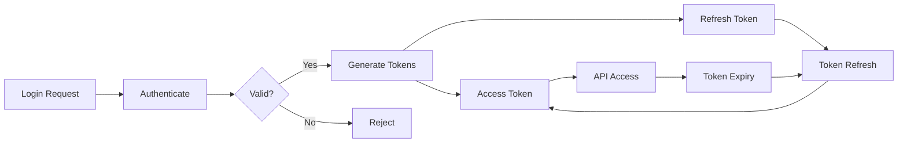

# 🔐 Fire22 API Security Guide - RBAC & Validation

## Table of Contents

1. [Role-Based Access Control (RBAC)](#role-based-access-control-rbac)
2. [Token Management](#token-management)
3. [Validation Flow](#validation-flow)
4. [Security Monitoring](#security-monitoring)
5. [Implementation Guide](#implementation-guide)
6. [Testing Security](#testing-security)

---

## 🎯 Role-Based Access Control (RBAC)

### RBAC Architecture

```
┌─────────────────────────────────────────────────────────────┐
│                     Fire22 RBAC System                       │
├─────────────────────────────────────────────────────────────┤
│                                                               │
│  ┌─────────────┐     ┌─────────────┐     ┌─────────────┐   │
│  │    Users    │────▶│    Roles    │────▶│ Permissions │   │
│  └─────────────┘     └─────────────┘     └─────────────┘   │
│        │                    │                     │          │
│        ▼                    ▼                     ▼          │
│  ┌─────────────────────────────────────────────────────┐   │
│  │                  Access Control Layer                │   │
│  │  • Token Validation                                  │   │
│  │  • Permission Checking                               │   │
│  │  • Scope Enforcement                                 │   │
│  └─────────────────────────────────────────────────────┘   │
│                             │                                │
│                             ▼                                │
│  ┌─────────────────────────────────────────────────────┐   │
│  │                   Protected Resources                │   │
│  │  • API Endpoints                                     │   │
│  │  • Database Operations                               │   │
│  │  • System Functions                                  │   │
│  └─────────────────────────────────────────────────────┘   │
│                                                               │
└─────────────────────────────────────────────────────────────┘
```

### Role Definitions

#### 1. Admin Role

```typescript
const adminRole = {
  name: 'admin',
  level: 5,
  description: 'Full system administrative access',
  permissions: [
    // System Management
    'system.*',
    'admin.*',

    // User Management
    'user.create',
    'user.read',
    'user.update',
    'user.delete',
    'user.role.assign',

    // Financial Operations
    'financial.*',
    'withdrawal.approve',
    'withdrawal.reject',
    'deposit.process',

    // Wager Management
    'wager.*',
    'wager.settle',
    'wager.void',
    'wager.bulk_settle',

    // Agent Management
    'agent.*',
    'agent.create',
    'agent.configure',
    'agent.suspend',

    // Customer Management
    'customer.*',
    'customer.create',
    'customer.bulk_import',
    'customer.modify',

    // Reporting
    'reports.*',
    'analytics.*',

    // System Operations
    'sync.fire22',
    'cache.clear',
    'audit.view',
  ],
  inherits: ['manager', 'agent', 'customer'],
};
```

#### 2. Manager Role

```typescript
const managerRole = {
  name: 'manager',
  level: 4,
  description: 'Management and reporting access',
  permissions: [
    // Reporting & Analytics
    'reports.weekly',
    'reports.daily',
    'reports.monthly',
    'analytics.sports',
    'analytics.performance',

    // Agent Management
    'agent.view',
    'agent.performance',
    'agent.kpi',

    // Customer Management
    'customer.list',
    'customer.view',
    'customer.vip',
    'customer.details',

    // Wager Monitoring
    'wager.view_live',
    'wager.alerts',
    'wager.history',

    // Financial Monitoring
    'financial.view',
    'withdrawal.pending',

    // Queue Management
    'queue.view',
    'queue.stats',
    'queue.opportunities',
  ],
  inherits: ['agent'],
};
```

#### 3. Agent Role

```typescript
const agentRole = {
  name: 'agent',
  level: 3,
  description: 'Agent-specific operations',
  permissions: [
    // Wager Operations
    'wager.create',
    'wager.view_own',

    // Customer Management (Own Only)
    'customer.view_own',
    'customer.create_sub',

    // Reporting (Own Only)
    'reports.own',
    'analytics.own',

    // Queue Operations
    'queue.deposit',
    'queue.withdrawal',
  ],
  scope: {
    type: 'agent',
    field: 'agentId',
    restriction: 'own_customers',
  },
};
```

#### 4. Customer Role

```typescript
const customerRole = {
  name: 'customer',
  level: 2,
  description: 'Customer self-service operations',
  permissions: [
    // Account Operations
    'account.view_own',
    'account.update_own',

    // Betting Operations
    'bet.view_own',
    'bet.history_own',

    // Financial Operations
    'withdrawal.request',
    'deposit.request',
    'balance.view_own',

    // Queue Operations
    'queue.own',
  ],
  scope: {
    type: 'customer',
    field: 'customerId',
    restriction: 'self_only',
  },
};
```

### Permission Matrix

| **Operation**              | **Admin** | **Manager** | **Agent** | **Customer** |
| -------------------------- | --------- | ----------- | --------- | ------------ |
| **System Sync**            | ✅        | ❌          | ❌        | ❌           |
| **View All Wagers**        | ✅        | ✅          | ❌        | ❌           |
| **Settle Wagers**          | ✅        | ❌          | ❌        | ❌           |
| **Create Wager**           | ✅        | ✅          | ✅        | ❌           |
| **View Agent Performance** | ✅        | ✅          | Own Only  | ❌           |
| **Manage Customers**       | ✅        | ✅          | Own Only  | ❌           |
| **Request Withdrawal**     | ✅        | ✅          | ✅        | ✅           |
| **Approve Withdrawal**     | ✅        | ❌          | ❌        | ❌           |
| **View Reports**           | ✅        | ✅          | Own Only  | Own Only     |
| **Audit Logs**             | ✅        | ❌          | ❌        | ❌           |

---

## 🔑 Token Management

### Token Lifecycle



### Token Generation

```typescript
import { secrets } from 'bun';
import jwt from 'jsonwebtoken';

async function generateTokens(user: User): Promise<TokenPair> {
  // Get secret from secure storage
  const jwtSecret = await secrets.get({
    service: 'fire22-dashboard',
    name: 'jwt_secret',
  });

  // Get user permissions
  const permissions = await getUserPermissions(user);

  // Generate access token (short-lived)
  const accessToken = jwt.sign(
    {
      sub: user.id,
      role: user.role,
      level: getRoleLevel(user.role),
      permissions: permissions.list,
      scope: permissions.scope,
      type: 'access',
    },
    jwtSecret,
    {
      expiresIn: '24h',
      issuer: 'fire22-dashboard',
      audience: 'fire22-api',
      jwtid: crypto.randomUUID(),
    }
  );

  // Generate refresh token (long-lived)
  const refreshToken = jwt.sign(
    {
      sub: user.id,
      type: 'refresh',
    },
    jwtSecret,
    {
      expiresIn: '7d',
      issuer: 'fire22-dashboard',
      jwtid: crypto.randomUUID(),
    }
  );

  // Store refresh token in database
  await storeRefreshToken(user.id, refreshToken);

  return {
    accessToken,
    refreshToken,
    expiresIn: 86400, // 24 hours in seconds
    tokenType: 'Bearer',
  };
}
```

### Token Validation

```typescript
async function validateAccessToken(token: string): Promise<TokenPayload> {
  const jwtSecret = await secrets.get({
    service: 'fire22-dashboard',
    name: 'jwt_secret',
  });

  try {
    // Verify token signature and claims
    const decoded = jwt.verify(token, jwtSecret, {
      issuer: 'fire22-dashboard',
      audience: 'fire22-api',
      complete: true,
    });

    // Check token type
    if (decoded.payload.type !== 'access') {
      throw new Error('Invalid token type');
    }

    // Check if token is blacklisted
    if (await isTokenBlacklisted(decoded.payload.jti)) {
      throw new Error('Token has been revoked');
    }

    // Check user still active
    const user = await getUserById(decoded.payload.sub);
    if (!user || user.status !== 'active') {
      throw new Error('User account inactive');
    }

    return decoded.payload;
  } catch (error) {
    throw new UnauthorizedError(`Token validation failed: ${error.message}`);
  }
}
```

### Token Refresh

```typescript
async function refreshAccessToken(refreshToken: string): Promise<TokenPair> {
  const jwtSecret = await secrets.get({
    service: 'fire22-dashboard',
    name: 'jwt_secret',
  });

  try {
    // Verify refresh token
    const decoded = jwt.verify(refreshToken, jwtSecret, {
      issuer: 'fire22-dashboard',
    });

    // Check token type
    if (decoded.type !== 'refresh') {
      throw new Error('Invalid refresh token');
    }

    // Check if refresh token is valid in database
    const storedToken = await getStoredRefreshToken(decoded.sub);
    if (storedToken !== refreshToken) {
      throw new Error('Refresh token mismatch');
    }

    // Get user and generate new tokens
    const user = await getUserById(decoded.sub);
    if (!user) {
      throw new Error('User not found');
    }

    // Revoke old refresh token
    await revokeRefreshToken(refreshToken);

    // Generate new token pair
    return generateTokens(user);
  } catch (error) {
    throw new UnauthorizedError(`Token refresh failed: ${error.message}`);
  }
}
```

---

## ✅ Validation Flow

### Request Validation Pipeline

```typescript
class ValidationPipeline {
  async validate(req: Request): Promise<ValidationResult> {
    // 1. Token Validation
    const token = this.extractToken(req);
    const tokenPayload = await validateAccessToken(token);

    // 2. Permission Check
    const hasPermission = await this.checkPermissions(
      tokenPayload.permissions,
      req.endpoint,
      req.method
    );

    if (!hasPermission) {
      throw new ForbiddenError('Insufficient permissions');
    }

    // 3. Scope Validation
    if (tokenPayload.scope) {
      await this.validateScope(tokenPayload.scope, req.params, req.body);
    }

    // 4. Input Validation with Zod
    const validatedInput = await this.validateInput(
      req.body,
      getSchemaForEndpoint(req.endpoint)
    );

    // 5. Rate Limit Check
    await this.checkRateLimit(tokenPayload.sub, req.endpoint);

    return {
      user: tokenPayload,
      validatedInput,
      permissions: tokenPayload.permissions,
    };
  }
}
```

### Response Validation with @fire22/validator

```typescript
import {
  Fire22SecureClient,
  Fire22CustomersResponseSchema,
} from '@fire22/validator';

async function secureApiCall() {
  const client = new Fire22SecureClient({
    validateResponses: true,
    apiToken: await getApiToken(),
  });

  try {
    // Make API call with automatic validation
    const response = await client.getCustomers({
      pageSize: 10,
      status: 'active',
    });

    // Response is automatically validated against schema
    // Type-safe response
    response.data.forEach(customer => {
      console.log(customer.customerID); // TypeScript knows the type
    });
  } catch (error) {
    if (error.name === 'Fire22ValidationError') {
      // Response didn't match expected schema
      console.error('Invalid response format:', error.validationError);
    } else if (error.name === 'Fire22APIError') {
      // API error (auth, permissions, etc.)
      console.error('API error:', error.code, error.message);
    }
  }
}
```

---

## 📊 Security Monitoring

### Real-time Monitoring Dashboard

```typescript
import { createMonitor } from '@fire22/validator';

class SecurityMonitor {
  private monitor: any;
  private alerts: SecurityAlert[] = [];

  async initialize() {
    this.monitor = createMonitor(client, {
      checkInterval: 30000, // 30 seconds
      alertThresholds: {
        errorRate: 5,
        validationErrorRate: 2,
        latency: 1000,
        consecutiveFailures: 3,
      },
    });

    await this.monitor.start();
    this.setupAlertHandlers();
  }

  setupAlertHandlers() {
    // Authentication failures
    this.on('auth.failed', event => {
      if (event.count > 5) {
        this.raiseAlert('BRUTE_FORCE', {
          ip: event.ip,
          attempts: event.count,
        });
      }
    });

    // Permission violations
    this.on('permission.denied', event => {
      this.raiseAlert('PERMISSION_VIOLATION', {
        user: event.userId,
        endpoint: event.endpoint,
        requiredPermission: event.permission,
      });
    });

    // Rate limit violations
    this.on('rate.limit.exceeded', event => {
      this.raiseAlert('RATE_LIMIT_ABUSE', {
        user: event.userId,
        endpoint: event.endpoint,
        requests: event.count,
      });
    });
  }

  async getSecurityMetrics(): Promise<SecurityMetrics> {
    const status = this.monitor.getStatus();

    return {
      authentication: {
        successful: await this.getMetric('auth.success'),
        failed: await this.getMetric('auth.failed'),
        activeTokens: await this.getActiveTokenCount(),
      },
      authorization: {
        granted: await this.getMetric('auth.granted'),
        denied: await this.getMetric('auth.denied'),
      },
      validation: {
        passed: status.metrics.total - status.metrics.validationErrors,
        failed: status.metrics.validationErrors,
        errorRate: status.metrics.validationErrorRate,
      },
      alerts: {
        total: this.alerts.length,
        unresolved: this.alerts.filter(a => !a.resolved).length,
        critical: this.alerts.filter(a => a.level === 'critical').length,
      },
    };
  }
}
```

### Security Alert System

```typescript
interface SecurityAlert {
  id: string;
  timestamp: Date;
  level: 'info' | 'warning' | 'error' | 'critical';
  type: string;
  message: string;
  details: any;
  resolved: boolean;
}

class AlertManager {
  async handleSecurityAlert(alert: SecurityAlert) {
    // Log alert
    await this.logAlert(alert);

    // Take automatic action based on alert type
    switch (alert.type) {
      case 'BRUTE_FORCE':
        await this.blockIP(alert.details.ip, 3600000); // 1 hour
        break;

      case 'PERMISSION_VIOLATION':
        if (alert.details.count > 10) {
          await this.suspendUser(alert.details.user);
        }
        break;

      case 'RATE_LIMIT_ABUSE':
        await this.temporaryBan(alert.details.user, 900000); // 15 min
        break;

      case 'VALIDATION_FAILURE':
        await this.investigateEndpoint(alert.details.endpoint);
        break;
    }

    // Notify administrators for critical alerts
    if (alert.level === 'critical') {
      await this.notifyAdmins(alert);
    }
  }
}
```

---

## 🚀 Implementation Guide

### Step 1: Setup Authentication Middleware

```typescript
// middleware/auth.ts
export const authenticate = async (req: Request, res: Response, next: Next) => {
  try {
    const token = extractBearerToken(req.headers.authorization);
    if (!token) {
      throw new UnauthorizedError('No token provided');
    }

    const payload = await validateAccessToken(token);
    req.user = payload;
    next();
  } catch (error) {
    res.status(401).json({
      error: 'Authentication failed',
      message: error.message,
    });
  }
};
```

### Step 2: Setup Authorization Middleware

```typescript
// middleware/authorize.ts
export const authorize = (requiredPermissions: string[]) => {
  return async (req: Request, res: Response, next: Next) => {
    try {
      const userPermissions = req.user.permissions;

      // Check if user has all required permissions
      const hasPermissions = requiredPermissions.every(
        perm =>
          userPermissions.includes(perm) ||
          userPermissions.includes(perm.split('.')[0] + '.*')
      );

      if (!hasPermissions) {
        throw new ForbiddenError('Insufficient permissions');
      }

      next();
    } catch (error) {
      res.status(403).json({
        error: 'Authorization failed',
        message: error.message,
      });
    }
  };
};
```

### Step 3: Setup Validation Middleware

```typescript
// middleware/validate.ts
import { z } from 'zod';

export const validate = (schema: z.ZodSchema) => {
  return async (req: Request, res: Response, next: Next) => {
    try {
      const validated = await schema.parseAsync(req.body);
      req.validatedBody = validated;
      next();
    } catch (error) {
      res.status(400).json({
        error: 'Validation failed',
        details: error.errors,
      });
    }
  };
};
```

### Step 4: Secure Endpoint Example

```typescript
// routes/manager.ts
app.post(
  '/api/manager/getLiveWagers',
  authenticate,
  authorize(['manager.wager.view_live']),
  validate(GetLiveWagersSchema),
  rateLimiter({ max: 100, windowMs: 60000 }),
  async (req, res) => {
    try {
      // Use validated input
      const { agentID } = req.validatedBody;

      // Apply scope restrictions
      const wagers = await getLiveWagers({
        agentId: agentID,
        userScope: req.user.scope,
      });

      // Validate response
      const validated = Fire22LiveWagersResponseSchema.parse(wagers);

      // Audit log
      await auditLog.record({
        userId: req.user.sub,
        action: 'VIEW_LIVE_WAGERS',
        resource: agentID,
        timestamp: new Date(),
      });

      res.json(validated);
    } catch (error) {
      handleError(error, res);
    }
  }
);
```

---

## 🧪 Testing Security

### Security Test Suite

```typescript
import { describe, test, expect } from 'bun:test';

describe('API Security Tests', () => {
  test('should reject request without token', async () => {
    const response = await fetch('/api/manager/getLiveWagers', {
      method: 'POST',
      body: JSON.stringify({ agentID: 'AGENT001' }),
    });

    expect(response.status).toBe(401);
  });

  test('should reject request with invalid token', async () => {
    const response = await fetch('/api/manager/getLiveWagers', {
      method: 'POST',
      headers: {
        Authorization: 'Bearer invalid-token',
      },
      body: JSON.stringify({ agentID: 'AGENT001' }),
    });

    expect(response.status).toBe(401);
  });

  test('should reject request with insufficient permissions', async () => {
    const customerToken = await getCustomerToken();

    const response = await fetch('/api/manager/getLiveWagers', {
      method: 'POST',
      headers: {
        Authorization: `Bearer ${customerToken}`,
      },
      body: JSON.stringify({ agentID: 'AGENT001' }),
    });

    expect(response.status).toBe(403);
  });

  test('should allow request with valid token and permissions', async () => {
    const managerToken = await getManagerToken();

    const response = await fetch('/api/manager/getLiveWagers', {
      method: 'POST',
      headers: {
        Authorization: `Bearer ${managerToken}`,
      },
      body: JSON.stringify({ agentID: 'AGENT001' }),
    });

    expect(response.status).toBe(200);
    const data = await response.json();
    expect(data).toHaveProperty('data');
  });

  test('should enforce scope restrictions for agents', async () => {
    const agentToken = await getAgentToken('AGENT001');

    // Should succeed for own agent
    const ownResponse = await fetch('/api/manager/getCustomersByAgent', {
      method: 'GET',
      headers: {
        Authorization: `Bearer ${agentToken}`,
      },
      query: { agentID: 'AGENT001' },
    });
    expect(ownResponse.status).toBe(200);

    // Should fail for other agent
    const otherResponse = await fetch('/api/manager/getCustomersByAgent', {
      method: 'GET',
      headers: {
        Authorization: `Bearer ${agentToken}`,
      },
      query: { agentID: 'AGENT002' },
    });
    expect(otherResponse.status).toBe(403);
  });
});
```

### Security Audit Script

```typescript
#!/usr/bin/env bun

async function auditSecurity() {
  console.log('🔐 Running Security Audit...\n');

  // Check authentication
  console.log('✓ Testing authentication endpoints...');
  await testAuthentication();

  // Check authorization
  console.log('✓ Testing authorization matrix...');
  await testAuthorization();

  // Check validation
  console.log('✓ Testing input validation...');
  await testValidation();

  // Check rate limiting
  console.log('✓ Testing rate limits...');
  await testRateLimits();

  // Check security headers
  console.log('✓ Testing security headers...');
  await testSecurityHeaders();

  // Generate report
  const report = await generateSecurityReport();
  console.log('\n📊 Security Audit Report:');
  console.log(report);
}

if (import.meta.main) {
  auditSecurity();
}
```

---

## 📚 Summary

The Fire22 API Security system provides:

1. **Role-Based Access Control (RBAC)**

   - 5 authentication levels
   - Granular permission system
   - Scope-based restrictions

2. **Secure Token Management**

   - JWT-based authentication
   - Access and refresh tokens
   - Token revocation support

3. **Comprehensive Validation**

   - Request validation with Zod
   - Response validation with @fire22/validator
   - Permission checking at every level

4. **Security Monitoring**

   - Real-time alert system
   - Security metrics dashboard
   - Audit logging

5. **Best Practices Implementation**
   - Security headers
   - Rate limiting
   - Input sanitization
   - Error handling

All components work together to provide enterprise-grade security for the Fire22
Dashboard API.

---

**Last Updated**: December 2024  
**Version**: 1.0.0  
**Security Level**: Production Ready

🔥 Secured with Fire22 Security System
