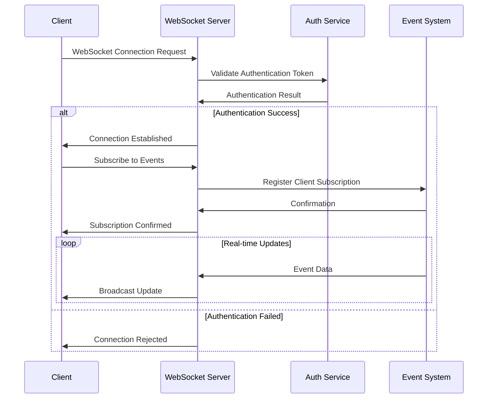
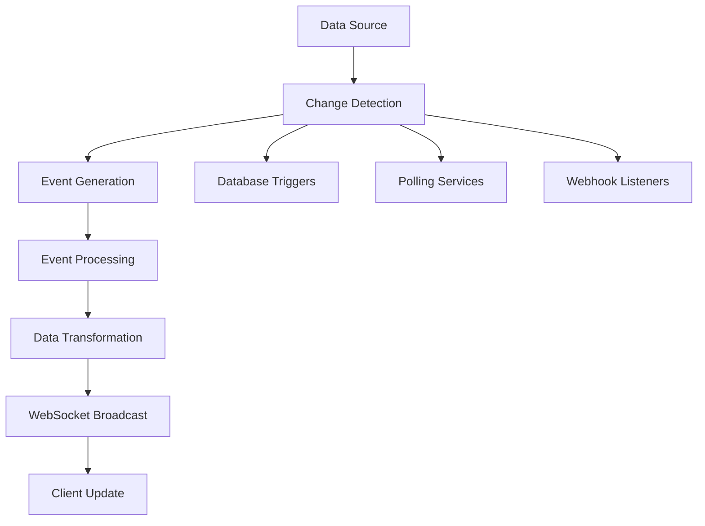

# Fire22 Dashboard Real-Time Flows

## Overview

Complete documentation of real-time data flows, WebSocket implementations, and
live data streaming in the Fire22 Dashboard system.

## Table of Contents

- [Real-Time Architecture](#real-time-architecture)
- [WebSocket Implementation](#websocket-implementation)
- [Event System](#event-system)
- [Data Streaming](#data-streaming)
- [Real-Time Updates](#real-time-updates)
- [Performance Optimization](#performance-optimization)
- [Error Handling](#error-handling)
- [Security Considerations](#security-considerations)
- [Monitoring and Analytics](#monitoring-and-analytics)
- [Scalability](#scalability)

---

## Real-Time Architecture

### System Overview

```
[Data Sources] → [Event Bus] → [WebSocket Server] → [Client Applications]
      ↓              ↓              ↓                    ↓
   Database      Event        Connection         Real-time
   Changes      Handlers     Management         Updates
      ↓              ↓              ↓                    ↓
   Triggers     Processing    Session            Dashboard
   & Polling    & Routing    Management        Updates
```

### Core Components

1. **Event Bus**

   - Database change triggers
   - Business logic events
   - System notifications
   - External webhooks

2. **WebSocket Server**

   - Connection management
   - Event broadcasting
   - Session handling
   - Load balancing

3. **Client Applications**
   - Dashboard updates
   - Mobile apps
   - Third-party integrations
   - Real-time notifications

---

## WebSocket Implementation

### Connection Lifecycle



### WebSocket Message Types

```typescript
interface WebSocketMessage {
  type: 'tick' | 'update' | 'alert' | 'notification' | 'error';
  timestamp: string;
  data: any;
  target?: string; // Specific client or broadcast
  priority?: 'low' | 'normal' | 'high' | 'critical';
}
```

### Connection Management

1. **Connection Pooling**

   - Maximum connections per server
   - Connection timeout settings
   - Heartbeat monitoring
   - Graceful disconnection

2. **Session Management**
   - User session tracking
   - Subscription management
   - Permission validation
   - Rate limiting

---

## Event System

### Event Types

1. **Data Change Events**

   - Database record updates
   - New record creation
   - Record deletion
   - Bulk operations

2. **Business Logic Events**

   - Wager placement
   - Payment processing
   - Risk alerts
   - Commission calculations

3. **System Events**
   - Performance metrics
   - Error notifications
   - Maintenance alerts
   - Security warnings

### Event Structure

```typescript
interface Event {
  id: string;
  type: string;
  source: string;
  timestamp: string;
  data: any;
  metadata: {
    priority: number;
    category: string;
    tags: string[];
    expiresAt?: string;
  };
}
```

### Event Routing

```
Event Source → Event Bus → Event Handlers → WebSocket Server → Clients
     ↓           ↓           ↓              ↓              ↓
  Database    Publish     Process        Broadcast      Receive
  Changes     Event       Business       to Subscribed  Updates
```

---

## Data Streaming

### Real-Time Data Pipeline



### Data Flow Types

1. **Continuous Streams**

   - Live KPI updates
   - Real-time metrics
   - Performance monitoring
   - System health

2. **Event-Driven Updates**

   - User actions
   - System events
   - External notifications
   - Scheduled tasks

3. **Batch Updates**
   - Daily aggregations
   - Weekly reports
   - Monthly summaries
   - Historical data

---

## Real-Time Updates

### KPI Real-Time Updates

```typescript
interface KPIUpdate {
  type: 'kpi_update';
  timestamp: string;
  data: {
    revenue: number;
    activePlayers: number;
    pending: number;
    totalLiability: number;
    change: {
      revenue: number;
      activePlayers: number;
      pending: number;
      totalLiability: number;
    };
  };
}
```

### Wager Real-Time Updates

```typescript
interface WagerUpdate {
  type: 'wager_update';
  timestamp: string;
  data: {
    wagerId: string;
    status: string;
    amount: number;
    customerId: string;
    agentId: string;
    action: 'placed' | 'settled' | 'cancelled' | 'modified';
  };
}
```

### Activity Real-Time Updates

```typescript
interface ActivityUpdate {
  type: 'activity_update';
  timestamp: string;
  data: {
    activityId: string;
    userId: string;
    action: string;
    amount?: number;
    timestamp: string;
    icon: string;
  };
}
```

---

## Performance Optimization

### Connection Optimization

1. **Connection Pooling**

   - Reuse connections
   - Limit concurrent connections
   - Implement connection timeouts
   - Use connection compression

2. **Message Batching**
   - Group multiple updates
   - Reduce network overhead
   - Implement message queuing
   - Use efficient serialization

### Data Optimization

1. **Delta Updates**

   - Send only changes
   - Implement change detection
   - Use efficient diffing
   - Minimize data transfer

2. **Caching Strategies**
   - Client-side caching
   - Server-side caching
   - Cache invalidation
   - Smart cache updates

### Network Optimization

1. **Compression**

   - Message compression
   - Connection compression
   - Efficient encoding
   - Binary protocols

2. **Load Balancing**
   - Distribute connections
   - Geographic distribution
   - Failover handling
   - Health monitoring

---

## Error Handling

### Connection Errors

```typescript
interface ConnectionError {
  type: 'connection_error';
  code: string;
  message: string;
  timestamp: string;
  retryAfter?: number;
  details?: any;
}
```

### Error Recovery Strategies

1. **Automatic Reconnection**

   - Exponential backoff
   - Maximum retry attempts
   - Connection health checks
   - Graceful degradation

2. **Fallback Mechanisms**
   - Polling fallback
   - Cache-based updates
   - Offline mode
   - Sync on reconnect

### Error Categories

1. **Network Errors**

   - Connection failures
   - Timeout errors
   - Network interruptions
   - Server unavailability

2. **Authentication Errors**

   - Token expiration
   - Invalid credentials
   - Permission denied
   - Session timeout

3. **Data Errors**
   - Invalid data format
   - Processing failures
   - Validation errors
   - System errors

---

## Security Considerations

### WebSocket Security

1. **Authentication**

   - JWT token validation
   - Session management
   - Permission checking
   - Access control

2. **Data Protection**
   - Message encryption
   - Secure connections
   - Input validation
   - Output sanitization

### Security Measures

1. **Connection Security**

   - WSS (WebSocket Secure)
   - Certificate validation
   - TLS encryption
   - Secure headers

2. **Access Control**
   - Role-based access
   - Resource permissions
   - Rate limiting
   - IP restrictions

---

## Monitoring and Analytics

### Real-Time Metrics

1. **Connection Metrics**

   - Active connections
   - Connection rate
   - Disconnection rate
   - Connection duration

2. **Performance Metrics**

   - Message latency
   - Throughput
   - Error rates
   - Resource usage

3. **Business Metrics**
   - User engagement
   - Feature usage
   - Update frequency
   - Data freshness

### Monitoring Tools

- **Real-time Dashboards**: Live system status
- **Alert Systems**: Automated notifications
- **Logging**: Comprehensive event logs
- **Analytics**: Usage pattern analysis

---

## Scalability

### Horizontal Scaling

1. **Load Balancing**

   - Distribute connections
   - Geographic distribution
   - Health monitoring
   - Failover handling

2. **Event Distribution**
   - Event partitioning
   - Shard management
   - Cross-shard communication
   - Data consistency

### Vertical Scaling

1. **Resource Optimization**

   - Memory management
   - CPU optimization
   - Network efficiency
   - Storage optimization

2. **Performance Tuning**
   - Connection pooling
   - Message batching
   - Caching strategies
   - Database optimization

---

## Implementation Examples

### WebSocket Server Setup

```typescript
import { WebSocketServer } from 'ws';

const wss = new WebSocketServer({
  port: 8080,
  perMessageDeflate: true,
  maxPayload: 1024 * 1024, // 1MB
});

wss.on('connection', (ws, request) => {
  // Handle new connection
  handleConnection(ws, request);
});

wss.on('error', error => {
  console.error('WebSocket Server Error:', error);
});
```

### Event Broadcasting

```typescript
function broadcastEvent(event: Event, target?: string) {
  wss.clients.forEach(client => {
    if (client.readyState === WebSocket.OPEN) {
      if (!target || client.subscriptions.includes(target)) {
        client.send(JSON.stringify(event));
      }
    }
  });
}
```

### Client Connection Handler

```typescript
function handleConnection(ws: WebSocket, request: IncomingMessage) {
  // Authenticate connection
  const token = extractToken(request);
  const user = validateToken(token);

  if (!user) {
    ws.close(1008, 'Authentication failed');
    return;
  }

  // Set up client
  ws.userId = user.id;
  ws.subscriptions = [];

  // Handle messages
  ws.on('message', data => {
    handleMessage(ws, data);
  });

  // Handle disconnection
  ws.on('close', () => {
    handleDisconnection(ws);
  });
}
```

---

## Best Practices

### Performance Best Practices

1. **Efficient Messaging**

   - Use binary protocols when possible
   - Implement message compression
   - Batch multiple updates
   - Minimize payload size

2. **Connection Management**
   - Implement connection pooling
   - Use keep-alive mechanisms
   - Handle reconnections gracefully
   - Monitor connection health

### Security Best Practices

1. **Authentication**

   - Validate all connections
   - Implement proper session management
   - Use secure tokens
   - Regular security audits

2. **Data Protection**
   - Encrypt sensitive data
   - Validate all inputs
   - Sanitize outputs
   - Monitor for anomalies

### Reliability Best Practices

1. **Error Handling**

   - Implement comprehensive error handling
   - Use fallback mechanisms
   - Monitor system health
   - Implement automatic recovery

2. **Monitoring**
   - Real-time system monitoring
   - Performance metrics tracking
   - Error rate monitoring
   - User experience monitoring

---

## Future Enhancements

### Planned Features

1. **Advanced Protocols**

   - GraphQL subscriptions
   - gRPC streaming
   - Server-sent events
   - WebRTC integration

2. **Intelligent Routing**

   - AI-powered routing
   - Predictive caching
   - Smart load balancing
   - Adaptive optimization

3. **Enhanced Analytics**
   - Real-time insights
   - Predictive analytics
   - User behavior analysis
   - Performance optimization

### Technology Roadmap

- **Short-term**: Performance optimization
- **Medium-term**: New protocols
- **Long-term**: AI integration
- **Continuous**: Security improvements

---

_Last Updated: 2024-01-20_ _Version: 1.0_ _Maintainer: Fire22 Development Team_
