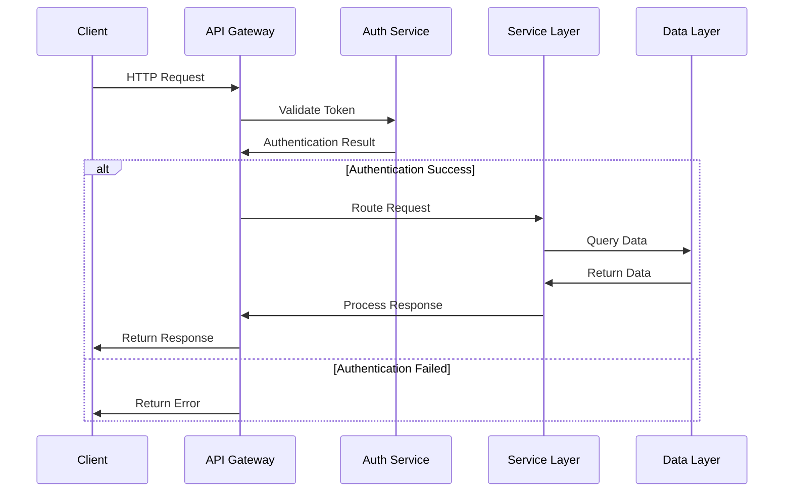
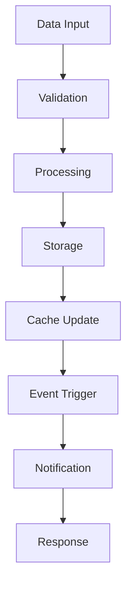
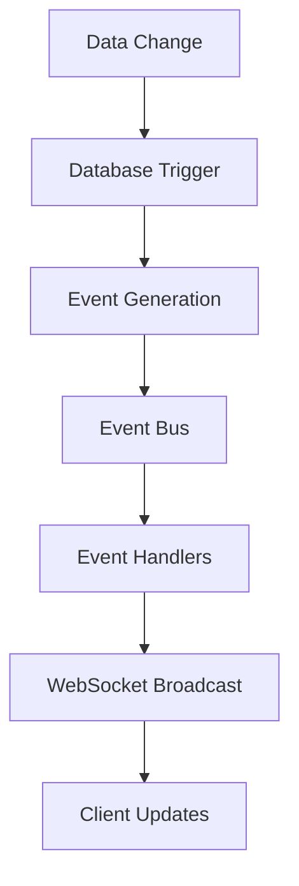
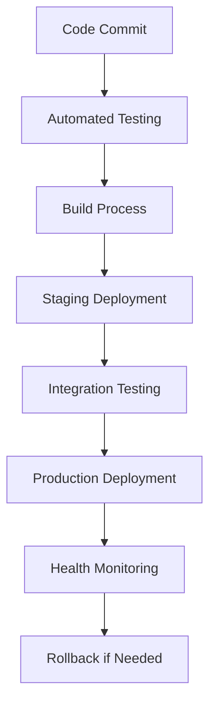

# Fire22 Dashboard System Architecture

## Overview

Complete documentation of the Fire22 Dashboard system architecture, including
component design, system patterns, and architectural decisions.

## Table of Contents

- [System Overview](#system-overview)
- [Architecture Patterns](#architecture-patterns)
- [Component Architecture](#component-architecture)
- [Data Flow Architecture](#data-flow-architecture)
- [Security Architecture](#security-architecture)
- [Scalability Architecture](#scalability-architecture)
- [Deployment Architecture](#deployment-architecture)
- [Integration Architecture](#integration-architecture)
- [Performance Architecture](#performance-architecture)
- [Monitoring Architecture](#monitoring-architecture)

---

## System Overview

### High-Level Architecture

```
[Client Layer] → [API Gateway] → [Service Layer] → [Data Layer]
      ↓              ↓              ↓              ↓
   Web App      Load Balancer   Business      Database
   Mobile App   Rate Limiting   Services      Cache
   Third-party  Authentication  Middleware    Storage
   Integrations Security        Workers       External APIs
```

### System Components

1. **Frontend Applications**

   - Web Dashboard (React/Vue)
   - Mobile Applications
   - Third-party Integrations

2. **Backend Services**

   - API Gateway
   - Authentication Service
   - Business Logic Services
   - Background Workers

3. **Data Layer**
   - Primary Database (SQLite/D1)
   - Cache Layer (Redis/Memory)
   - File Storage
   - External APIs

---

## Architecture Patterns

### Layered Architecture

```
╭─────────────────────────────────────╮
│           Presentation Layer        │
│         (Web, Mobile, API)         │
├─────────────────────────────────────┤
│           Business Logic Layer      │
│      (Services, Controllers)       │
├─────────────────────────────────────┤
│           Data Access Layer         │
│        (Repositories, ORM)         │
├─────────────────────────────────────┤
│           Infrastructure Layer      │
│     (Database, Cache, External)    │
╰─────────────────────────────────────╯
```

### Microservices Pattern

```
╭─────────────╮  ╭─────────────╮  ╭─────────────╮
│   User      │  │   Wager     │  │  Payment    │
│  Service    │  │  Service    │  │  Service    │
╰─────────────╯  ╰─────────────╯  ╰─────────────╯
       │              │              │
       ╰──────────────┼──────────────╯
                      │
              ╭─────────────╮
              │   Event     │
              │   Bus       │
              ╰─────────────╯
```

### Event-Driven Architecture

```
[Event Sources] → [Event Bus] → [Event Handlers] → [Event Sinks]
      ↓              ↓              ↓              ↓
   User Actions   Message Queue   Processors    Database
   System Events  Event Store    Workers       Notifications
   External APIs  Event Router   Services      External Systems
```

---

## Component Architecture

### API Gateway Component

```typescript
interface APIGateway {
  // Request handling
  handleRequest(request: Request): Promise<Response>;

  // Authentication
  authenticate(token: string): Promise<User>;

  // Rate limiting
  checkRateLimit(userId: string): Promise<boolean>;

  // Routing
  routeRequest(request: Request): Promise<Response>;

  // Error handling
  handleError(error: Error): Response;
}
```

### Service Layer Components

```typescript
interface ServiceLayer {
  // User management
  userService: UserService;

  // Wager processing
  wagerService: WagerService;

  // Payment processing
  paymentService: PaymentService;

  // Analytics
  analyticsService: AnalyticsService;

  // Notifications
  notificationService: NotificationService;
}
```

### Data Layer Components

```typescript
interface DataLayer {
  // Database connections
  database: Database;

  // Cache layer
  cache: Cache;

  // File storage
  storage: Storage;

  // External APIs
  externalAPIs: ExternalAPIClient;
}
```

---

## Data Flow Architecture

### Request Flow



### Data Processing Flow



### Real-Time Data Flow



---

## Security Architecture

### Security Layers

```
╭─────────────────────────────────────╮
│         Application Security        │
│      (Input Validation, XSS)       │
├─────────────────────────────────────┤
│         Transport Security          │
│        (HTTPS, TLS 1.3)           │
├─────────────────────────────────────┤
│         Network Security            │
│      (Firewall, DDoS Protection)   │
├─────────────────────────────────────┤
│         Infrastructure Security     │
│      (Access Control, Monitoring)  │
╰─────────────────────────────────────╯
```

### Authentication Architecture

```typescript
interface AuthenticationArchitecture {
  // JWT token management
  jwtService: JWTService;

  // Password hashing
  passwordService: PasswordService;

  // Session management
  sessionService: SessionService;

  // Two-factor authentication
  twoFactorService: TwoFactorService;

  // OAuth integration
  oauthService: OAuthService;
}
```

### Authorization Architecture

```typescript
interface AuthorizationArchitecture {
  // Role-based access control
  rbacService: RBACService;

  // Permission management
  permissionService: PermissionService;

  // Resource-level access
  resourceService: ResourceService;

  // Audit logging
  auditService: AuditService;
}
```

---

## Scalability Architecture

### Horizontal Scaling

```
╭─────────────╮  ╭─────────────╮  ╭─────────────╮
│   Load      │  │   Load      │  │   Load      │
│ Balancer 1  │  │ Balancer 2  │  │ Balancer 3  │
╰─────────────╯  ╰─────────────╯  ╰─────────────╯
       │              │              │
╭─────────────╮  ╭─────────────╮  ╭─────────────╮
│   Server    │  │   Server    │  │   Server    │
│ Instance 1  │  │ Instance 2  │  │ Instance 3  │
╰─────────────╯  ╰─────────────╯  ╰─────────────╯
```

### Vertical Scaling

```
╭─────────────────────────────────────╮
│         Resource Optimization        │
├─────────────────────────────────────┤
│  CPU: Multi-core processing        │
│  Memory: Efficient caching          │
│  Storage: SSD optimization          │
│  Network: Bandwidth management      │
╰─────────────────────────────────────╯
```

### Database Scaling

```
╭─────────────╮  ╭─────────────╮  ╭─────────────╮
│   Primary   │  │   Read      │  │   Cache     │
│  Database   │  │ Replica 1   │  │   Layer     │
╰─────────────╯  ╰─────────────╯  ╰─────────────╯
       │              │              │
       ╰──────────────┼──────────────╯
                      │
              ╭─────────────╮
              │   Load      │
              │ Balancer    │
              ╰─────────────╯
```

---

## Deployment Architecture

### Environment Structure

```
╭─────────────────────────────────────╮
│         Production Environment      │
├─────────────────────────────────────┤
│  Load Balancer → Multiple Instances │
│  Database Clusters                  │
│  CDN Distribution                   │
│  Monitoring & Alerting              │
╰─────────────────────────────────────╯

╭─────────────────────────────────────╮
│         Staging Environment         │
├─────────────────────────────────────┤
│  Single Instance                    │
│  Production-like Data               │
│  Testing & Validation               │
╰─────────────────────────────────────╯

╭─────────────────────────────────────╮
│        Development Environment      │
├─────────────────────────────────────┤
│  Local Development                  │
│  Mock Services                      │
│  Development Database               │
╰─────────────────────────────────────╯
```

### Deployment Pipeline



### Infrastructure as Code

```typescript
interface InfrastructureAsCode {
  // Cloudflare Workers configuration
  wranglerConfig: WranglerConfig;

  // Database configuration
  databaseConfig: DatabaseConfig;

  // Environment variables
  environmentConfig: EnvironmentConfig;

  // Monitoring configuration
  monitoringConfig: MonitoringConfig;
}
```

---

## Integration Architecture

### External System Integration

```typescript
interface ExternalIntegration {
  // Fire22 API integration
  fire22API: Fire22APIClient;

  // Stripe payment integration
  stripeAPI: StripeAPIClient;

  // SendGrid email integration
  sendGridAPI: SendGridAPIClient;

  // Twilio SMS integration
  twilioAPI: TwilioAPIClient;

  // Telegram bot integration
  telegramAPI: TelegramAPIClient;
}
```

### API Integration Patterns

```typescript
interface APIIntegrationPatterns {
  // REST API patterns
  restPatterns: RESTPatterns;

  // Webhook patterns
  webhookPatterns: WebhookPatterns;

  // GraphQL patterns (future)
  graphqlPatterns: GraphQLPatterns;

  // gRPC patterns (future)
  grpcPatterns: GRPCPatterns;
}
```

### Data Integration

```typescript
interface DataIntegration {
  // ETL processes
  etlProcesses: ETLProcesses;

  // Data synchronization
  dataSync: DataSynchronization;

  // Real-time streaming
  realTimeStreaming: RealTimeStreaming;

  // Batch processing
  batchProcessing: BatchProcessing;
}
```

---

## Performance Architecture

### Caching Strategy

```
╭─────────────────────────────────────╮
│         Client-Side Cache           │
│      (Browser, Mobile App)         │
├─────────────────────────────────────┤
│         CDN Cache                   │
│      (Static Assets, API)          │
├─────────────────────────────────────┤
│         Application Cache           │
│      (Memory, Redis)               │
├─────────────────────────────────────┤
│         Database Cache              │
│      (Query Cache, Indexes)        │
╰─────────────────────────────────────╯
```

### Performance Optimization

```typescript
interface PerformanceOptimization {
  // Database optimization
  databaseOptimization: DatabaseOptimization;

  // Query optimization
  queryOptimization: QueryOptimization;

  // Caching optimization
  cachingOptimization: CachingOptimization;

  // Network optimization
  networkOptimization: NetworkOptimization;
}
```

### Load Balancing

```typescript
interface LoadBalancing {
  // Round-robin balancing
  roundRobin: RoundRobinBalancer;

  // Weighted balancing
  weightedBalancing: WeightedBalancer;

  // Health-based balancing
  healthBasedBalancing: HealthBasedBalancer;

  // Geographic balancing
  geographicBalancing: GeographicBalancer;
}
```

---

## Monitoring Architecture

### Monitoring Layers

```
╭─────────────────────────────────────╮
│         Application Monitoring      │
│      (Performance, Errors)          │
├─────────────────────────────────────┤
│         Infrastructure Monitoring   │
│      (CPU, Memory, Network)        │
├─────────────────────────────────────┤
│         Business Monitoring         │
│      (KPIs, User Behavior)         │
├─────────────────────────────────────┤
│         Security Monitoring         │
│      (Threats, Vulnerabilities)    │
╰─────────────────────────────────────╯
```

### Monitoring Components

```typescript
interface MonitoringComponents {
  // Application performance monitoring
  apm: ApplicationPerformanceMonitoring;

  // Infrastructure monitoring
  infrastructure: InfrastructureMonitoring;

  // Business intelligence
  businessIntelligence: BusinessIntelligence;

  // Security monitoring
  securityMonitoring: SecurityMonitoring;

  // Alerting system
  alerting: AlertingSystem;
}
```

### Metrics Collection

```typescript
interface MetricsCollection {
  // System metrics
  systemMetrics: SystemMetrics;

  // Application metrics
  applicationMetrics: ApplicationMetrics;

  // Business metrics
  businessMetrics: BusinessMetrics;

  // User experience metrics
  userExperienceMetrics: UserExperienceMetrics;
}
```

---

## System Patterns

### Circuit Breaker Pattern

```typescript
interface CircuitBreaker {
  // Circuit states
  state: 'CLOSED' | 'OPEN' | 'HALF_OPEN';

  // Failure threshold
  failureThreshold: number;

  // Recovery timeout
  recoveryTimeout: number;

  // Success threshold
  successThreshold: number;
}
```

### Retry Pattern

```typescript
interface RetryPattern {
  // Maximum retry attempts
  maxRetries: number;

  // Retry delay strategy
  delayStrategy: 'FIXED' | 'EXPONENTIAL' | 'LINEAR';

  // Backoff multiplier
  backoffMultiplier: number;

  // Maximum delay
  maxDelay: number;
}
```

### Bulkhead Pattern

```typescript
interface BulkheadPattern {
  // Resource pools
  resourcePools: ResourcePool[];

  // Pool isolation
  poolIsolation: boolean;

  // Resource limits
  resourceLimits: ResourceLimits;

  // Fallback strategies
  fallbackStrategies: FallbackStrategy[];
}
```

---

## Technology Stack

### Frontend Technologies

```typescript
interface FrontendTechnologies {
  // Web framework
  webFramework: 'React' | 'Vue' | 'Angular';

  // Mobile framework
  mobileFramework: 'React Native' | 'Flutter' | 'Native';

  // UI library
  uiLibrary: 'Tailwind CSS' | 'Material-UI' | 'Bootstrap';

  // State management
  stateManagement: 'Redux' | 'Vuex' | 'Context API';
}
```

### Backend Technologies

```typescript
interface BackendTechnologies {
  // Runtime environment
  runtime: 'Bun' | 'Node.js' | 'Deno';

  // Web framework
  webFramework: 'Express' | 'Fastify' | 'Hono';

  // Database ORM
  orm: 'Drizzle ORM' | 'Prisma' | 'TypeORM';

  // Authentication
  authentication: 'JWT' | 'OAuth 2.0' | 'SAML';
}
```

### Infrastructure Technologies

```typescript
interface InfrastructureTechnologies {
  // Cloud platform
  cloudPlatform: 'Cloudflare Workers' | 'AWS' | 'Google Cloud';

  // Database
  database: 'SQLite' | 'PostgreSQL' | 'MySQL';

  // Cache
  cache: 'Redis' | 'Memcached' | 'In-Memory';

  // Monitoring
  monitoring: 'Prometheus' | 'Grafana' | 'Datadog';
}
```

---

## Future Architecture

### Planned Enhancements

1. **Microservices Migration**

   - Service decomposition
   - API gateway implementation
   - Service mesh adoption

2. **Event Sourcing**

   - Event store implementation
   - CQRS pattern adoption
   - Event replay capabilities

3. **Machine Learning Integration**
   - Predictive analytics
   - Automated decision making
   - Pattern recognition

### Technology Evolution

- **Short-term**: Performance optimization
- **Medium-term**: Architecture modernization
- **Long-term**: AI/ML integration
- **Continuous**: Security improvements

---

_Last Updated: 2024-01-20_ _Version: 1.0_ _Maintainer: Fire22 Development Team_
