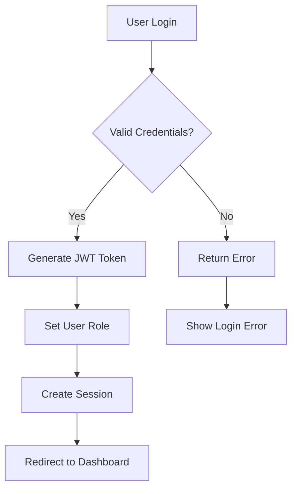
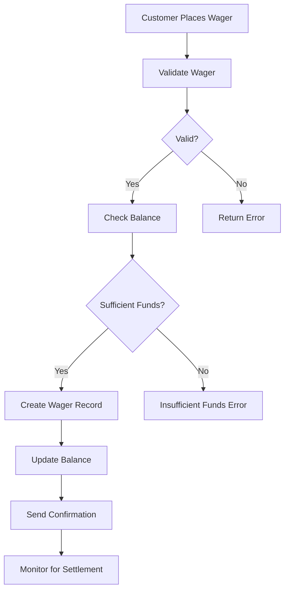
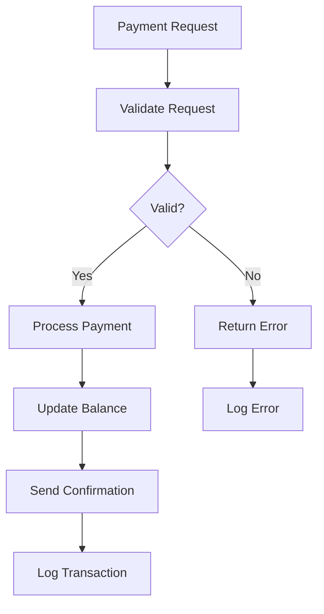
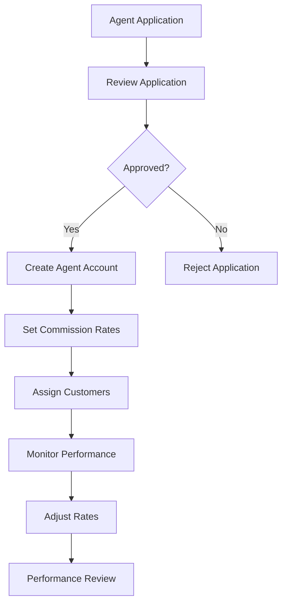
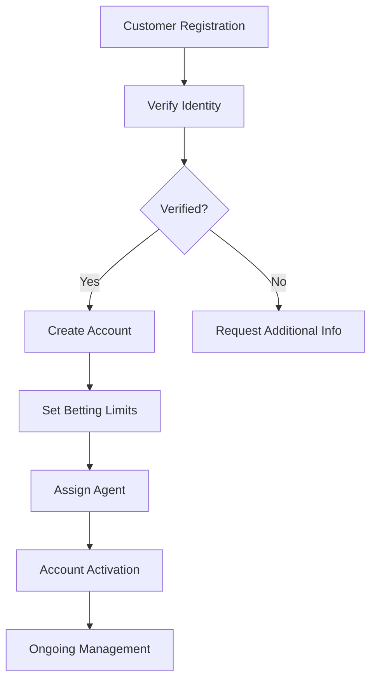
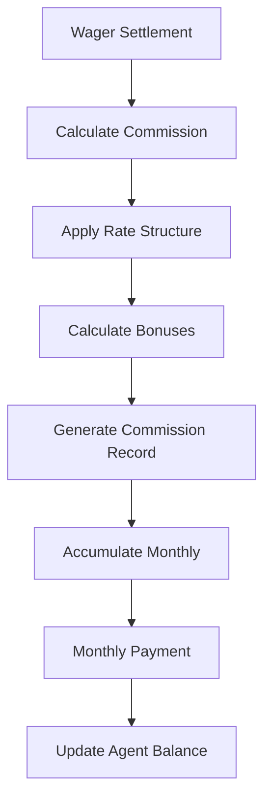
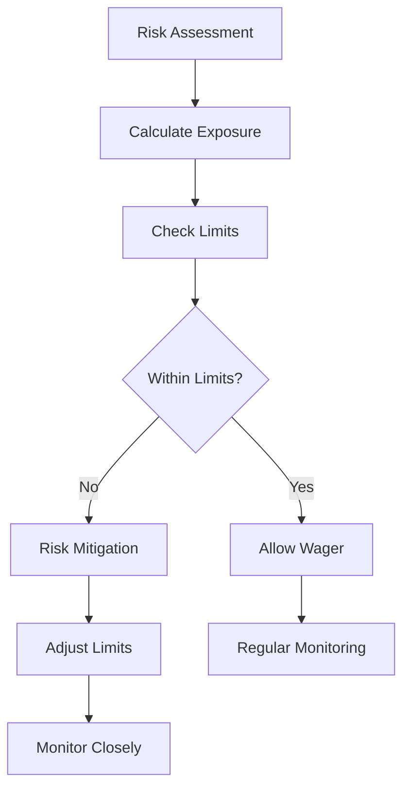
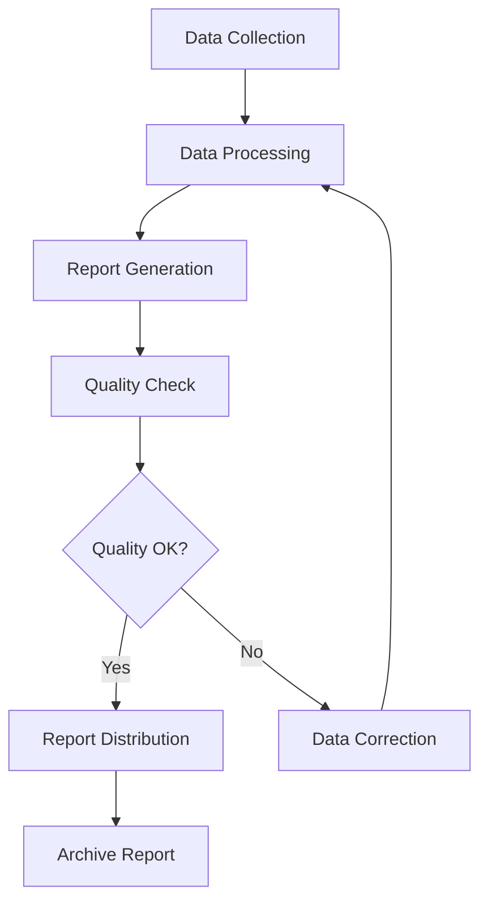
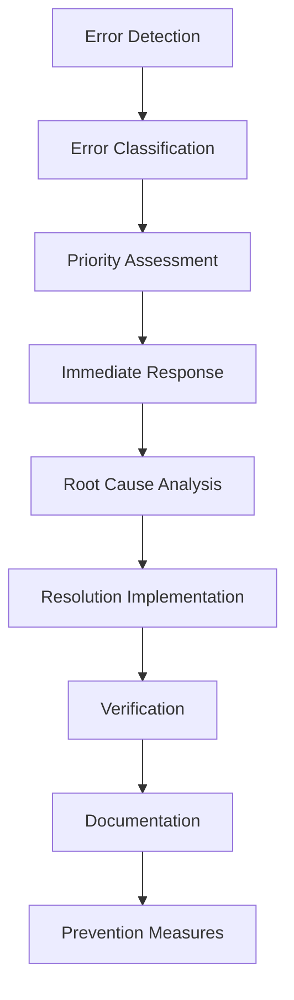
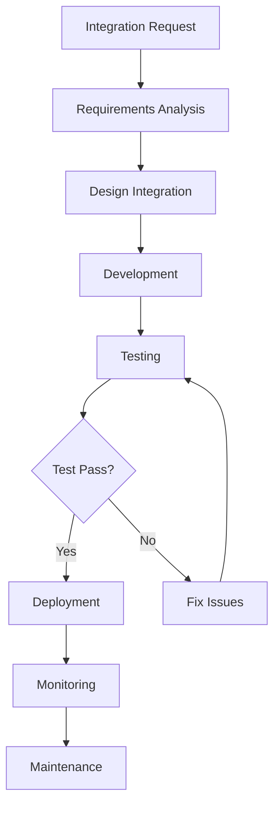

# Fire22 Dashboard Workflows

## Overview

Complete documentation of all business processes, user journeys, and system
workflows in the Fire22 Dashboard system.

## Table of Contents

- [User Authentication Workflow](#user-authentication-workflow)
- [Wager Processing Workflow](#wager-processing-workflow)
- [Payment Processing Workflow](#payment-processing-workflow)
- [Agent Management Workflow](#agent-management-workflow)
- [Customer Management Workflow](#customer-management-workflow)
- [Commission Calculation Workflow](#commission-calculation-workflow)
- [Risk Management Workflow](#risk-management-workflow)
- [Reporting Workflow](#reporting-workflow)
- [Error Handling Workflow](#error-handling-workflow)
- [System Integration Workflow](#system-integration-workflow)

---

## User Authentication Workflow

### Overview

Complete user authentication and authorization process from login to session
management.

### Process Flow

### Steps

1. **Login Request**

   - User enters username/password
   - System validates credentials
   - Check account status and permissions

2. **Authentication**

   - Verify password hash
   - Check account lockout status
   - Validate 2FA if enabled

3. **Authorization**

   - Determine user role (admin, agent, customer)
   - Set appropriate permissions
   - Create access token

4. **Session Management**
   - Generate JWT token
   - Set session timeout
   - Store user context

### Error Handling

- **Invalid Credentials**: Show generic error message
- **Account Locked**: Display lockout information
- **Session Expired**: Redirect to login
- **Permission Denied**: Show access denied message

---

## Wager Processing Workflow

### Overview

Complete lifecycle of a wager from placement to settlement.

### Process Flow

### Steps

1. **Wager Placement**

   - Customer selects teams/odds
   - System validates wager details
   - Check customer balance

2. **Validation**

   - Verify odds are current
   - Check betting limits
   - Validate customer status

3. **Processing**

   - Deduct amount from balance
   - Create wager record
   - Generate confirmation

4. **Settlement**
   - Monitor game results
   - Calculate winnings/losses
   - Update customer balance

### Status Transitions

- **Pending** → **Active** → **Settled**
- **Pending** → **Cancelled** (if invalid)
- **Active** → **Voided** (if game cancelled)

---

## Payment Processing Workflow

### Overview

Complete payment processing including deposits, withdrawals, and refunds.

### Process Flow

### Payment Types

1. **Deposits**

   - Credit card processing
   - Bank transfer
   - Cryptocurrency
   - E-wallet integration

2. **Withdrawals**

   - Bank account verification
   - Identity verification
   - Processing timeframes
   - Fee calculations

3. **Refunds**
   - Cancelled wagers
   - System errors
   - Customer disputes
   - Processing procedures

### Security Measures

- **Encryption**: All payment data encrypted
- **Verification**: Multi-factor authentication
- **Monitoring**: Fraud detection systems
- **Compliance**: PCI DSS compliance

---

## Agent Management Workflow

### Overview

Complete agent lifecycle from onboarding to performance management.

### Process Flow

### Steps

1. **Onboarding**

   - Application submission
   - Background verification
   - Contract agreement
   - Account setup

2. **Commission Management**

   - Set base commission rates
   - Performance bonuses
   - Volume incentives
   - Payment schedules

3. **Performance Monitoring**

   - Customer acquisition
   - Volume generation
   - Risk management
   - Compliance adherence

4. **Relationship Management**
   - Regular communication
   - Training and support
   - Performance reviews
   - Contract renewals

---

## Customer Management Workflow

### Overview

Complete customer lifecycle from registration to account management.

### Process Flow

### Steps

1. **Registration**

   - Personal information
   - Identity verification
   - Terms acceptance
   - Account creation

2. **Verification**

   - Email verification
   - Phone verification
   - Identity documents
   - Address verification

3. **Account Setup**

   - Set betting limits
   - Assign agent
   - Configure preferences
   - Initial deposit

4. **Ongoing Management**
   - Account monitoring
   - Limit adjustments
   - Support requests
   - Account maintenance

---

## Commission Calculation Workflow

### Overview

Complete commission calculation and payment process for agents.

### Process Flow

### Commission Structure

1. **Base Commission**

   - Percentage of handle
   - Minimum thresholds
   - Maximum caps
   - Volume tiers

2. **Performance Bonuses**

   - Customer acquisition
   - Volume milestones
   - Risk management
   - Compliance scores

3. **Payment Schedule**
   - Monthly calculations
   - Payment processing
   - Tax reporting
   - Reconciliation

### Calculation Factors

- **Handle Volume**: Total wager amounts
- **Win/Loss Ratio**: Agent performance
- **Risk Management**: Loss prevention
- **Customer Retention**: Long-term value

---

## Risk Management Workflow

### Overview

Complete risk assessment and management process.

### Process Flow

### Risk Factors

1. **Customer Risk**

   - Betting patterns
   - Financial capacity
   - Payment history
   - Behavior analysis

2. **Market Risk**

   - Odds movements
   - Market volatility
   - Event outcomes
   - External factors

3. **Operational Risk**
   - System failures
   - Human errors
   - Regulatory changes
   - Market conditions

### Mitigation Strategies

- **Limit Setting**: Maximum wager amounts
- **Monitoring**: Real-time risk tracking
- **Diversification**: Spread risk across markets
- **Insurance**: Hedging strategies

---

## Reporting Workflow

### Overview

Complete reporting generation and distribution process.

### Process Flow

### Report Types

1. **Operational Reports**

   - Daily summaries
   - Weekly analytics
   - Monthly performance
   - Quarterly reviews

2. **Financial Reports**

   - Revenue analysis
   - Profit/loss statements
   - Commission reports
   - Tax summaries

3. **Risk Reports**
   - Exposure analysis
   - Limit utilization
   - Risk metrics
   - Compliance status

### Distribution

- **Automated**: Scheduled delivery
- **On-demand**: User requests
- **Real-time**: Live dashboards
- **Archived**: Historical access

---

## Error Handling Workflow

### Overview

Complete error detection, handling, and resolution process.

### Process Flow

### Error Categories

1. **Critical Errors**

   - System failures
   - Data corruption
   - Security breaches
   - Financial discrepancies

2. **High Priority**

   - Performance issues
   - User experience problems
   - Integration failures
   - Compliance violations

3. **Medium Priority**
   - UI/UX issues
   - Performance degradation
   - Feature limitations
   - Documentation gaps

### Response Procedures

- **Immediate**: Stop affected processes
- **Short-term**: Implement workarounds
- **Long-term**: Permanent solutions
- **Prevention**: Process improvements

---

## System Integration Workflow

### Overview

Complete integration process for external systems and APIs.

### Process Flow

### Integration Types

1. **Payment Systems**

   - Stripe integration
   - Bank APIs
   - Cryptocurrency
   - E-wallets

2. **Communication Systems**

   - SendGrid email
   - Twilio SMS
   - Telegram bots
   - Webhook notifications

3. **Data Systems**
   - Fire22 API
   - Database connections
   - Analytics platforms
   - Reporting tools

### Integration Standards

- **API Design**: RESTful principles
- **Authentication**: OAuth 2.0 / JWT
- **Error Handling**: Standardized responses
- **Documentation**: OpenAPI specifications

---

## Workflow Automation

### Automated Processes

1. **Scheduled Tasks**

   - Daily reports
   - Weekly analytics
   - Monthly reconciliations
   - Quarterly reviews

2. **Triggered Actions**

   - Wager settlements
   - Commission calculations
   - Risk alerts
   - Payment processing

3. **Real-time Updates**
   - Dashboard updates
   - Notifications
   - Status changes
   - Balance updates

### Manual Processes

1. **Approval Workflows**

   - Large wagers
   - Withdrawal requests
   - Agent applications
   - Risk limit changes

2. **Review Processes**
   - Performance reviews
   - Compliance audits
   - System maintenance
   - Process improvements

---

## Workflow Monitoring

### Key Metrics

1. **Performance Metrics**

   - Processing time
   - Success rates
   - Error frequencies
   - User satisfaction

2. **Business Metrics**

   - Transaction volumes
   - Revenue generation
   - Customer acquisition
   - Risk exposure

3. **System Metrics**
   - Uptime
   - Response times
   - Resource utilization
   - Error rates

### Monitoring Tools

- **Real-time Dashboards**: Live workflow status
- **Alert Systems**: Automated notifications
- **Logging**: Comprehensive audit trails
- **Analytics**: Performance insights

---

## Workflow Optimization

### Continuous Improvement

1. **Process Analysis**

   - Identify bottlenecks
   - Measure efficiency
   - Find improvement opportunities
   - Implement changes

2. **Technology Updates**

   - New tools and platforms
   - Automation opportunities
   - Integration improvements
   - Performance enhancements

3. **User Feedback**
   - Customer suggestions
   - Agent input
   - Staff feedback
   - Stakeholder requirements

### Optimization Strategies

- **Automation**: Reduce manual processes
- **Standardization**: Consistent procedures
- **Integration**: Seamless data flow
- **Monitoring**: Proactive management

---

## Compliance and Governance

### Regulatory Compliance

1. **Gaming Regulations**

   - Licensing requirements
   - Reporting obligations
   - Compliance monitoring
   - Audit preparation

2. **Financial Regulations**

   - Anti-money laundering
   - Know your customer
   - Transaction monitoring
   - Reporting requirements

3. **Data Protection**
   - Privacy regulations
   - Data security
   - Access controls
   - Audit logging

### Governance Framework

- **Policies**: Clear guidelines
- **Procedures**: Standardized processes
- **Controls**: Risk mitigation
- **Monitoring**: Ongoing oversight

---

## Future Workflow Enhancements

### Planned Improvements

1. **Advanced Automation**

   - Machine learning
   - Predictive analytics
   - Intelligent routing
   - Self-healing systems

2. **Enhanced Integration**

   - API-first approach
   - Microservices architecture
   - Event-driven design
   - Real-time processing

3. **User Experience**
   - Simplified interfaces
   - Mobile optimization
   - Accessibility improvements
   - Performance enhancements

### Technology Roadmap

- **Short-term**: Process improvements
- **Medium-term**: Technology upgrades
- **Long-term**: Architecture evolution
- **Continuous**: Ongoing optimization

---

_Last Updated: 2024-01-20_ _Version: 1.0_ _Maintainer: Fire22 Development Team_
