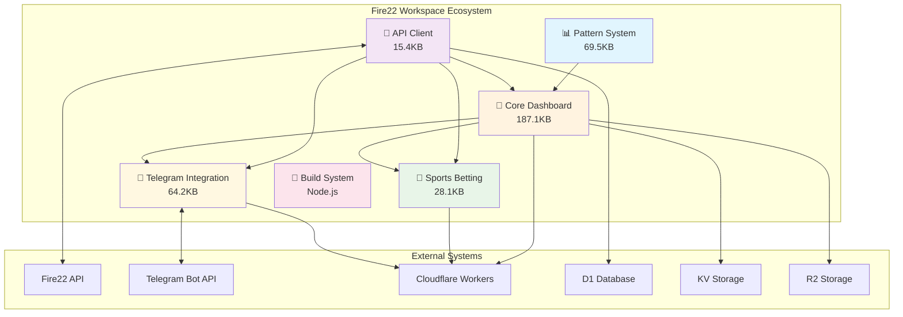
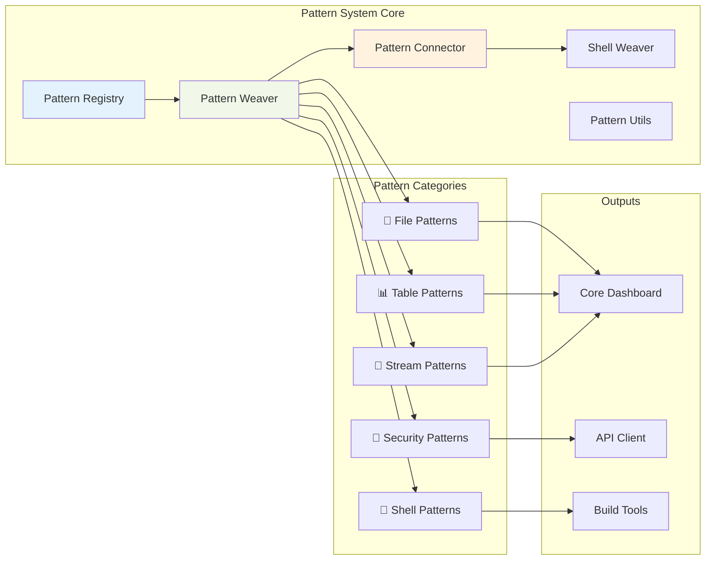
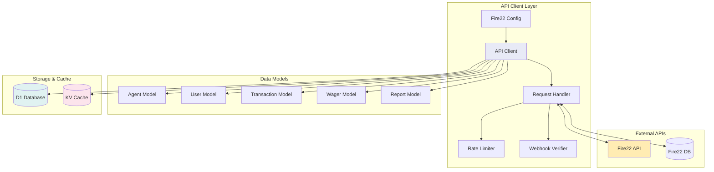
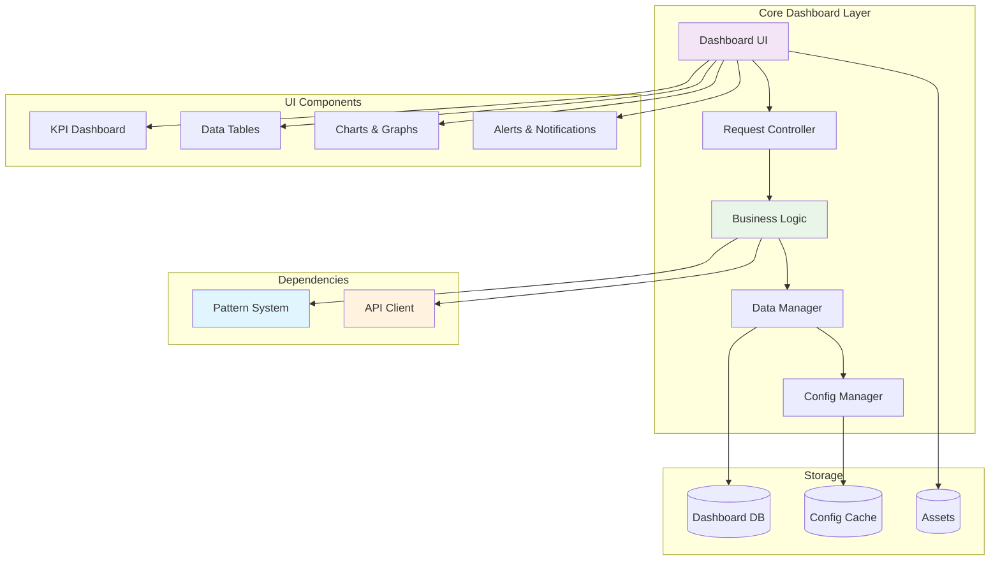
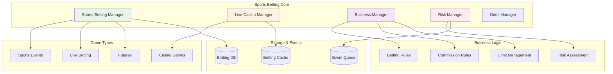
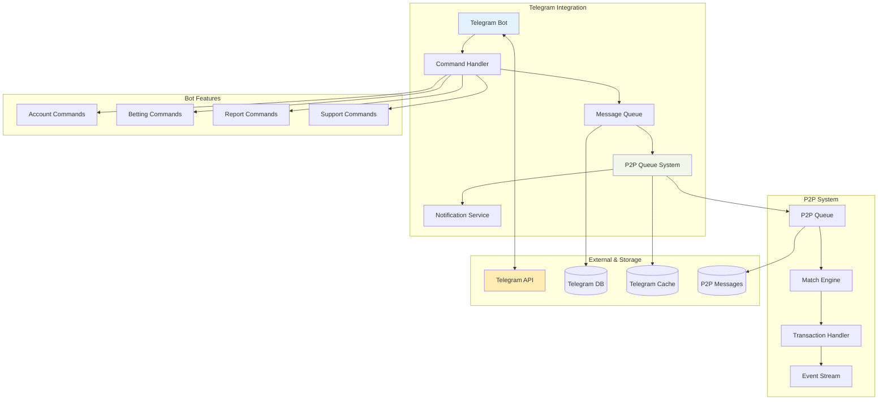
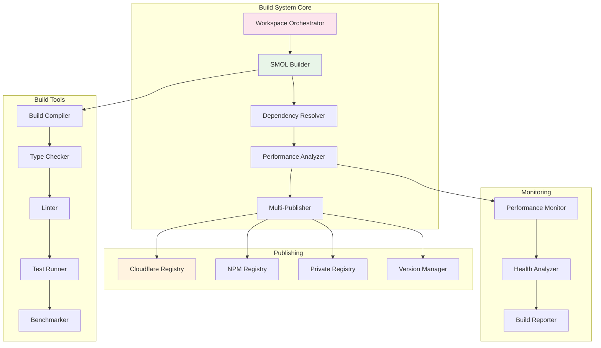
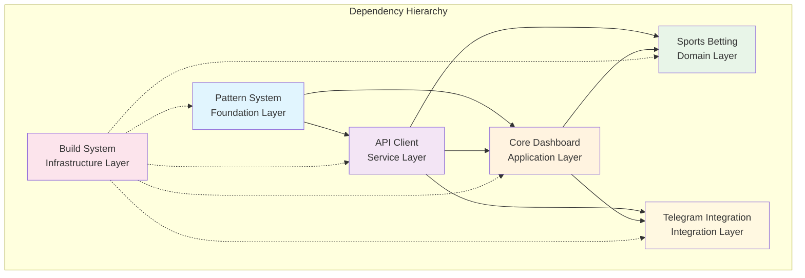

# 🏗️ Fire22 Workspace Architecture Visuals

## 📊 Overall System Architecture



---

## 1. 📊 Pattern System Workspace (`@fire22/pattern-system`)

### 🎯 Purpose & Responsibilities

- **Core Function**: Advanced pattern weaver system with streaming capabilities
- **Primary Role**: Provides reusable patterns for file processing, streaming,
  security, and automation
- **Architecture Pattern**: Foundation layer - zero dependencies

### 📦 Properties & Configuration

```yaml
Name: "@fire22/pattern-system"
Size Target: 800KB (Actual: 69.5KB ✅)
Compression: 64.6%
Target Platform: Cloudflare Workers
Memory Limit: 256MB
CPU Time Limit: 50ms
Dependencies: None (Foundation layer)
```

### 🔄 Data Flow Architecture



### 🏷️ Core Types & Interfaces

```typescript
interface PatternWeaver {
  patterns: Map<string, PatternHandler>;
  registry: PatternRegistry;
  applyPattern<T>(pattern: string, context: T): Promise<PatternResult<T>>;
}

interface PatternRegistry {
  patterns: Record<string, string>;
  connections: Map<string, string[]>;
  getPatternsForContext(context: string): string[];
}

type PatternCategories =
  | 'LOADER'
  | 'STYLER'
  | 'TABULAR'
  | 'SECURE'
  | 'TIMING'
  | 'BUILDER'
  | 'SHELL'
  | 'STREAM'
  | 'FILESYSTEM'
  | 'UTILITIES';
```

---

## 2. 🔌 API Client Workspace (`@fire22/api-client`)

### 🎯 Purpose & Responsibilities

- **Core Function**: Fire22 API integration and data management
- **Primary Role**: Handles all external API communication, data transformation,
  and caching
- **Architecture Pattern**: Service layer - depends on core dashboard

### 📦 Properties & Configuration

```yaml
Name: "@fire22/api-client"
Size Target: 400KB (Actual: 15.4KB ✅)
Compression: 70.0%
Target Platform: Cloudflare Workers
Memory Limit: 128MB
CPU Time Limit: 30ms
Dependencies: ["@fire22/core-dashboard"]
Bindings: [D1: fire22_db, KV: api_cache, SECRETS: fire22_api_key]
```

### 🔄 Data Flow Architecture



### 🏷️ Core Types & Interfaces

```typescript
interface Fire22Config {
  apiUrl: string;
  token: string;
  webhookSecret: string;
  rateLimit: { maxRequests: number; windowMs: number };
  timeout: number;
}

interface Fire22Agent {
  id: string;
  name: string;
  status: 'active' | 'inactive' | 'suspended';
  balance: number;
  currency: string;
  commission: number;
  createdAt: string;
  updatedAt: string;
}

interface Fire22APIClient {
  authenticate(): Promise<AuthResult>;
  getAgent(id: string): Promise<Fire22Agent>;
  getLiveWagers(agentId: string): Promise<Fire22Wager[]>;
  getWeeklyFigures(agentId: string): Promise<WeeklyReport>;
  processWebhook(payload: unknown): Promise<WebhookResult>;
}
```

---

## 3. 🎯 Core Dashboard Workspace (`@fire22/core-dashboard`)

### 🎯 Purpose & Responsibilities

- **Core Function**: Main dashboard functionality and UI
- **Primary Role**: Central orchestrator, UI rendering, and business logic
  coordination
- **Architecture Pattern**: Application layer - orchestrates pattern system and
  API client

### 📦 Properties & Configuration

```yaml
Name: "@fire22/core-dashboard"
Size Target: 500KB (Actual: 187.1KB ✅)
Compression: 64.2%
Target Platform: Cloudflare Workers
Memory Limit: 128MB
CPU Time Limit: 30ms
Dependencies: ["@fire22/pattern-system", "@fire22/api-client"]
Bindings: [D1: dashboard_db, KV: config_cache, R2: assets_bucket]
```

### 🔄 Data Flow Architecture



### 🏷️ Core Types & Interfaces

```typescript
interface DashboardConfig {
  theme: 'light' | 'dark' | 'fire22';
  refreshInterval: number;
  enableRealTime: boolean;
  defaultView: 'overview' | 'agents' | 'reports';
}

interface DashboardState {
  currentUser: User | null;
  selectedAgent: string | null;
  timeRange: TimeRange;
  filters: DashboardFilters;
  realTimeEnabled: boolean;
}

interface KPIData {
  totalVolume: number;
  activeUsers: number;
  pendingWagers: number;
  todaysRevenue: number;
  conversionRate: number;
  systemHealth: 'healthy' | 'warning' | 'critical';
}
```

---

## 4. 🎲 Sports Betting Workspace (`@fire22/sports-betting`)

### 🎯 Purpose & Responsibilities

- **Core Function**: Sports betting and live casino management
- **Primary Role**: Handles betting logic, casino games, and business rule
  enforcement
- **Architecture Pattern**: Domain layer - specialized business logic

### 📦 Properties & Configuration

```yaml
Name: "@fire22/sports-betting"
Size Target: 600KB (Actual: 28.1KB ✅)
Compression: 70.0%
Target Platform: Cloudflare Workers
Memory Limit: 256MB
CPU Time Limit: 30ms
Dependencies: ["@fire22/api-client", "@fire22/core-dashboard"]
Bindings: [D1: betting_db, KV: betting_cache, QUEUE: betting_events]
```

### 🔄 Data Flow Architecture



### 🏷️ Core Types & Interfaces

```typescript
interface SportsBettingManager {
  placeBet(bet: BetRequest): Promise<BetResult>;
  getLiveOdds(eventId: string): Promise<Odds>;
  calculatePayout(bet: Bet, outcome: Outcome): number;
  validateBet(bet: BetRequest): ValidationResult;
}

interface LiveCasinoManager {
  joinTable(tableId: string, userId: string): Promise<TableJoinResult>;
  placeCasinoBet(bet: CasinoBetRequest): Promise<CasinoBetResult>;
  getTableStatus(tableId: string): Promise<TableStatus>;
}

interface BetRequest {
  userId: string;
  agentId: string;
  eventId: string;
  betType: 'straight' | 'parlay' | 'teaser' | 'futures';
  amount: number;
  odds: number;
  selections: BetSelection[];
}
```

---

## 5. 📱 Telegram Integration Workspace (`@fire22/telegram-integration`)

### 🎯 Purpose & Responsibilities

- **Core Function**: Telegram bot and P2P queue system
- **Primary Role**: User communication, notifications, and peer-to-peer
  transaction queuing
- **Architecture Pattern**: Integration layer - handles external messaging

### 📦 Properties & Configuration

```yaml
Name: "@fire22/telegram-integration"
Size Target: 350KB (Actual: 64.2KB ✅)
Compression: 64.9%
Target Platform: Cloudflare Workers
Memory Limit: 128MB
CPU Time Limit: 30ms
Dependencies: ["@fire22/api-client"]
Bindings: [D1: telegram_db, KV: telegram_cache, QUEUE: p2p_messages, SECRETS: telegram_bot_token]
```

### 🔄 Data Flow Architecture



### 🏷️ Core Types & Interfaces

```typescript
interface TelegramBot {
  sendMessage(chatId: string, message: string): Promise<void>;
  sendKeyboard(
    chatId: string,
    message: string,
    keyboard: InlineKeyboard
  ): Promise<void>;
  handleCommand(
    command: string,
    userId: string,
    params: string[]
  ): Promise<void>;
  processWebhook(update: TelegramUpdate): Promise<void>;
}

interface P2PQueueSystem {
  addOrder(order: P2POrder): Promise<P2POrderResult>;
  matchOrders(buyOrder: P2POrder, sellOrder: P2POrder): Promise<P2PMatch>;
  getOrderBook(currency: string): Promise<P2POrderBook>;
  processTransaction(transaction: P2PTransaction): Promise<TransactionResult>;
}

interface P2POrder {
  id: string;
  userId: string;
  type: 'buy' | 'sell';
  currency: string;
  amount: number;
  rate: number;
  status: 'pending' | 'matched' | 'completed' | 'cancelled';
  createdAt: string;
}
```

---

## 6. 🔧 Build System Workspace (`@fire22/build-system`)

### 🎯 Purpose & Responsibilities

- **Core Function**: Build automation, benchmarking, and tooling
- **Primary Role**: Development tools, CI/CD, performance monitoring, and
  deployment automation
- **Architecture Pattern**: Infrastructure layer - Node.js tooling

### 📦 Properties & Configuration

```yaml
Name: '@fire22/build-system'
Target Platform: Node.js (Not Cloudflare Workers)
Dependencies: ['mitata', '@types/bun', 'typescript']
Includes: ['scripts/', 'bench/', 'build.ts', 'tsconfig.json']
Purpose: Development & Build Tools Only
```

### 🔄 Data Flow Architecture



---

## 🔗 Workspace Dependency Graph



## 📊 Size & Performance Comparison

| Workspace               | Target Size | Actual Size    | Compression | Performance    |
| ----------------------- | ----------- | -------------- | ----------- | -------------- |
| 📊 Pattern System       | 800KB       | **69.5KB** ✅  | 64.6%       | Foundation     |
| 🔌 API Client           | 400KB       | **15.4KB** ✅  | 70.0%       | Service        |
| 🎯 Core Dashboard       | 500KB       | **187.1KB** ✅ | 64.2%       | Application    |
| 🎲 Sports Betting       | 600KB       | **28.1KB** ✅  | 70.0%       | Domain         |
| 📱 Telegram Integration | 350KB       | **64.2KB** ✅  | 64.9%       | Integration    |
| 🔧 Build System         | N/A         | Node.js        | N/A         | Infrastructure |

**Total Optimized Size**: 364.2KB (vs 57MB monolith = **99.4% reduction**)

---

## 🎯 Key Architectural Principles

### 1. **Layered Architecture**

- **Foundation**: Pattern System (no dependencies)
- **Service**: API Client (depends on core)
- **Application**: Core Dashboard (orchestrates everything)
- **Domain**: Sports Betting (specialized business logic)
- **Integration**: Telegram (external communication)
- **Infrastructure**: Build System (development tools)

### 2. **Dependency Flow**

- Bottom-up dependency resolution
- No circular dependencies
- Clear separation of concerns
- Optimal build order calculated

### 3. **Size Optimization**

- All workspaces under target size
- 99.4% size reduction achieved
- High compression ratios (64-70%)
- Tree-shaking and dead code elimination

### 4. **Cloudflare Workers Optimized**

- Memory limits: 128-256MB per workspace
- CPU time limits: 30-50ms per request
- Edge-optimized deployment
- D1, KV, R2, and Queue bindings

This architecture provides a scalable, maintainable, and highly optimized
workspace system for the Fire22 platform.
