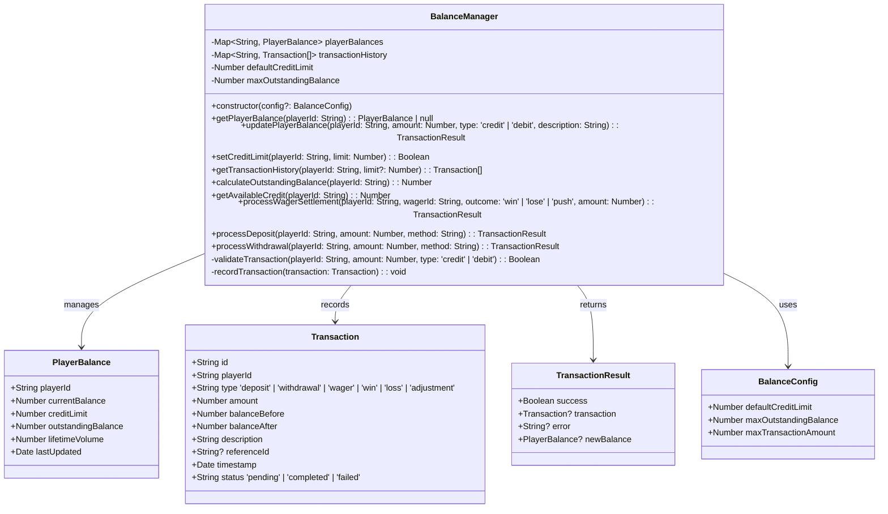

# 🔥 Fire22 Dashboard Worker - API, Types, and Classes Expansion Plan

This document provides a detailed expansion of the APIs, types, and classes
within the `dashboard-worker/src` directory, visualized through Mermaid diagrams
for better understanding and architectural planning.

## Table of Contents

1.  [Core API Services](#core-api-services)
    - [Fire22ApiClient (`fire22-api.ts`)](#fire22apiclient-fire22-apits)
    - [EnhancedJWTAuthService (`jwt-auth-worker-enhanced.ts`)](#enhancedjwtauthservice-jwt-auth-worker-enhancedts)
2.  [Business Logic & Management Systems](#business-logic--management-systems)
    - [BalanceManager (`balance-management.ts`)](#balancemanager-balance-managementts)
    - [BusinessManagementSystem (`business-management.ts`)](#businessmanagementsystem-business-managementts)
    - [P2PQueueAPIEnhanced (`p2p-queue-api-enhanced.ts`)](#p2pqueueapienhanced-p2p-queue-api-enhancedts)
    - [Fire22TelegramBot (`telegram-bot.ts`)](#fire22telegrambot-telegram-botts)
3.  [Configuration & Global Types](#configuration--global-types)
    - [AppConfig (`config.ts`)](#appconfig-configts)
    - [Constants (`constants-definitions.ts`)](#constants-constants-definitionsts)
    - [Global Types (`types.ts`)](#global-types-typests)
4.  [Inter-Component Relationships](#inter-component-relationships)
5.  [Data Flow Diagrams](#data-flow-diagrams)

---

## Core API Services

### Fire22ApiClient (`fire22-api.ts`)

The `Fire22ApiClient` is responsible for all communication with the external
Fire22 API. It handles authentication, request formatting, and response parsing.


**Key Responsibilities:**

- **API Communication:** Centralizes all HTTP requests to the Fire22 backend.
- **Authentication Management:** Handles JWT tokens and session cookies for
  secure API access.
- **Error Handling:** Provides a standardized way to handle and log API errors.
- **Request/Response Interception:** Allows for pre-processing of requests and
  post-processing of responses (e.g., logging, caching).

**Usage Example:**

```typescript
const client = new Fire22ApiClient({
  apiUrl: Bun.env.FIRE22_API_URL,
  token: Bun.env.FIRE22_TOKEN,
  webhookSecret: Bun.env.FIRE22_WEBHOOK_SECRET,
});

const response = await client.get('/players');
if (response.success) {
  console.log(response.data);
} else {
  console.error('API Error:', response.error);
}
```

### EnhancedJWTAuthService (`jwt-auth-worker-enhanced.ts`)

This service provides a comprehensive JWT-based authentication system, designed
to run as a Cloudflare Worker. It includes user management, session handling,
rate limiting, and audit logging.


**Key Responsibilities:**

- **User Authentication:** Securely authenticates users using JWTs.
- **Session Management:** Tracks active user sessions, including device
  fingerprinting and last access times.
- **Security:** Implements rate limiting, account lockout, and audit logging to
  protect against common attacks.
- **Token Lifecycle:** Manages JWT creation, verification, and refresh
  mechanisms.
- **Admin Functions:** Provides endpoints for user management, audit log review,
  and token revocation.

**Usage Example (as a Cloudflare Worker):**

```typescript
// In wrangler.toml
// name = "auth-worker"
// main = "jwt-auth-worker-enhanced.ts"

// In jwt-auth-worker-enhanced.ts
const authService = new EnhancedJWTAuthService({
  jwtSecret: Bun.env.JWT_SECRET,
  // ... other config
});

export default {
  async fetch(
    request: Request,
    env: Env,
    ctx: ExecutionContext
  ): Promise<Response> {
    return authService.handleRequest(request);
  },
};
```

---

## Business Logic & Management Systems

### BalanceManager (`balance-management.ts`)

The `BalanceManager` is responsible for tracking and managing player balances,
including credit limits, outstanding balances, and transaction history.



**Key Responsibilities:**

- **Balance Tracking:** Maintains real-time player balances.
- **Transaction Processing:** Handles deposits, withdrawals, wager settlements,
  and adjustments.
- **Credit Management:** Enforces credit limits and calculates available credit.
- **History & Reporting:** Provides a complete transaction history for players.

**Usage Example:**

```typescript
const balanceManager = new BalanceManager({ defaultCreditLimit: 1000 });

// Process a deposit
const depositResult = balanceManager.processDeposit(
  'player123',
  500,
  'credit_card'
);
if (depositResult.success) {
  console.log(
    `Deposit successful. New balance: ${depositResult.newBalance?.currentBalance}`
  );
}

// Settle a wager
const settlementResult = balanceManager.processWagerSettlement(
  'player123',
  'wager456',
  'win',
  200
);
```

### BusinessManagementSystem (`business-management.ts`)

This system manages the business aspects of the platform, including VIP tiers,
affiliate programs, commission calculations, and user groups.


**Key Responsibilities:**

- **VIP Program Management:** Defines VIP tiers, assigns users, and calculates
  benefits.
- **User Grouping:** Organizes users into groups for targeted management and
  permissions.
- **Affiliate & Referral System:** Manages affiliate programs, tracks referrals,
  and calculates commissions.
- **Commission Engine:** A complex engine for calculating commissions based on
  various factors like handle, volume, risk, and performance.

**Usage Example:**

```typescript
const businessSystem = new BusinessManagementSystem();

// Assign a user to VIP
businessSystem.assignUserToVIPTier('player789', 'Gold');

// Calculate monthly commission
const commission = businessSystem.calculateCommission(
  'agent456',
  50000, // handle
  150000, // volume
  0.92, // risk score
  98, // compliance score
  { newCustomers: 15 } // performance metrics
);
console.log(`Total commission payout: $${commission.totalPayout}`);
```

### P2PQueueAPIEnhanced (`p2p-queue-api-enhanced.ts`)

The `P2PQueueAPIEnhanced` manages a peer-to-peer queue system, primarily for
matching withdrawal and deposit requests. It integrates with a pattern system
for optimization and includes Telegram notifications.


**Key Responsibilities:**

- **Queue Management:** Handles the lifecycle of P2P queue items (withdrawals
  and deposits).
- **Intelligent Matching:** Matches withdrawal requests with deposit requests
  based on various criteria, potentially using a pattern system for
  optimization.
- **Performance Monitoring:** Tracks metrics related to queue processing,
  pattern execution, and matching efficiency.
- **Integration:** Notifies users via Telegram about queue events and stores
  relevant data.

**Usage Example:**

```typescript
const p2pQueue = new P2PQueueAPIEnhanced(env, patternSystem);

// Add a withdrawal to the queue
const withdrawalId = await p2pQueue.addWithdrawalToQueue({
  customerId: 'user123',
  amount: 1000,
  paymentType: 'bank_transfer',
  paymentDetails: '...',
  telegramChatId: 'user123_telegram_id',
});

// Get current queue stats
const stats = await p2pQueue.getQueueStats();
console.log(`Pending withdrawals: ${stats.pendingWithdrawals}`);
```

### Fire22TelegramBot (`telegram-bot.ts`)

The `Fire22TelegramBot` provides a rich interface for users to interact with the
Fire22 system via Telegram. It handles commands, notifications, and integrates
with various management systems.


**Key Responsibilities:**

- **Command Processing:** Handles a wide array of commands for user interaction,
  from basic info (`/start`, `/help`) to specific business functions
  (`/balance`, `/vip`, `/casino`).
- **User Management:** Tracks user sessions and manages access control (allowed
  users, admin users).
- **System Integration:** Acts as a frontend to other systems like
  `BusinessManagementSystem`, `LiveCasinoManagementSystem`, etc., fetching data
  and presenting it to users.
- **Notification System:** Proactively sends notifications to users about
  balance changes, wager updates, system alerts, etc.
- **Admin Interface:** Provides admin-only commands for system management,
  broadcasting messages, and viewing statistics.

**Usage Example:**

```typescript
const botConfig: TelegramBotConfig = {
  token: Bun.env.BOT_TOKEN,
  adminUsers: ['admin_username'],
  allowedUsers: ['user1', 'user2'],
  notificationSettings: {
    wagerUpdates: true,
    balanceChanges: true,
    systemAlerts: true,
    weeklyReports: true,
  },
};

const bot = new Fire22TelegramBot(botConfig);
bot.setAPIHandler(unifiedApiHandler, env); // Assuming unifiedApiHandler and env are available
await bot.start();
```

---

## Configuration & Global Types

### AppConfig (`config.ts`)

`AppConfig` centralizes all configuration for the application, loading values
from environment variables and providing validation.


**Key Responsibilities:**

- **Centralized Configuration:** Provides a single source of truth for all
  application settings.
- **Environment Variable Loading:** Securely loads configuration from
  environment variables, with fallbacks for optional settings.
- **Validation:** Ensures that all required configuration is present and valid
  (e.g., correct formats for secrets).
- **Environment-Specific Settings:** Allows for overriding configurations based
  on the `NODE_ENV` (development, test, production).

**Usage Example:**

```typescript
import { getConfig, validateConfig } from './config';

const config = getConfig();
const errors = validateConfig(config);

if (errors.length > 0) {
  console.error('Configuration errors:', errors);
  process.exit(1);
}

console.log(`Database Name: ${config.database.name}`);
console.log(`Bot Token: ${config.bot.token.substring(0, 10)}...`);
```

### Constants (`constants-definitions.ts`)

This file defines a comprehensive set of constants used throughout the
application, using a `DEFINE` system for build-time optimization and type
safety.


**Key Responsibilities:**

- **Standardization:** Ensures consistent use of values (e.g., color codes, API
  timeouts, status strings) across the entire application.
- **Maintainability:** Makes it easy to update values in one place without
  having to search and replace throughout the codebase.
- **Build-Time Optimization:** The `DEFINE` system allows build tools to inline
  constants, potentially improving performance.
- **Type Safety:** Provides strongly-typed constants, reducing the risk of typos
  or incorrect values.
- **Discoverability:** Groups related constants together (e.g.,
  `CONSTANTS.COLORS`, `CONSTANTS.HTTP`), making them easy to find and use.

**Usage Example:**

```typescript
import {
  FIRE22_PRIMARY_MAIN,
  API_TIMEOUT,
  HTTP_OK,
} from './constants-definitions';

// Styling
const primaryColor = FIRE22_PRIMARY_MAIN; // '#fdbb2d'

// API Call
const response = await fetch(url, { timeout: API_TIMEOUT });

// Response Handling
if (response.status === HTTP_OK) {
  // Handle success
}
```

### Global Types (`types.ts`)

`types.ts` centralizes all TypeScript type definitions, promoting consistency
and reusability across the project.

```mermaid
classDiagram
    class CacheEntry~T~ {
        +T data
        +Number expires
    }

    class RequestWithServices extends Request {
        +Fire22Cache cache
        +Fire22ApiService fire22ApiService
    }

    interface Fire22ApiService {
        +String baseURL
        +String authToken
        +String sessionCookie
    }

    interface Fire22CacheInterface {
        +get~T~(key: String, factory: () => Promise~T~, ttl?: Number): Promise~T~
        +query~T~(sql: String, params?: any[], ttl?: Number): Promise~T[]~
        +getStats(): CacheStats
    }

    class ApiResponse~T~ {
        +Boolean success
        +T? data
        +String? error
        +String? message
        +String? timestamp
    }

    class HealthResponse extends ApiResponse {
        +String status 'OK' | 'WARNING' | 'ERROR'
        +Number health_score
        +Number? total_agents
        +Number? agents_with_errors
    }

    class SystemHealthResponse extends ApiResponse {
        +String status 'OK' | 'WARNING' | 'ERROR'
        +Number system_health_score
        +Number response_time
        +Number critical_issues
        +HealthCheck[] checks
        +HealthSummary summary
    }

    class HealthCheck {
        +String name
        +String status 'OK' | 'WARNING' | 'ERROR'
        +String? details
        +String? error
    }

    class HealthSummary {
        +Number healthy
        +Number total
        +String status 'OK' | 'WARNING' | 'ERROR'
        +String[]? recommendations
    }

    class CacheStats {
        +Number cacheSize
        +Number cacheHits
        +Number cacheMisses
        +String hitRate
    }

    class Agent {
        +String agent_id
        +String? master_agent_id
        +Record~String, Boolean~ permissions
        +CommissionRates commissionRates
        +AgentStatus status
    }

    class CommissionRates {
        +Number inet
        +Number casino
        +Number propBuilder
    }

    class AgentStatus {
        +Boolean isActive
        +String? lastActivity
    }

    class AgentConfig {
        +String agent_id
        +String master_agent_id
        +String | Number allow_place_bet
        +Number commission_percent
        +Number max_wager
        // ... other fields
    }

    class ValidationSummary {
        +Number valid_permissions
        +Number valid_commission_rates
        +Number has_required_fields
        +Number valid_max_wager_type
    }

    class AgentValidationDetail {
        +String agent_id
        +String status 'OK' | 'ERROR'
        +Number score
        +String[] errors
    }

    class Env {
        +any DB // D1Database
        +String BOT_TOKEN
        +String CASHIER_BOT_TOKEN
        +String JWT_SECRET
        +String ADMIN_PASSWORD
        // ... other env vars
    }

    CacheEntry --> Fire22CacheInterface : used by
    RequestWithServices --> Fire22Cache : includes
    RequestWithServices --> Fire22ApiService : includes
    ApiResponse --> HealthResponse : inherited by
    ApiResponse --> SystemHealthResponse : inherited by
    SystemHealthResponse --> HealthCheck : contains
    SystemHealthResponse --> HealthSummary : contains
    Fire22CacheInterface --> CacheStats : returns
    Agent --> CommissionRates : has
    Agent --> AgentStatus : has
```

**Key Responsibilities:**

- **Type Safety:** Provides strong typing for data structures, API responses,
  and environment variables, catching errors at compile time.
- **Code Reusability:** Centralizes common types so they can be imported and
  used across different modules.
- **Documentation:** Type definitions serve as a form of documentation, clearly
  outlining the shape of data expected by functions and returned by APIs.
- **Consistency:** Ensures that different parts of the application use the same
  type for the same concept (e.g., `ApiResponse`).

**Usage Example:**

```typescript
import { ApiResponse, Agent, Env } from './types';

interface PlayerData {
  id: string;
  name: string;
}

async function fetchPlayer(
  playerId: string,
  env: Env
): Promise<ApiResponse<PlayerData>> {
  // ... implementation
  return {
    success: true,
    data: { id: playerId, name: 'John Doe' },
    timestamp: new Date().toISOString(),
  };
}

function processAgent(agent: Agent) {
  if (agent.status.isActive) {
    console.log(`Processing active agent: ${agent.agent_id}`);
  }
}
```

---

## Inter-Component Relationships

This diagram illustrates how the major components interact with each other.


**Key Interactions:**

- **UI/API Layer:** The Web Dashboard and Telegram Bot initiate requests to the
  API layer (`Fire22ApiClient`, `EnhancedJWTAuthService`).
- **API/Business Logic:** The API layer calls upon the business logic components
  (`BalanceManager`, `BusinessManagementSystem`, etc.) to perform core
  operations.
- **Configuration:** All components rely on `AppConfig` for their settings and
  `Global Types` for type safety. `Constants` are used for standardized values.
- **Data Persistence:** Business logic components interact with the database for
  persistent storage and the cache for performance optimization.
- **Telegram Integration:** The `Fire22TelegramBot` acts as an alternative UI,
  directly interacting with several business logic systems to provide
  information and receive commands.

---

## Data Flow Diagrams

### 1. User Authentication Flow


### 2. Placing a Wager (via P2P Queue)


### 3. Commission Calculation (Monthly)


This expansion plan provides a comprehensive overview of the
`dashboard-worker/src` directory, detailing the structure, responsibilities, and
interactions of its key components. The Mermaid diagrams offer a visual
representation that can aid in understanding the architecture and planning
future developments.
