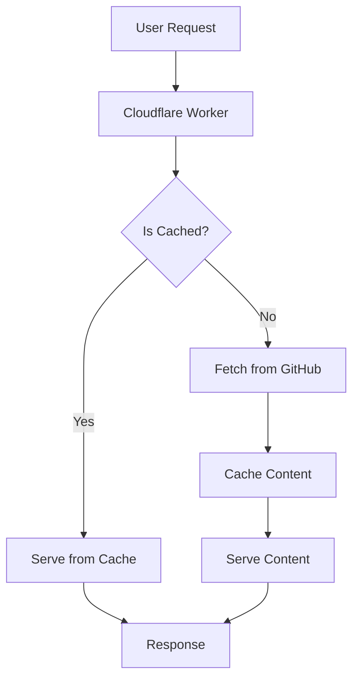

# 📚 Crystal Clear Docs Worker

**Automated Documentation CDN using Cloudflare Workers**

This Cloudflare Worker automatically serves your documentation from GitHub, providing a fast, reliable, and always-up-to-date documentation site.

## 🚀 Features

- **🔄 Automatic Updates**: Content automatically updates when you push to GitHub
- **⚡ Fast CDN**: Served via Cloudflare's global CDN network
- **🧠 Smart Caching**: Intelligent caching with ETags and cache headers
- **📊 Health Monitoring**: Comprehensive health check endpoints
- **🔒 Secure**: Optional GitHub token authentication for private repos
- **🎯 Multiple Formats**: Supports HTML, Markdown, CSS, JS, and images
- **📱 Responsive**: Works on all devices and browsers

## 🏗️ Architecture



## 📋 Prerequisites

- Cloudflare account with Workers enabled
- GitHub repository with documentation
- Node.js 18+ and npm

## 🚀 Quick Start

### 1. Install Wrangler CLI

```bash
npm install -g wrangler
```

### 2. Login to Cloudflare

```bash
wrangler auth login
```

### 3. Configure Environment

Edit `wrangler.toml` and update:

```toml
[vars]
GITHUB_REPO = "your-username/your-repo"
GITHUB_BRANCH = "main"  # or your default branch
```

### 4. Deploy

```bash
cd docs-worker
npm install
npm run deploy
```

## ⚙️ Configuration

### Environment Variables

```toml
# Required
GITHUB_REPO = "nolarose1968-pixel/crystal-clear-architecture"
GITHUB_BRANCH = "main"

# Optional (for private repos)
GITHUB_TOKEN = "your_github_personal_access_token"

# Caching
CACHE_TTL = 3600  # Cache TTL in seconds (1 hour)
```

### Custom Domain (Optional)

```toml
[[routes]]
pattern = "docs.yourdomain.com"
zone_name = "yourdomain.com"
```

## 📖 API Endpoints

### Documentation Pages
- `GET /` - Main documentation index
- `GET /communication.html` - Communication hub
- `GET /domains.html` - Domain documentation
- `GET /performance.html` - Performance metrics
- `GET /favicon.ico` - Site favicon

### Health & Monitoring
- `GET /api/health` - Service health check
- `GET /api/docs` - Documentation service info
- `POST /api/clear-cache` - Clear cache (admin only)

### Examples

```bash
# Health check
curl https://crystal-clear-docs.nolarose1968.workers.dev/api/health

# Documentation info
curl https://crystal-clear-docs.nolarose1968.workers.dev/api/docs

# Clear cache (requires auth)
curl -X POST \
  -H "Authorization: Bearer admin-token" \
  https://crystal-clear-docs.nolarose1968.workers.dev/api/clear-cache
```

## 🔧 Development

### Local Development

```bash
# Start local development server
npm run dev

# Open http://localhost:8787
```

### Testing

```bash
# Run tests
npm test

# Type checking
npm run typecheck

# Linting
npm run lint
```

### Logs

```bash
# View live logs
npm run logs
```

## 📊 Monitoring & Analytics

### Health Monitoring

The worker provides comprehensive health monitoring:

```json
{
  "status": "healthy",
  "timestamp": "2024-01-01T00:00:00.000Z",
  "service": "Docs CDN",
  "cache": {
    "entries": 25,
    "status": "active"
  },
  "github": {
    "repo": "nolarose1968-pixel/crystal-clear-architecture",
    "branch": "main"
  }
}
```

### Cache Statistics

- **Cache Hit Rate**: Monitor via response headers
- **Cache Size**: Available via `/api/docs` endpoint
- **Response Times**: Included in health metrics

## 🚀 Deployment

### Automatic Deployment

The worker automatically deploys when you push changes to the `docs/` directory:

```yaml
# .github/workflows/deploy-docs-worker.yml
on:
  push:
    branches: [ main ]
    paths:
      - 'docs/**'
      - 'docs-worker/**'
```

### Manual Deployment

```bash
# Deploy to production
npm run deploy

# Dry run (test deployment)
npm run build
```

## 🔒 Security

### GitHub Token Authentication

For private repositories or higher rate limits:

1. Create a GitHub Personal Access Token
2. Add to `wrangler.toml`:
   ```toml
   GITHUB_TOKEN = "ghp_your_token_here"
   ```
3. Or set as environment variable:
   ```bash
   export GITHUB_TOKEN="ghp_your_token_here"
   ```

### Cache Clearing

Admin endpoint to clear cache:

```bash
curl -X POST \
  -H "Authorization: Bearer admin-token" \
  https://your-worker.workers.dev/api/clear-cache
```

## 🐛 Troubleshooting

### Common Issues

#### 404 Errors
- Check that files exist in GitHub repository
- Verify `GITHUB_REPO` and `GITHUB_BRANCH` are correct
- Ensure files are in the `docs/` directory

#### Caching Issues
- Clear cache: `POST /api/clear-cache`
- Check cache status: `GET /api/docs`
- Adjust `CACHE_TTL` in configuration

#### Rate Limiting
- Add GitHub token for higher limits
- Check GitHub API rate limit status
- Implement exponential backoff

### Debug Mode

Enable debug logging:

```javascript
// In docs-worker.ts
console.log('Debug info:', data);
```

## 📈 Performance Optimization

### Caching Strategy

- **ETags**: Content-based caching
- **TTL**: Time-based cache expiration
- **Stale-While-Revalidate**: Serve stale content during updates
- **CDN**: Cloudflare's global edge network

### Response Headers

```javascript
// Cache headers
'Cache-Control': 'public, max-age=3600'
'ETag': '"content-hash"'
'X-Source': 'GitHub-CDN'
'X-Cache-Status': 'HIT/MISS/STALE'
```

## 🤝 Contributing

1. Fork the repository
2. Create a feature branch
3. Make your changes
4. Test locally: `npm run dev`
5. Deploy: `npm run deploy`
6. Create a Pull Request

## 📄 License

MIT License - see LICENSE file for details.

## 🔗 Links

- **Live Documentation**: https://crystal-clear-docs.nolarose1968.workers.dev
- **GitHub Repository**: https://github.com/nolarose1968-pixel/crystal-clear-architecture
- **Cloudflare Workers**: https://workers.cloudflare.com
- **Wrangler CLI**: https://developers.cloudflare.com/workers/wrangler

---

**🎉 Your documentation is now automatically served via Cloudflare Workers!**
