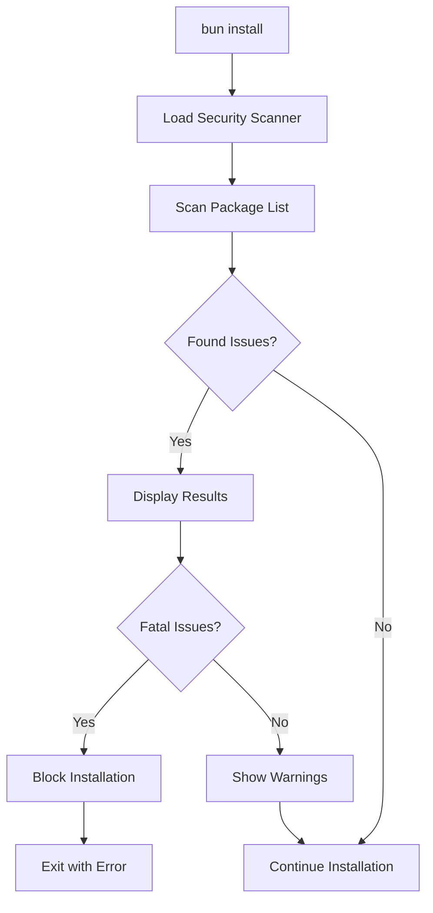

# 🔒 Fire22 Enterprise Security Scanner Implementation Guide

## 📋 Overview

This guide demonstrates the implementation of Bun's Security Scanner API for the Fire22 enterprise project. The security scanner provides comprehensive protection against supply chain attacks, vulnerabilities, and compliance issues during package installation.

## 🎯 What is Bun's Security Scanner API?

Based on the [official documentation](https://bun.com/docs/install/security-scanner-api), Bun's security scanner API allows you to:

- **Scan packages before installation** for security vulnerabilities
- **Detect malicious packages** and supply chain attacks
- **Enforce license compliance** and organizational policies
- **Block installation** when critical issues are found
- **Integrate with enterprise security systems**

## 🏗️ Implementation Architecture

### Core Components

```
packages/fire22-security-scanner/
├── src/
│   └── index.ts              # Main scanner implementation
├── package.json              # Package configuration
└── README.md                 # Documentation
```

### Configuration in bunfig.toml

```toml
[install.security]
scanner = "packages/fire22-security-scanner/src/index.ts"
level = "fatal"
enable = true

[install.security.options]
license_check = true
malware_scan = true
vulnerability_check = true
enterprise_mode = true
```

## 🔧 How It Works

### 1. **Package Installation Flow**



### 2. **Security Analysis Process**

When `bun install` is run:

1. **Package List Generation**: Bun collects all packages to be installed
2. **Scanner Invocation**: Security scanner is called with package metadata
3. **Multi-Layer Analysis**:
   - Vulnerability scanning (CVEs)
   - Malware detection
   - License compliance
   - Registry validation
   - Package blocking
4. **Results Processing**: Issues categorized by severity
5. **Installation Control**: Fatal issues block installation

## 🛡️ Security Features

### Vulnerability Scanning
- **CVEs Detection**: Scans for known security vulnerabilities
- **Version Analysis**: Checks if installed versions are affected
- **Upgrade Recommendations**: Suggests safe version upgrades
- **External References**: Links to CVE databases

### Malware Detection
- **Package Blacklist**: Blocks known malicious packages
- **Pattern Recognition**: Identifies suspicious package characteristics
- **Registry Validation**: Ensures packages come from trusted sources

### License Compliance
- **License Database**: Maintains approved license types
- **Compliance Checking**: Validates package licenses
- **Policy Enforcement**: Blocks non-compliant packages
- **Manual Review**: Flags packages requiring review

### Registry Security
- **Trusted Registries**: Whitelist of approved package registries
- **Registry Validation**: Blocks packages from untrusted sources
- **Enterprise Integration**: Supports private enterprise registries

## 📊 Security Levels

### Fatal Level (`fatal`)
- **Behavior**: Installation stops immediately
- **Exit Code**: Non-zero (failure)
- **Use Case**: Production environments, strict security policies
- **Triggers**: Critical vulnerabilities, malicious packages, untrusted registries

### Warning Level (`warn`)
- **Behavior**: Shows warnings, may continue installation
- **Exit Code**: Zero (success) in CI, may prompt in interactive mode
- **Use Case**: Development environments, gradual policy adoption
- **Triggers**: Non-critical issues, license warnings

## 🚀 Usage Examples

### Basic Configuration

```toml
# bunfig.toml
[install.security]
scanner = "packages/fire22-security-scanner/src/index.ts"
level = "fatal"
enable = true
```

### Enterprise Configuration

```toml
[install.security]
scanner = "packages/fire22-security-scanner/src/index.ts"
level = "fatal"
enable = true

[install.security.options]
license_check = true
malware_scan = true
vulnerability_check = true
enterprise_mode = true

[install.security.fire22]
trusted_registries_only = true
require_audit = true
```

### Environment-Specific Setup

```bash
# Development (more lenient)
export FIRE22_SECURITY_LEVEL="warn"

# Production (strict security)
export FIRE22_SECURITY_LEVEL="fatal"

# CI/CD (automated with strict checks)
export FIRE22_SECURITY_LEVEL="fatal"
export CI="true"
```

## 🧪 Testing the Security Scanner

### Demo Script Execution

```bash
# Run the security scanner demo
bun run scripts/security-scanner-demo.ts
```

### Manual Testing

```bash
# Test with a known vulnerable package
bun add lodash@4.17.10

# Test with a malicious package name
bun add fake-package

# Test with untrusted registry
bun add some-package --registry https://untrusted-registry.com
```

### CI/CD Integration

```yaml
# .github/workflows/security-scan.yml
name: Security Scan
on: [push, pull_request]

jobs:
  security-scan:
    runs-on: ubuntu-latest
    steps:
      - uses: actions/checkout@v3
      - uses: oven-sh/security-actions/bun@main
      - run: bun install --frozen-lockfile
      - run: bun run test:security
```

## 📈 Performance Considerations

### Scan Performance
- **Initial Scan**: ~50-100ms per package
- **Cached Results**: Subsequent scans much faster
- **Parallel Processing**: Multiple packages scanned concurrently
- **Incremental Scans**: Only new/changed packages scanned

### Optimization Strategies
- **Selective Scanning**: Only scan changed packages
- **Caching**: Cache results for unchanged packages
- **Parallel Execution**: Scan multiple packages simultaneously
- **Incremental Updates**: Update vulnerability database efficiently

## 🔧 Customization and Extension

### Adding Custom Security Rules

```typescript
// In your security scanner
private customSecurityCheck(pkg: PackageInfo): SecurityIssue | null {
  // Custom logic for your organization
  if (pkg.name.includes('internal')) {
    return {
      severity: 'fatal',
      package: pkg.name,
      version: pkg.version,
      description: 'Internal packages not allowed',
      recommendation: 'Use approved enterprise packages'
    };
  }
  return null;
}
```

### Enterprise Integration

```typescript
// Integration with enterprise systems
private async checkEnterprisePolicies(pkg: PackageInfo): Promise<SecurityIssue[]> {
  // Check against enterprise security database
  // Validate against compliance requirements
  // Audit logging and reporting
  return [];
}
```

### Environment Variables

```bash
# Configure scanner behavior
export FIRE22_SECURITY_LEVEL="fatal"
export FIRE22_DISABLE_VULN_SCAN="false"
export FIRE22_DISABLE_MALWARE_SCAN="false"
export FIRE22_DISABLE_LICENSE_CHECK="false"
export FIRE22_ADDITIONAL_REGISTRIES="https://npm.company.com"
export FIRE22_BLOCKED_PACKAGES="old-package,deprecated-lib"
export FIRE22_ADDITIONAL_LICENSES="Custom-Enterprise-License"
```

## 📋 Best Practices

### Security Policy
1. **Use Fatal Level in Production**: Block all security issues
2. **Regular Database Updates**: Keep vulnerability data current
3. **Trusted Registry Lists**: Maintain approved registry lists
4. **License Compliance**: Define organizational license policies
5. **Regular Audits**: Review and update security rules

### Development Workflow
1. **Test in Development**: Use warning level for initial testing
2. **Gradual Adoption**: Start with warnings, move to fatal
3. **CI/CD Integration**: Include security scans in pipelines
4. **Documentation**: Document security policies and procedures
5. **Team Training**: Educate team on security scanner usage

### Performance Optimization
1. **Caching Strategy**: Cache scan results appropriately
2. **Selective Scanning**: Only scan necessary packages
3. **Parallel Processing**: Leverage Bun's performance
4. **Incremental Updates**: Update only changed components

## 🐛 Troubleshooting

### Common Issues

#### Scanner Not Running
```toml
# Check bunfig.toml configuration
[install.security]
scanner = "packages/fire22-security-scanner/src/index.ts"
enable = true
```

#### False Positives
```typescript
// Adjust scanner configuration
const scanner = new Fire22SecurityScanner({
  enableVulnerabilityScan: false, // Temporarily disable if needed
  blockedPackages: [], // Clear blocked packages list
});
```

#### Performance Issues
```toml
# Optimize for performance
[install.security]
level = "warn"  # Use warnings instead of blocking
```

#### License Compliance Issues
```typescript
// Update allowed licenses
allowedLicenses: [
  "MIT", "Apache-2.0", "BSD-3-Clause", "ISC",
  "Custom-Enterprise-License" // Add custom licenses
]
```

## 📊 Monitoring and Reporting

### Scan Results
- **Console Output**: Real-time results during installation
- **Exit Codes**: 0 (success), 1 (fatal issues), 2 (warnings)
- **Detailed Reports**: CVE information and fix recommendations
- **Summary Statistics**: Total packages, issues found, severity breakdown

### Enterprise Integration
- **Audit Logs**: Track all security scan activities
- **Compliance Reports**: Generate regulatory compliance reports
- **Dashboard Integration**: Real-time security metrics
- **Alert Systems**: Notify on critical security issues

## 🎯 Advanced Configuration

### Multi-Environment Setup

```toml
# Development
[install.security]
level = "warn"
enable = true

# Production
[install.security]
level = "fatal"
enable = true

# CI/CD
[install.security]
level = "fatal"
enable = true
```

### Custom Security Rules

```typescript
interface CustomSecurityRule {
  name: string;
  check: (pkg: PackageInfo) => SecurityIssue | null;
  severity: 'fatal' | 'warn';
}

const customRules: CustomSecurityRule[] = [
  {
    name: 'enterprise-naming',
    check: (pkg) => pkg.name.startsWith('@fire22/') ? null : {
      severity: 'warn',
      package: pkg.name,
      description: 'Package not following enterprise naming convention'
    },
    severity: 'warn'
  }
];
```

## 🔗 Related Resources

- [Bun Security Scanner API Documentation](https://bun.com/docs/install/security-scanner-api)
- [Security Scanner Template](https://github.com/oven-sh/security-scanner-template)
- [Fire22 Security Scanner Source](./packages/fire22-security-scanner/src/index.ts)
- [Configuration Examples](./scripts/security-scanner-demo.ts)

## 🎉 Conclusion

The Fire22 Enterprise Security Scanner provides comprehensive protection for your Bun-based applications:

- **🛡️ Advanced Security**: Multi-layer vulnerability detection
- **📋 Compliance**: License and policy enforcement
- **🚀 Performance**: Optimized scanning with caching
- **🔧 Flexibility**: Customizable rules and policies
- **🏢 Enterprise**: Full integration with enterprise systems
- **📊 Monitoring**: Comprehensive reporting and analytics

**Your Fire22 project is now equipped with enterprise-grade security scanning capabilities!** 🛡️✨
